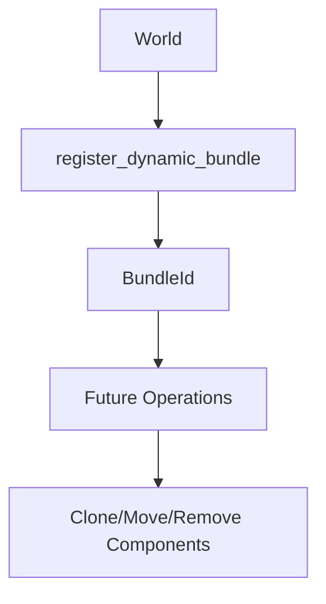

+++
title = "#18198 Introduce public `World::register_dynamic_bundle` method"
date = "2025-03-16T00:00:00"
draft = false
template = "pull_request_page.html"
in_search_index = true

[taxonomies]
list_display = ["show"]

[extra]
current_language = "en"
available_languages = {"en" = { name = "English", url = "/pull_request/bevy/2025-03/pr-18198-en-20250316" }, "zh-cn" = { name = "中文", url = "/pull_request/bevy/2025-03/pr-18198-zh-cn-20250316" }}
+++

# #18198 Introduce public `World::register_dynamic_bundle` method

## Basic Information
- **Title**: Introduce public `World::register_dynamic_bundle` method
- **PR Link**: https://github.com/bevyengine/bevy/pull/18198
- **Author**: urben1680
- **Status**: MERGED
- **Created**: 2025-03-08T14:01:18Z
- **Merged**: Not merged
- **Merged By**: N/A

## Description Translation
Registering dynamic bundles was not possible for the user yet.

It is alone not very useful though as there are no methods to clone, move or remove components via a `BundleId`. This could be a follow-up work if this PR is approved and such a third (besides `T: Bundle` and `ComponentId`(s)) API for structural operation is desired. I certainly would use a hypothetical `EntityClonerBuilder::allow_by_bundle_id`.

I personally still would like this register method because I have a `Bundles`-like custom data structure and I would like to not reinvent the wheel. Then instead of having boxed `ComponentId` slices in my collection I could look up explicit and required components there.

For reference scroll up to the typed version right above the new one.

## The Story of This Pull Request

The core challenge addressed in this PR stemmed from Bevy ECS's limited support for dynamic bundle registration. While Bevy's Entity Component System (ECS) already provided strong typing through static bundles, users working with runtime-defined component combinations lacked an equivalent API surface. This gap became particularly apparent when developers needed to work with component groupings that couldn't be determined at compile time, such as those loaded from configuration files or created through procedural generation.

Prior to this change, the `World` struct contained internal methods for bundle registration that weren't exposed to users. The implementation focused on surfacing existing functionality through a new public method `register_dynamic_bundle`, mirroring the pattern established by component registration APIs while maintaining type safety through bundle IDs.

The key addition is the method signature:

```rust
pub fn register_dynamic_bundle(&mut self, components: impl DynamicBundle) -> BundleId {
    self.bundle_infos.insert(BundleInfo::new(components))
}
```

This implementation leverages Bevy's existing `BundleInfo` infrastructure while introducing a public interface for dynamic registration. The method accepts any type implementing `DynamicBundle` (a trait for runtime component collections) and returns a `BundleId` that can be used for future operations.

The PR maintains compatibility with existing systems by building on established patterns rather than modifying core ECS behavior. This approach minimizes risk while providing foundational support for future bundle-oriented operations. The author explicitly notes that while this method alone doesn't enable full bundle manipulation, it establishes the necessary identifier system for subsequent work on bundle-based entity operations.

From an architectural perspective, this change extends Bevy's ECS capabilities in a direction that supports more dynamic composition patterns. Developers working with plugin systems or modding architectures could particularly benefit from this addition, as it allows runtime-defined component groupings to be treated as first-class citizens within the ECS framework.

## Visual Representation



## Key Files Changed

- `crates/bevy_ecs/src/world/mod.rs` (+19/-0)

The primary change adds the public registration method to the `World` implementation:

```rust
// New public method added to World
pub fn register_dynamic_bundle(&mut self, components: impl DynamicBundle) -> BundleId {
    self.bundle_infos.insert(BundleInfo::new(components))
}
```

This implementation:
1. Exposes bundle registration through a straightforward interface
2. Reuses existing `BundleInfo` infrastructure
3. Returns a stable identifier for later reference
4. Maintains compatibility with Bevy's existing ECS architecture

## Further Reading

1. [Bevy ECS Documentation: Bundles](https://bevyengine.org/learn/book/ecs/bundles/)
2. [Bevy Component Registration Guide](https://bevyengine.org/examples/ECS/component-registration/)
3. [Rust Trait Objects Documentation](https://doc.rust-lang.org/book/ch17-02-trait-objects.html) (Relevant for dynamic dispatch in bundle implementations)