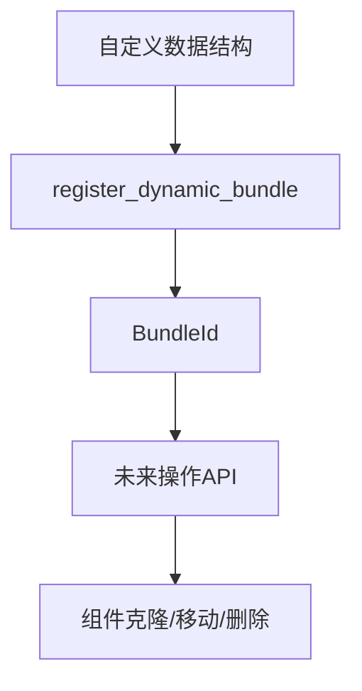

+++
title = "#18198 Introduce public `World::register_dynamic_bundle` method"
date = "2025-03-16T00:00:00"
draft = false
template = "pull_request_page.html"
in_search_index = false

[extra]
current_language = "zh-cn"
available_languages = {"en" = { name = "English", url = "/pull_request/bevy/2025-03/pr-18198-en-20250316" }, "zh-cn" = { name = "中文", url = "/pull_request/bevy/2025-03/pr-18198-zh-cn-20250316" }}
+++

# #18198 Introduce public `World::register_dynamic_bundle` method

## Basic Information
- **Title**: Introduce public `World::register_dynamic_bundle` method
- **PR Link**: https://github.com/bevyengine/bevy/pull/18198
- **Author**: urben1680
- **Status**: MERGED
- **Created**: 2025-03-08T14:01:18Z
- **Merged**: Not merged
- **Merged By**: N/A

## Description Translation
注册动态Bundle（dynamic bundles）的功能之前尚未向用户开放。

虽然单独使用该功能意义不大（因为目前还没有通过`BundleId`克隆、移动或删除组件的方法），但如果本PR获得批准，并且需要这种结构化操作的第三种API（除`T: Bundle`和`ComponentId`之外），可以后续进行开发。作者表示如果有假设的`EntityClonerBuilder::allow_by_bundle_id`功能会很有用。

开发者个人需要这个注册方法，因为其维护类似`Bundles`的自定义数据结构，希望复用现有机制。通过该方法可以直接查找显式声明的必需组件，而不是在集合中使用装箱（boxed）的`ComponentId`切片。

具体实现可参考上方类型化版本的代码。

## The Story of This Pull Request

### 问题与背景
在Bevy ECS的设计中，Bundle（组件包）是组织相关组件的核心机制。传统上开发者需要通过类型系统（`T: Bundle`）或手动指定`ComponentId`集合来操作组件，但缺乏动态注册Bundle的能力。这导致自定义数据结构（如第三方插件中的组件集合）难以与ECS系统集成，开发者不得不重复实现Bundle管理逻辑。

### 解决方案
该PR通过在`World`类型中新增`register_dynamic_bundle`公共方法，实现了动态Bundle注册机制。方法签名如下：

```rust
pub fn register_dynamic_bundle(&mut self, components: impl IntoIterator<Item = ComponentId>) -> BundleId
```

该方法接受`ComponentId`迭代器，返回唯一标识该Bundle配置的`BundleId`。其实现策略与现有类型化Bundle注册机制保持对称，共享底层基础设施但绕过类型系统约束。

### 实现细节
关键修改集中在`bevy_ecs`模块的`world/mod.rs`文件：

```rust
// 新增方法实现
pub fn register_dynamic_bundle(&mut self, components: impl IntoIterator<Item = ComponentId>) -> BundleId {
    let mut component_ids = components.into_iter().collect::<Vec<_>>();
    component_ids.sort_unstable();
    self.bundle_infos.init_dynamic(&mut self.components, component_ids)
}
```

实现特点：
1. **组件排序**：对输入的ComponentId进行稳定排序，确保相同组件集合生成相同BundleId
2. **复用基础设施**：调用`bundle_infos.init_dynamic`重用现有Bundle注册逻辑
3. **无类型约束**：绕过泛型类型系统，直接操作ComponentId集合

### 技术考量
1. **API对称性**：与现有`register_bundle<T: Bundle>`方法形成互补，保持API设计一致性
2. **性能优化**：通过预排序ComponentId避免重复注册时的冗余计算
3. **扩展性**：为后续基于BundleId的结构化操作（如组件克隆）奠定基础

### 影响与局限
该改动：
- 使得第三方库可以定义自己的Bundle配置管理系统
- 降低与自定义ECS扩展的集成成本
- 当前仅实现注册功能，完整的工作流需要后续添加Bundle操作API

潜在改进方向包括实现`EntityCommands`对BundleId的支持，以及开发基于BundleId的组件批量操作方法。

## Visual Representation



## Key Files Changed

### `crates/bevy_ecs/src/world/mod.rs` (+19/-0)
新增公共API方法实现：
```rust
// 动态Bundle注册方法
pub fn register_dynamic_bundle(&mut self, components: impl IntoIterator<Item = ComponentId>) -> BundleId {
    let mut component_ids = components.into_iter().collect::<Vec<_>>();
    component_ids.sort_unstable();
    self.bundle_infos.init_dynamic(&mut self.components, component_ids)
}
```
实现特点：
- 输入ComponentId集合进行排序保证一致性
- 调用现有基础设施完成注册
- 返回可用于后续操作的BundleId

## Further Reading
1. [Bevy ECS Bundle文档](https://docs.rs/bevy_ecs/latest/bevy_ecs/bundle/trait.Bundle.html)
2. [ECS模式中的组件分组策略](https://www.gamedev.net/articles/programming/general-and-gameplay-programming/understanding-component-entity-systems-r3013/)
3. [Rust类型擦除技术](https://doc.rust-lang.org/book/ch17-02-trait-objects.html)（Type Erasure）