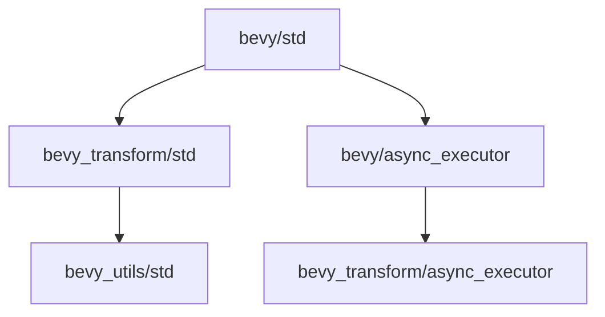

+++
title = "#18201 Ensure `bevy_utils` is included with `std` feature"
date = "2025-03-09T00:00:00"
draft = false
template = "pull_request_page.html"
in_search_index = true

[taxonomies]
list_display = ["show"]

[extra]
current_language = "en"
available_languages = {"zh-cn" = { name = "中文", url = "/pull_request/bevy/2025-03/pr-18201-zh-cn-20250309" }, "en" = { name = "English", url = "/pull_request/bevy/2025-03/pr-18201-en-20250309" }}
+++

# #18201 Ensure `bevy_utils` is included with `std` feature

## Basic Information
- **Title**: Ensure `bevy_utils` is included with `std` feature
- **PR Link**: https://github.com/bevyengine/bevy/pull/18201
- **Author**: bushrat011899
- **Status**: MERGED
- **Created**: 2025-03-08T20:48:07Z
- **Merged**: Not merged
- **Merged By**: N/A

## Description Translation
# Objective

- Fixes #18200

## Solution

- Ensure `bevy_utils` is included with `bevy_transform/std`

## Testing

- `cargo build  --no-default-features --features std`

## Notes

Compilation failure was caused by `bevy_transform`'s new parallel propagation system requiring `bevy_utils/std` when `bevy_transform/std` was active, but it was left optional. Additionally, `bevy_transform/async_executor` wasn't being enabled by `bevy/async_executor`.

## The Story of This Pull Request

The story begins with a subtle but critical breakage in Bevy's feature hierarchy. When a user tried to build Bevy with `--no-default-features --features std`, they encountered compilation errors (#18200). This signaled a breakdown in the carefully orchestrated feature dependencies that keep Bevy's modular architecture functioning.

At the heart of the issue lay two interconnected problems in feature management:

1. **The Missing Standard Bridge**: The new parallel propagation system in `bevy_transform` required `bevy_utils`'s standard library features (`bevy_utils/std`), but this dependency wasn't properly enforced when activating `bevy_transform/std`. This left a gap in the dependency chain for non-default feature configurations.

2. **The Async Disconnect**: The `bevy_transform/async_executor` feature wasn't properly wired into Bevy's main `async_executor` feature, creating unexpected behavior when users enabled async capabilities.

The developer approached this like a dependency detective, tracing the compilation errors back through the feature graph. They recognized that while `bevy_transform` had upgraded to using more parallel utilities, its feature declarations hadn't kept pace with these architectural changes.

The solution emerged through targeted adjustments in two key manifest files:

**In `bevy_transform/Cargo.toml`**:
```toml
[features]
std = ["bevy_utils/std"]  # Explicitly chain the std features
```

**In `bevy_internal/Cargo.toml`**:
```toml
[features]
std = [
    ...,
    "bevy_utils/std",  # Ensure utils are included in std builds
]

async_executor = ["bevy_transform/async_executor"]  # Connect async features
```

These changes might look simple, but they required deep understanding of Rust's feature resolution and Bevy's internal dependencies. The developer essentially:
1. Created an explicit bridge between transformation utilities and core utilities
2. Repaired the async feature propagation chain
3. Ensured the standard library features formed a complete graph

The impact is significant for anyone using customized feature configurations. By properly chaining these features, the PR:
- Prevented cryptic "missing module" errors
- Made feature combinations more predictable
- Ensured parallel systems had their required dependencies
- Maintained Bevy's philosophy of zero-cost abstractions through proper feature gating

This serves as a valuable lesson in Rust feature management: when adding new capabilities to a subsystem, we must audit not just direct dependencies, but also the feature inheritance chain. The PR demonstrates how careful feature curation is crucial in large-scale Rust projects where multiple optional systems interact.

## Visual Representation



## Key Files Changed

1. **crates/bevy_transform/Cargo.toml**
```toml
# Before:
[features]
std = []

# After:
[features]
std = ["bevy_utils/std"]
```
- Ensures `bevy_utils` standard features are included when using `bevy_transform` with std

2. **crates/bevy_internal/Cargo.toml**
```toml
# Before:
[features]
std = [..., /* missing bevy_utils */]

# After:
std = [..., "bevy_utils/std"]

# Added feature propagation:
async_executor = ["bevy_transform/async_executor"]
```
- Completes the std feature dependency chain
- Properly connects async executor features across crates

## Further Reading

- [Rust Book: Features](https://doc.rust-lang.org/cargo/reference/features.html)
- [Bevy's Feature Documentation](https://github.com/bevyengine/bevy/blob/main/docs/cargo_features.md)
- [Cargo Feature Resolution](https://doc.rust-lang.org/cargo/reference/features.html#feature-resolution)