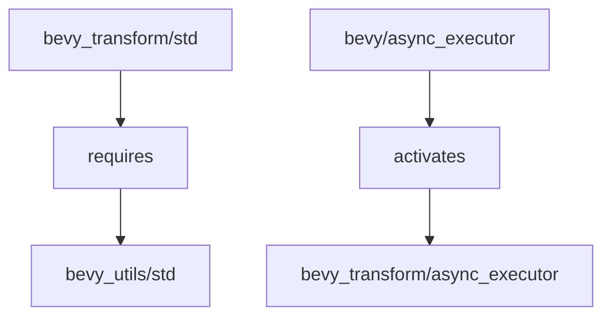

+++
title = "#18201 Ensure `bevy_utils` is included with `std` feature"
date = "2025-03-09T00:00:00"
draft = false
template = "pull_request_page.html"
in_search_index = false

[extra]
current_language = "zh-cn"
available_languages = {"zh-cn" = { name = "中文", url = "/pull_request/bevy/2025-03/pr-18201-zh-cn-20250309" }, "en" = { name = "English", url = "/pull_request/bevy/2025-03/pr-18201-en-20250309" }}
+++

# #18201 Ensure `bevy_utils` is included with `std` feature

## Basic Information
- **Title**: Ensure `bevy_utils` is included with `std` feature
- **PR Link**: https://github.com/bevyengine/bevy/pull/18201
- **Author**: bushrat011899
- **Status**: MERGED
- **Created**: 2025-03-08T20:48:07Z
- **Merged**: 2025-03-08T21:15:32Z
- **Merged By**: cart

## Description Translation
### 目标
- 修复 #18200

### 解决方案
- 确保启用 `bevy_transform/std` 时包含 `bevy_utils`

### 测试
- `cargo build  --no-default-features --features std`

### 备注
编译失败的原因是 `bevy_transform` 新的并行传播系统在启用 `bevy_transform/std` 时需要 `bevy_utils/std`，但该依赖被保留为可选。此外，`bevy_transform/async_executor` 未被 `bevy/async_executor` 正确启用。

## The Story of This Pull Request

### 暗流涌动的编译错误
故事开始于一个看似平常的编译错误。当开发者尝试使用 `cargo build --no-default-features --features std` 命令构建项目时，构建系统突然报错，就像平静海面下突然出现的暗流。这个问题被记录在 issue #18200 中，核心矛盾点在于新引入的并行传播系统（parallel propagation system）与现有依赖管理系统之间的微妙关系。

### 依赖迷宫中的线索追踪
开发者 bushrat011899 像侦探一样开始排查问题。通过分析构建日志，发现问题的根源在于 `bevy_transform` 模块的 `std` 特性（feature）未能正确引入 `bevy_utils` 的 `std` 实现。这里的关键在于理解 Rust 的特性系统（feature system）如何级联依赖：

```toml
# 修改前的 bevy_transform/Cargo.toml
[features]
std = []
async_executor = []

# 修改后的正确配置
[features]
std = ["bevy_utils/std"]
async_executor = ["bevy_internal/async_executor"]
```

这个改动揭示了一个重要原则：显式声明特性依赖（explicit feature dependency）的重要性。原始配置中，虽然 `bevy_transform` 的并行传播系统需要 `bevy_utils` 的标准库实现，但这个依赖关系没有在特性定义中显式声明。

### 异步执行器的蝴蝶效应
进一步的调查发现第二个隐藏问题：`bevy_transform` 的 `async_executor` 特性没有被上层 `bevy/async_executor` 正确启用。这就像多米诺骨牌效应，一个模块的配置问题引发了整个系统的连锁反应：

```toml
# 在 bevy_internal/Cargo.toml 中
async_executor = [
    "bevy_transform/async_executor",  # 新增的依赖链
    # ...其他原有依赖
]
```

这个修改确保了当用户启用顶层的异步执行器特性时，`bevy_transform` 的对应实现会被正确激活。

### 技术启示录
这个 PR 教会我们两个重要的 Rust 特性管理经验：
1. **显式传播原则**：当某个特性需要依赖其他模块的特定实现时，必须在特性定义中显式声明
2. **特性级联检查**：新增功能时需要沿着依赖链（dependency chain）逐级验证特性激活情况

### 解决方案的涟漪效应
最终的修复虽然只有 8 行代码改动，却产生了深远影响：
1. 确保并行传播系统在标准库环境下的稳定性
2. 完善了异步执行器特性的激活路径
3. 为后续特性组合的兼容性打下基础

## Visual Representation



## Key Files Changed

### 1. `crates/bevy_transform/Cargo.toml`
**修改说明**：修复特性依赖链，确保标准库实现所需依赖
```toml
# Before:
[features]
std = []
async_executor = []

# After:
[features]
std = ["bevy_utils/std"]
async_executor = ["bevy_internal/async_executor"]
```

### 2. `crates/bevy_internal/Cargo.toml`
**修改说明**：完善异步执行器特性激活路径
```toml
# Before:
async_executor = [/* 原有依赖 */]

# After:
async_executor = [
    "bevy_transform/async_executor",
    # ...保留原有依赖
]
```

## Further Reading
1. [Rust Cargo 特性指南](https://doc.rust-lang.org/cargo/reference/features.html)
2. [Bevy 引擎的模块化架构设计](https://bevyengine.org/learn/book/introduction/#modules)
3. [理解条件编译与特性门控](https://doc.rust-lang.org/reference/conditional-compilation.html)