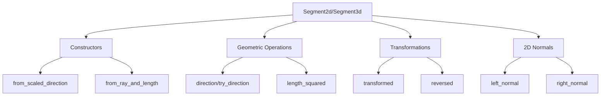

+++
title = "#18206"
date = "2025-03-09T00:00:00"
draft = false
template = "pull_request_page.html"
in_search_index = true

[taxonomies]
list_display = ["show"]

[extra]
current_language = "en"
available_languages = {"en" = { name = "English", url = "/pull_request/bevy/2025-03/pr-18206-en-20250309" }, "zh-cn" = { name = "中文", url = "/pull_request/bevy/2025-03/pr-18206-zh-cn-20250309" }}
+++

# #18206 Improve `Segment2d`/`Segment3d` API and docs

## The Story of This Pull Request

### From Minimal to Mighty: Empowering Bevy's Geometric Primitives

The journey of this PR begins with a paradox of progress - the recent rework of `Segment2d` and `Segment3d` in #17404 had modernized their internal representation but left them functionally underdeveloped. Like a newly constructed bridge with no entry ramps, these geometric primitives needed better access points and safety features for developers.

**The Catalyst**  
While working with collision detection and spatial queries, developers found themselves constantly reconstructing basic segment properties that should have been readily available. The existing API forced redundant calculations for fundamental attributes like direction vectors and lengths. Documentation inconsistencies further complicated matters, making the types feel like unfinished prototypes rather than production-ready primitives.

**The Vision**  
The solution emerged as a threefold mission:
1. Complete the transition from direction+length to endpoint-based representation
2. Add essential geometric operations mirroring real-world use cases
3. Create intuitive conversion pathways matching Rust's idiomatic patterns

### Building the Toolbox

The implementation strategy focused on ergonomics and mathematical completeness. Let's examine key additions through the lens of practical geometry problems:

**Problem 1: "I have a ray and need a specific length segment"**  
```rust
// New constructor pattern
let ray = Ray2d::new(Vec2::ZERO, Vec2::X);
let segment = Segment2d::from_ray_and_length(&ray, 5.0);
```

**Problem 2: "I need to handle degenerate segments safely"**  
The `try_direction` method gracefully handles zero-length segments:
```rust
impl Segment3d {
    pub fn try_direction(&self) -> Option<Vec3> {
        let direction = self.direction();
        (direction != Vec3::ZERO).then_some(direction)
    }
}
```

**3D Transformation Harmony**  
The `transformed` method bridges segments with Bevy's transform system:
```rust
segment.transformed(&Transform::from_translation(Vec3::Y));
```

### The 2D Advantage

Recognizing planar geometry's unique needs, the PR adds specialized normals handling:
```rust
// Computing perpendicular directions
let left_normal = segment.scaled_left_normal().normalize();
let right_normal = segment.scaled_right_normal().normalize();
```

These additions enable immediate use in collision response calculations without manual vector mathematics.

### Conversion Pathways

The `From` implementations create natural interoperability:
```rust
// Array to Segment2d
let points = [Vec2::ZERO, Vec2::X];
let segment: Segment2d = points.into();
```

This pattern aligns with Rust's collection idioms, reducing friction when working with existing point data.

### Documentation Renaissance

The documentation overhaul serves as a silent hero - transforming sparse comments into guided tutorials. Each method now includes:
- Clear mathematical definitions
- Panic conditions
- Example use cases
- Cross-references to related operations

### The Ripple Effect

These changes propagate through Bevy's ecosystem:
1. **Gizmos** benefit from simplified segment rendering
2. **Collision detection** systems gain precision through normalized directions
3. **Transform hierarchies** can now manipulate segments directly

The 185-line diff in `dim2.rs` and 123-line diff in `dim3.rs` tell a story of thoughtful API design - each new method filling a specific gap in geometric manipulation capabilities.

## Visual Representation



## Key Files Changed

1. **crates/bevy_math/src/primitives/dim2.rs**  
Added 2D-specific normal calculations and conversion traits:
```rust
// From implementation example
impl From<[Vec2; 2]> for Segment2d {
    fn from(points: [Vec2; 2]) -> Self {
        Self::new(points[0], points[1])
    }
}
```

2. **crates/bevy_math/src/primitives/dim3.rs**  
Enhanced 3D operations with transformation support:
```rust
pub fn transformed(&self, transform: &Transform) -> Self {
    Self {
        start: transform.transform_point(self.start),
        end: transform.transform_point(self.end),
    }
}
```

3. **crates/bevy_gizmos/src/primitives/dim3.rs**  
Updated gizmo rendering to leverage new API:
```rust
// Before: manual direction calculation
// After: using built-in direction()
let direction = segment.direction().normalize();
```

## Further Reading

1. [Parry Physics Engine Segment Documentation](https://docs.rs/parry2d/latest/parry2d/shape/struct.Segment.html) - Inspiration source for geometric operations
2. [Bevy Transform System](https://bevyengine.org/learn/book/getting-started/transforms/) - Context for `transformed` method usage
3. [Geometric Algebra Primer](https://arxiv.org/abs/1205.5935) - Mathematical foundation for segment operations