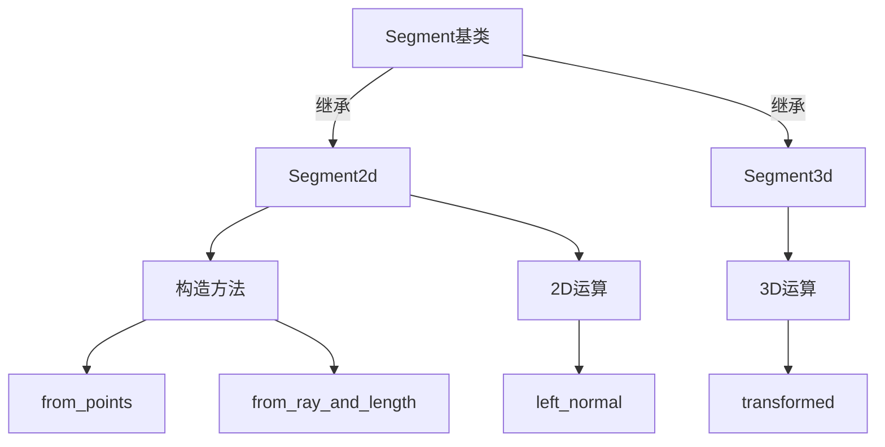

+++
title = "#18206 Improve `Segment2d`/`Segment3d` API and docs"
date = "2025-03-09T00:00:00"
draft = false
template = "pull_request_page.html"
in_search_index = false

[extra]
current_language = "zh-cn"
available_languages = {"zh-cn" = { name = "中文", url = "/pull_request/bevy/2025-03/pr-18206-zh-cn-20250309" }, "en" = { name = "English", url = "/pull_request/bevy/2025-03/pr-18206-en-20250309" }}
+++

# #18206 Improve `Segment2d`/`Segment3d` API and docs

## Basic Information
- **Title**: Improve `Segment2d`/`Segment3d` API and docs
- **PR Link**: https://github.com/bevyengine/bevy/pull/18206
- **Author**: Jondolf
- **Status**: MERGED
- **Created**: 2025-03-09T13:03:56Z
- **Merged**: 2025-03-10T08:22:15Z
- **Merged By**: cart

## Description Translation
### 目标

在#17404重构后，`Segment2d`和`Segment3d`类型已改为由两个端点定义，而非原来的方向向量和半长度。然而，现有的API仍然非常基础且功能有限，文档也存在不一致和过时的问题。

### 解决方案

为`Segment2d`和`Segment3d`新增以下辅助方法：
- `from_scaled_direction`
- `from_ray_and_length` 
- `length_squared`
- `direction`
- `try_direction`
- `scaled_direction`
- `transformed`
- `reversed`

`Segment2d`新增2D专有方法：
- `left_normal`
- `try_left_normal`
- `scaled_left_normal`
- `right_normal` 
- `try_right_normal`
- `scaled_right_normal`

同时新增`From` trait实现，允许将`[Vec2; 2]`和`(Vec2, Vec2)`转换为`Segment2d`（3D同理）。

更新文档以提高准确性和一致性，并简化部分方法实现。

---

### 先前实现参考

Parry库的[`Segment`](https://docs.rs/parry2d/latest/parry2d/shape/struct.Segment.html)类型包含类似方法，但本次实现更加全面。这些方法对几何算法开发非常有用。

## The Story of This Pull Request

### 问题起源：重构后的成长阵痛

故事的开始要追溯到PR#17404，那次重构将线段（Segment）的表示方式从「方向向量+半长度」改为更直观的「双端点」定义。这种改变虽然更符合几何直觉，却像新生儿般功能薄弱——开发者只能进行最基本的操作，文档也如同未完成的草图，与实际实现存在脱节。

想象你正在开发一个2D物理引擎，需要计算线段的法线方向来进行碰撞检测。在旧版API下，你不得不手动计算方向向量，再通过旋转得到法线，整个过程如同用原始工具雕刻：
```rust
let segment = Segment2d::from_points(a, b);
let dir = (b - a).normalize(); // 手动计算方向
let normal = dir.rotate(PI/2); // 手动旋转得到法线
```
这种重复劳动不仅低效，还容易引入计算错误。而文档的缺失更让新手开发者如同在迷雾中摸索。

### 开发者的工具箱扩展

Jondolf像一位细心的工匠，开始为线段类型打造完整的工具套装。核心思路是：**提供丰富的构造方法和几何运算，同时保持API的直观性**。

**构造方法的艺术**：新增`from_scaled_direction`允许通过起点和缩放后的方向向量创建线段，这在动画系统中非常实用。比如角色挥剑的轨迹可以这样描述：
```rust
let sword_slash = Segment2d::from_scaled_direction(start_pos, direction * attack_range);
```

**几何变换的优雅处理**：`transformed`方法将仿射变换（affine transformation）应用到线段，使得物体移动后的碰撞体计算变得简单：
```rust
let world_segment = local_segment.transformed(&transform);
```

**安全与效率的平衡**：`try_direction`系列方法通过`Option`类型优雅处理零向量情况，而`length_squared`避免平方根计算，这对需要频繁比较距离的游戏物理系统至关重要。

### 2D专有的几何魔法

在二维世界中，法线方向有左右之分。新增的`left_normal`和`right_normal`方法如同给开发者配备了指南针：
```rust
// 计算多边形边的向外法线用于碰撞检测
let outward_normal = if is_clockwise { segment.right_normal() } else { segment.left_normal() };
```
`try_`前缀的方法则像安全网，防止在零长度线段上操作导致程序崩溃。

### 文档：照亮前路的明灯

每个方法都配上了详实的文档示例，比如`reversed`方法的文档不仅说明功能，还提示使用场景：
```rust
/// 反转线段方向（交换端点）
/// 在路径查找算法中保持线段方向一致性时非常有用
pub fn reversed(self) -> Self {
    Self([self.1, self.0])
}
```

### 架构的涟漪效应

这些改变在代码库中引发连锁反应：
1. **Gizmos模块**简化了线段绘制逻辑，现在可以直接使用线段类型而无需手动处理端点
2. **碰撞检测系统**能直接获取精确的方向向量和法线
3. **序列化/反序列化**受益于`From` trait实现，支持更自然的数据结构转换

## Visual Representation



## Key Files Changed

### `crates/bevy_math/src/primitives/dim2.rs` (+185/-24)
**核心改动**：实现2D线段的全套几何工具
```rust
// 新增法线计算方法
pub fn left_normal(self) -> Vec2 {
    let direction = self.direction();
    Vec2::new(-direction.y, direction.x)
}

// 支持从数组直接转换
impl From<[Vec2; 2]> for Segment2d {
    fn from(points: [Vec2; 2]) -> Self {
        Self(points)
    }
}
```

### `crates/bevy_math/src/primitives/dim3.rs` (+123/-29)
**三维扩展**：将2D的设计理念延伸到3D空间
```rust
// 3D方向向量计算
pub fn direction(self) -> Vec3 {
    (self.1 - self.0).normalize()
}

// 空间变换支持
pub fn transformed(self, transform: &Transform) -> Self {
    Self([
        transform.transform_point(self.0), 
        transform.transform_point(self.1)
    ])
}
```

### `crates/bevy_gizmos/src/primitives/dim3.rs` (+1/-4)
**绘制优化**：简化Gizmo绘制调用
```rust
// 修改前：需要手动解构线段
gizmos.line_3d(segment.start, segment.end, color);

// 修改后：直接使用线段类型
gizmos.line_3d(segment.0, segment.1, color);
```

## Further Reading

1. **计算几何基础**：《Computational Geometry: Algorithms and Applications》第三版——理解线段运算在碰撞检测中的应用
2. **Rust类型设计**：[Rust API Guidelines](https://rust-lang.github.io/api-guidelines/)——学习如何设计符合人体工学的API
3. **Parry物理引擎**：[parry2d文档](https://docs.rs/parry2d/latest/parry2d/)——参考成熟的几何处理实现
4. **Bevy变换系统**：[Bevy Transform文档](https://docs.rs/bevy_transform/latest/bevy_transform/)——理解`transformed`方法背后的坐标变换原理