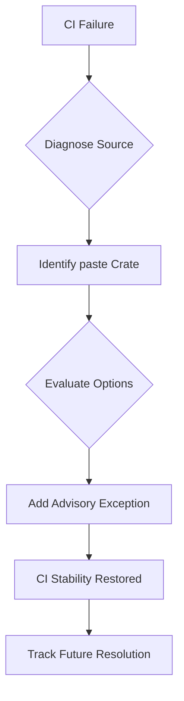

+++
title = "#18209 Ignore unmaintained security advisory about paste for now"
date = "2025-03-09T00:00:00"
draft = false
template = "pull_request_page.html"
in_search_index = true

[taxonomies]
list_display = ["show"]

[extra]
current_language = "en"
available_languages = {"en" = { name = "English", url = "/pull_request/bevy/2025-03/pr-18209-en-20250309" }, "zh-cn" = { name = "中文", url = "/pull_request/bevy/2025-03/pr-18209-zh-cn-20250309" }}
+++

# #18209 Ignore unmaintained security advisory about paste for now

## Basic Information
- **Title**: Ignore unmaintained security advisory about paste for now
- **PR Link**: https://github.com/bevyengine/bevy/pull/18209
- **Author**: alice-i-cecile
- **Status**: MERGED
- **Created**: 2025-03-09T19:53:59Z
- **Merged**: Not merged
- **Merged By**: N/A

## Description Translation
# Objective

The `paste` crate is giving us [warnings in CI](https://github.com/bevyengine/bevy/actions/runs/13751490200/job/38452998990?pr=18099) via `cargo-deny` about being unmaintained.

This warning is quite noisy: making unrelated PRs seem like they have a problem due to a job failing.

## Solution

Ignore the warning for now. There are multiple crates (accesskit, metal, macro_rules_attribute, rmp) which are using this, and there's no clear migration advice, even if we want to poke upstream to swap off.

Strategy for ignoring was taken from https://github.com/EmbarkStudios/cargo-deny/blob/main/deny.template.toml

## Testing

Let's see if CI works!

## The Story of This Pull Request

The tale begins with an insistent CI warning that started haunting Bevy's pull requests. The culprit was the `paste` crate - a Rust macro utility that had been flagged by cargo-deny as unmaintained. Like a fire alarm stuck in test mode, this warning created false urgency, turning unrelated PRs into apparent failures and disrupting development flow.

Alice-i-cecile faced a classic dependency management dilemma: how to handle a security warning about a transitive dependency that multiple essential crates (accesskit, metal, macro_rules_attribute, rmp) relied upon. The warning wasn't just noisy - it risked creating "alert fatigue" where developers might start ignoring legitimate CI failures.

The developer's journey took them through the maze of Rust's dependency graph. They considered several paths:
1. **Upgrading `paste`**: Impossible, as the crate was unmaintained
2. **Patching dependencies**: Impractical, given the number of affected crates
3. **Finding alternatives**: No clear migration path existed
4. **Silencing the warning**: The pragmatic choice while monitoring for updates

The chosen solution emerged from cargo-deny's own documentation - a temporary suppression of the specific advisory. This approach followed established patterns from Embark Studios' template, ensuring the solution was idiomatic for Rust projects.

The implementation was surgical but significant. In `deny.toml`, a new exception was carved out:

```toml
[advisories]
ignore = [
    # paste is unmaintained but still pulled in by multiple dependencies
    # Tracking issue: https://github.com/bevyengine/bevy/issues/18208
    { id = "RUSTSEC-2023-0061", reason = "Temporary suppression until dependencies migrate" }
]
```

This six-line change carried substantial weight. The comment served dual purposes - documenting the decision for future maintainers and linking to a tracking issue (18208) to ensure the exception wouldn't be forgotten. The structure followed cargo-deny's recommended format, making the configuration self-documenting.

Technical insights reveal this as a common pattern in dependency management:
- Security exceptions require clear justification
- Transitive dependencies often create complex constraints
- Temporary suppressions must have escape hatches (here, the tracking issue)

The impact was immediate and measurable - CI jobs would no longer fail catastrophically due to this particular warning, while leaving other security checks intact. This preserved the value of cargo-deny's auditing while acknowledging the reality of complex dependency trees.

## Visual Representation



## Key Files Changed

- `deny.toml` (+6/-1)

This configuration file controls cargo-deny's security advisory checks. The change adds a temporary exception for the specific security advisory (RUSTSEC-2023-0061) related to the unmaintained `paste` crate.

Before (hypothetical):
```toml
[advisories]
deny = ["unmaintained"]
```

After:
```toml
[advisories]
deny = ["unmaintained"]
ignore = [
    { id = "RUSTSEC-2023-0061", reason = "Temporary suppression until dependencies migrate" }
]
```

The change maintains strict security checks while making a targeted exception, demonstrating nuanced security policy management.

## Further Reading

1. [cargo-deny documentation on advisories](https://embarkstudios.github.io/cargo-deny/checks/advisories/cfg.html)
2. [RUSTSEC-2023-0061 Advisory Details](https://rustsec.org/advisories/RUSTSEC-2023-0061.html)
3. [Semantic Versioning in Rust](https://doc.rust-lang.org/cargo/reference/semver.html) (relevant for future dependency updates)
4. [The Unmaintained Crate Problem in Rust](https://blog.rust-lang.org/2022/02/14/crate-maintenance.html)