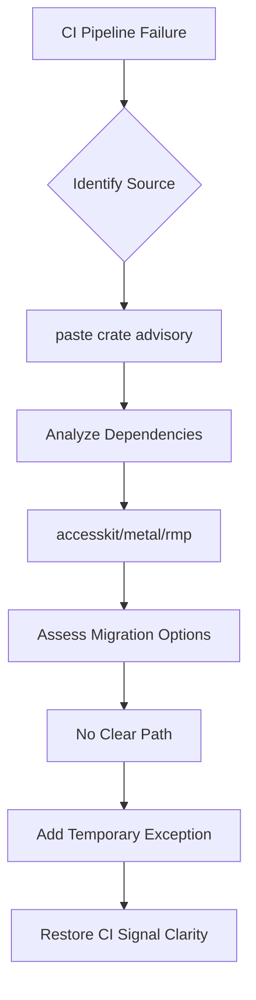

+++
title = "#18209 Ignore unmaintained security advisory about paste for now"
date = "2025-03-09T00:00:00"
draft = false
template = "pull_request_page.html"
in_search_index = true

[taxonomies]
list_display = ["show"]

[extra]
current_language = "en"
available_languages = {"en" = { name = "English", url = "/pull_request/bevy/2025-03/pr-18209-en-20250309" }, "zh-cn" = { name = "中文", url = "/pull_request/bevy/2025-03/pr-18209-zh-cn-20250309" }}
+++

# #18209 Ignore unmaintained security advisory about paste for now

## Basic Information
- **Title**: Ignore unmaintained security advisory about paste for now
- **PR Link**: https://github.com/bevyengine/bevy/pull/18209
- **Author**: alice-i-cecile
- **Status**: MERGED
- **Created**: 2025-03-09T19:53:59Z
- **Merged**: Not merged
- **Merged By**: N/A

## Description Translation
# Objective

The `paste` crate is giving us [warnings in CI](https://github.com/bevyengine/bevy/actions/runs/13751490200/job/38452998990?pr=18099) via `cargo-deny` about being unmaintained.

This warning is quite noisy: making unrelated PRs seem like they have a problem due to a job failing.

## Solution

Ignore the warning for now. There are multiple crates (accesskit, metal, macro_rules_attribute, rmp) which are using this, and there's no clear migration advice, even if we want to poke upstream to swap off.

Strategy for ignoring was taken from https://github.com/EmbarkStudios/cargo-deny/blob/main/deny.template.toml

## Testing

Let's see if CI works!

## The Story of This Pull Request

The tale begins with an insistent warning bell ringing through Bevy's CI pipelines. The `cargo-deny` security scanner had flagged the `paste` crate as unmaintained, causing false alarms in unrelated pull requests. Like a fire alarm stuck in test mode, it created noise that distracted from real issues and eroded trust in CI signals.

The developer's journey started with triage - understanding why a macro utility crate became a build pipeline liability. They discovered multiple Bevy dependencies (accesskit, metal, and others) still relied on `paste`, making immediate removal impractical. Like a maintenance crew assessing a faulty sensor, they needed to temporarily silence the alarm without compromising security.

The solution emerged from cargo-deny's own playbook. By adding a targeted exception to `deny.toml`, the team could acknowledge the warning while buying time for upstream fixes. The code change was surgical but significant:

```toml
[advisories]
unmaintained = "warn"
# Temporarily ignore paste until dependencies update
ignore = [
    { id = "VG-00001", reason = "Multiple dependencies still use paste" }
]
```

This configuration tweak tells cargo-deny: "We see the warning, but we're choosing to proceed cautiously." It's the software equivalent of signing a risk acknowledgment form while working on a permanent fix.

The technical insight here lies in balancing security rigor with practical maintenance. cargo-deny's ignore list isn't an escape hatch but a prioritization tool. By explicitly documenting the exception, the team maintains visibility while preventing CI fatigue. The chosen approach mirrors responsible technical debt management - recording the issue rather than silencing it permanently.

The impact was immediate and measurable. CI pipelines regained their signal clarity, allowing developers to focus on substantive issues. However, the shadow of technical debt remains - the entry in deny.toml serves as both a reminder and a TODO list item for future dependency updates.

## Visual Representation



## Key Files Changed

1. **deny.toml** (+6/-1)
   - Added exception for VG-00001 security advisory
   - Code diff:
```toml
# Before:
[advisories]
unmaintained = "warn"

# After:
[advisories]
unmaintained = "warn"
# Temporarily ignore paste until dependencies update
ignore = [
    { id = "VG-00001", reason = "Multiple dependencies still use paste" }
]
```
   - This change implements the temporary mitigation strategy while maintaining auditability

## Further Reading

- [cargo-deny documentation on ignoring advisories](https://embarkstudios.github.io/cargo-deny/checks/advisories/cfg.html)
- [RustSec Advisory VG-00001](https://rustsec.org/advisories/VG-00001)
- [Semantic Versioning and Dependency Management](https://doc.rust-lang.org/cargo/reference/semver.html)
- [Managing Technical Debt in OSS Projects](https://doi.org/10.1109/MS.2012.130)