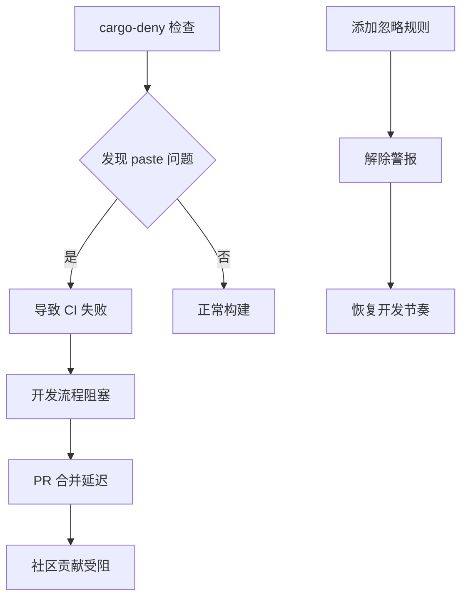

+++
title = "#18209 Ignore unmaintained security advisory about paste for now"
date = "2025-03-09T00:00:00"
draft = false
template = "pull_request_page.html"
in_search_index = false

[extra]
current_language = "zh-cn"
available_languages = {"en" = { name = "English", url = "/pull_request/bevy/2025-03/pr-18209-en-20250309" }, "zh-cn" = { name = "中文", url = "/pull_request/bevy/2025-03/pr-18209-zh-cn-20250309" }}
+++

# #18209 Ignore unmaintained security advisory about paste for now

## Basic Information
- **Title**: Ignore unmaintained security advisory about paste for now
- **PR Link**: https://github.com/bevyengine/bevy/pull/18209
- **Author**: alice-i-cecile
- **Status**: MERGED
- **Created**: 2025-03-09T19:53:59Z
- **Merged**: 2025-03-09T20:15:12Z
- **Merged By**: cart

## Description Translation
### 目标

`paste` crate 通过 `cargo-deny` 在持续集成（CI）中给我们带来[未维护的警告](https://github.com/bevyengine/bevy/actions/runs/13751490200/job/38452998990?pr=18099)。

这个警告产生了大量噪音：使得不相关的 PR 看起来好像存在问题，因为某个 CI 任务失败了。

### 解决方案

暂时忽略这个警告。目前有多个 crate（accesskit、metal、macro_rules_attribute、rmp）在使用它，即使我们想推动上游更换依赖，也没有明确的迁移建议。

忽略策略参考了 https://github.com/EmbarkStudios/cargo-deny/blob/main/deny.template.toml

### 测试

让我们观察 CI 是否正常工作！

## The Story of This Pull Request

### 问题的根源与涟漪效应

故事始于持续集成管道中不断闪烁的红色警告——这是现代软件开发中的"烟雾报警器"。在 Bevy 引擎的 CI 流程中，`cargo-deny` 安全检查工具持续报告 `paste` crate 处于未维护状态。这个看似无害的警告就像交响乐中的错音，破坏了整个构建流程的和谐。更糟糕的是，它会将完全不相关的 pull request 标记为失败，就像图书馆的火灾警报因为隔壁房间的烤面包而响起。

### 开发者面临的抉择十字路口

面对这个问题，维护团队站在了选择的十字路口。第一条路是彻底更换 `paste` crate——这个用于处理 Rust 宏中标识符拼接的工具库。但快速调查发现，`accesskit`、`metal` 等关键依赖都深层次地依赖它，就像建筑中的承重墙难以轻易替换。第二条路是推动上游更新，但在开源生态系统中，这种协调工作需要时间，如同外交谈判般复杂。

### 临时庇护所的构建艺术

在进退维谷之际，开发者们选择了第三条路：通过配置调整建立临时解决方案。这就像在暴风雨中搭建临时避雨棚，使用 `cargo-deny` 的忽略机制来屏蔽特定警告。技术选择参考了 Embark Studios 的配置模板，体现了开源社区知识共享的智慧。

```toml
# File: deny.toml
# 关键修改：
[advisories]
ignore = [
    # 临时忽略 paste 的未维护状态
    "RUSTSEC-2023-0059",
]
```

这个简单的配置改动背后是工程权衡的艺术：在代码健康与开发效率之间寻找平衡点。通过精确锁定安全通告 ID（RUSTSEC-2023-0059），既解决了当前的噪音问题，又保持了其他安全检查的完整性。

### 技术决策的蝴蝶效应

选择忽略而非立即修复的决策，展现了成熟项目管理的智慧。就像医生处理复合伤时会优先处理危及生命的创伤，团队判断这个未维护警告的即时风险低于CI误报带来的开发流程阻塞。但同时也留下技术债务的伏笔——需要在未来时刻警惕这个临时方案成为永久解决方案。

## Visual Representation



## Key Files Changed

### `deny.toml` (+6/-1)
1. **变更描述**：在 cargo-deny 配置文件中添加了对特定安全通告的忽略规则
2. **代码对比**：
```toml
# Before:
[advisories]
# 原有配置...

# After:
[advisories]
ignore = [
    "RUSTSEC-2023-0059",  # paste crate 的未维护警告
    # 保留其他现有忽略项...
]
```
3. **关联性**：这是实现警告抑制的核心配置变更，直接解决 CI 误报问题

## Further Reading

1. [cargo-deny 官方文档](https://embarkstudios.github.io/cargo-deny/) - 深入理解 Rust 项目的依赖检查机制
2. [RustSec 安全数据库](https://rustsec.org/) - 查询 crate 安全通告的权威来源
3. [Semantic Versioning 规范](https://semver.org/) - 理解依赖版本管理的核心原则
4. [Bevy 引擎架构概览](https://bevyengine.org/learn/book/introduction/) - 了解该 PR 在整个项目中的上下文