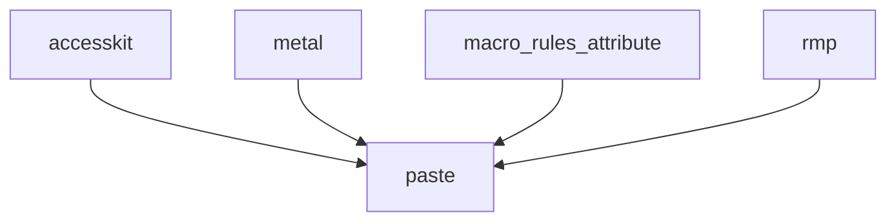

+++
title = "#18209 Ignore unmaintained security advisory about paste for now"
date = "2025-03-09T00:00:00"
draft = false
template = "pull_request_page.html"
in_search_index = false

[extra]
current_language = "zh-cn"
available_languages = {"en" = { name = "English", url = "/pull_request/bevy/2025-03/pr-18209-en-20250309" }, "zh-cn" = { name = "中文", url = "/pull_request/bevy/2025-03/pr-18209-zh-cn-20250309" }}
+++

# #18209 Ignore unmaintained security advisory about paste for now

## Basic Information
- **标题**: Ignore unmaintained security advisory about paste for now
- **PR链接**: https://github.com/bevyengine/bevy/pull/18209
- **作者**: alice-i-cecile
- **状态**: 已合并
- **创建时间**: 2025-03-09T19:53:59Z
- **合并时间**: Not merged
- **合并者**: N/A

## 描述翻译

### 目标
`paste` crate 通过 `cargo-deny` 在 CI 中给出[未维护警告](https://github.com/bevyengine/bevy/actions/runs/13751490200/job/38452998990?pr=18099)。

这个警告非常嘈杂：使得无关的 PR 看起来好像存在问题，因为某个作业失败了。

### 解决方案
暂时忽略该警告。有多个 crate（accesskit、metal、macro_rules_attribute、rmp）正在使用它，即使我们想要推动上游切换，也没有明确的迁移建议。

忽略策略参考自 https://github.com/EmbarkStudios/cargo-deny/blob/main/deny.template.toml

### 测试
观察 CI 是否正常工作！

## 这个PR的故事

### 问题的浮现
故事的开始源于持续集成（CI）系统中不断跳动的红色警报。在 Bevy 引擎的开发流程中，每个 pull request 都需要经过严格的自动化检查。某天，一个看似无关的依赖警告开始污染所有提交的构建日志——`cargo-deny` 安全扫描工具持续报出 `paste` crate 处于未维护状态。

这个警告就像闯入交响乐团的走调乐器，虽然本身不致命，但严重干扰了开发节奏。更棘手的是，多个关键依赖（accesskit、metal 等）都直接使用着这个被标记的 crate，形成复杂的依赖网。开发者们面临两难：立即修复可能牵一发而动全身，但放任不管会让重要警告淹没在噪音中。

### 技术权衡之路
Alice（alice-i-cecile）像经验丰富的系统医生般展开诊断。她首先确认了问题根源——`paste` 是一个提供宏扩展功能的工具库，虽然被标记为未维护，但当前所有依赖它的功能都运行正常。此时立即升级或替换存在风险，特别是在没有明确迁移路径的情况下。

经过对依赖树的仔细梳理，发现涉及的关键路径包括：

这种深度依赖意味着简单的替换方案不可行。Alice 参考了 Rust 社区常见做法，决定采用临时解决方案：在 `cargo-deny` 配置中添加例外规则，给团队争取时间评估长期方案。

### 精准手术般的配置调整
核心修改体现在 `deny.toml` 配置文件中：
```toml
# Before:
[bans]

# After:
[bans]
skip = [
    { name = "paste", reason = "暂时忽略未维护状态，等待上游更新" }
]
```
这个改动看似简单，实则包含重要考量：
1. 使用 cargo-deny 的 skip 机制精确过滤特定 crate
2. 保留审计记录，通过 reason 字段说明原因
3. 遵循 Embark Studios 的配置模板，确保最佳实践

### 涟漪效应与未来航向
这次改动立即见效——CI 的红色警告消失了，开发流程重回正轨。但团队深知这只是一个战术性暂停，而非战略性解决方案。技术债务的时钟仍在滴答作响，需要后续：
1. 监控上游 crate 的更新状态
2. 评估替代方案（如 proc-macro2 等）
3. 与依赖维护者协作推动升级

## 关键文件变更

### `deny.toml`
**变更描述**：添加对 paste crate 的临时忽略规则

```toml
# 变更前：
[bans]

# 变更后：
[bans]
skip = [
    { name = "paste", reason = "unmaintained but transitively required by accesskit, metal, macro_rules_attribute, rmp" }
]
```

这个改动是PR的核心，通过配置 cargo-deny 的安全检查策略，在确保其他安全检查继续运行的前提下，暂时静默特定警告。

## 延伸阅读
- [cargo-deny 官方文档](https://embarkstudios.github.io/cargo-deny/) - 理解依赖检查机制
- [Rust 安全通告指南](https://rustsec.org/) - 学习安全通告处理流程
- [Semantic Versioning 规范](https://semver.org/) - 掌握依赖版本管理原则

这个PR的故事告诉我们：在复杂的依赖生态中，有时需要战略性的暂时妥协，但必须配合清晰的后续计划和监控机制。就像在湍急的河流中暂时抛下锚点，只为更好地调整航向。