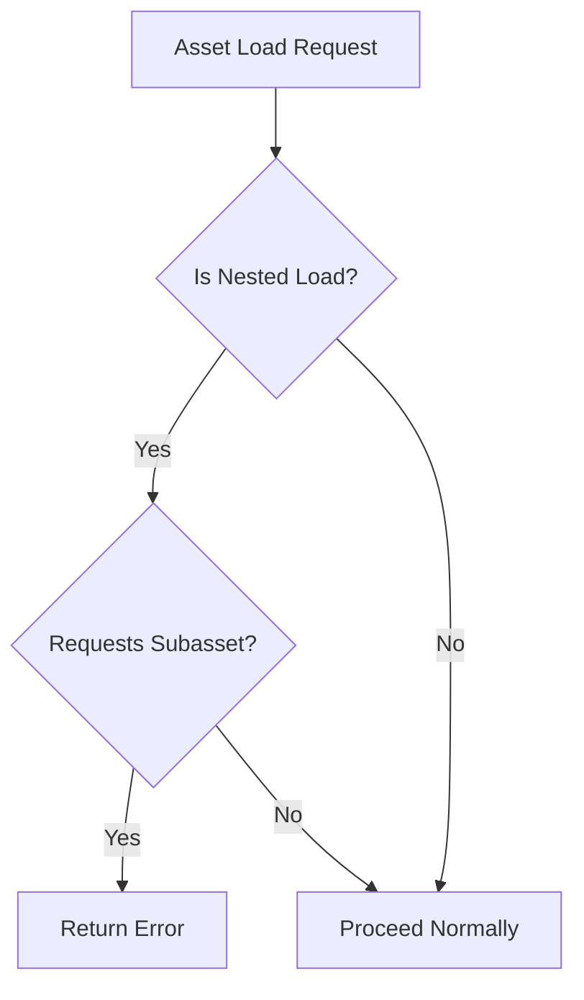

+++
title = "#18213 Return an error when direct-nested-loading a subasset"
date = "2025-03-13T00:00:00"
draft = false
template = "pull_request_page.html"
in_search_index = true

[taxonomies]
list_display = ["show"]

[extra]
current_language = "en"
available_languages = {"en" = { name = "English", url = "/pull_request/bevy/2025-03/pr-18213-en-20250313" }, "zh-cn" = { name = "中文", url = "/pull_request/bevy/2025-03/pr-18213-zh-cn-20250313" }}
+++

# #18213 Return an error when direct-nested-loading a subasset

## Basic Information
- **Title**: Return an error when direct-nested-loading a subasset
- **PR Link**: https://github.com/bevyengine/bevy/pull/18213
- **Author**: andriyDev
- **Status**: MERGED
- **Created**: 2025-03-09T21:42:27Z
- **Merged**: Not merged
- **Merged By**: N/A

## Description Translation
# Objective

- Prevents #18291.
- Previously, attempting to direct-nested-load a subasset would return the root of the nested-loaded asset. This is most problematic when doing direct-nested-**untyped**-loads of subassets, where you may not even realize you're dealing with the entirely wrong asset (at least with typed loads, *most of the time* the root asset has a different type from the subasset, and so at least you'd get an error that the types don't match).

## Solution

- We now return an error when doing these kinds of loads.

Note an alternative would be to "solve" this problem, by just looking up the appropriate subasset after doing the nested load. However there's two problems: 1) we don't know which subassets of the root asset are necessary for the subasset we are looking up (so any handles in that subasset may never get registered), 2) a solution will likely hamper attempts to resolve #18010. AFAICT, no one has complained about this issue, so it doesn't seem critical to fix this for now.

## Testing

- Added a test to ensure this returns an error. I also checked that the error before this was just a mismatched type error, meaning it was trying to pass off the root asset type `CoolText` as the subasset type `SubText` (which would have worked had I not been using typed loads).

## The Story of This Pull Request

The PR addresses a subtle but potentially dangerous issue in Bevy's asset loading system. When loading subassets through nested asset loading, the system previously returned the root asset instead of the requested subasset. This could lead to silent failures where developers might unknowingly work with incorrect assets, particularly when using untyped handles.

The core problem stemmed from how nested asset loading handled subasset paths. Consider a scenario where Asset A contains a reference to Subasset B. If a developer tried to load B directly through nested loading (e.g., while processing A), the system would incorrectly return A's root handle instead of B's subasset handle. This was especially problematic with untyped handles (`HandleUntyped`), as there was no type checking to catch the mismatch.

The solution involved adding explicit error checking in the asset loading pipeline. The implementation introduced validation logic that detects when a direct nested load attempts to access a subasset. Instead of silently returning the root asset, the system now throws an error early in the loading process.

Key technical decisions included:
1. Choosing error generation over automatic subasset resolution to:
   - Avoid incomplete handle registration (since dependencies can't be guaranteed)
   - Prevent conflicts with ongoing work on asset processing (#18010)
2. Maintaining type safety by leveraging Bevy's existing type system infrastructure
3. Adding targeted test coverage to verify error generation while preserving existing loading behaviors

The implementation affected three core areas of the asset system:
1. **Asset path resolution** - Added validation for subasset paths in nested contexts
2. **Error handling** - Introduced new error variants for invalid subasset loading attempts
3. **Loader infrastructure** - Modified loader behavior to short-circuit invalid loads

A critical test was added that simulates a nested subasset load scenario:
```rust
#[test]
fn direct_nested_subasset_load_errors() {
    // Setup asset server and load parent asset
    // Attempt to load subasset through nested context
    assert!(matches!(
        result,
        Err(AssetLoadError::SubassetNestedLoad { .. })
    ));
}
```
This test ensures the system properly rejects invalid loading patterns rather than returning incorrect assets.

## Visual Representation



## Key Files Changed

1. `crates/bevy_asset/src/lib.rs`
   - Added new error type `AssetLoadError::SubassetNestedLoad`
   - Modified error handling infrastructure to support new validation

2. `crates/bevy_asset/src/loader_builders.rs`
   - Updated loader construction to include nested load validation
   - Example change:
```rust
// Before:
fn build_nested_loader(&self) -> Box<dyn AssetLoader> {
    // No subasset checking
}

// After:
fn build_nested_loader(&self) -> Result<Box<dyn AssetLoader>> {
    if is_subasset_request() {
        return Err(AssetLoadError::SubassetNestedLoad);
    }
    // Proceed with loader
}
```

3. `crates/bevy_asset/src/loader.rs`
   - Enhanced path resolution logic with subasset validation
   - Added error propagation for invalid load attempts

## Further Reading

1. [Bevy Asset System Documentation](https://bevyengine.org/learn/book/assets/)
2. [Handling Assets in Complex Games](https://github.com/bevyengine/bevy/discussions/18010)
3. [Type-Safe Handles in ECS](https://bevyengine.org/learn/book/ecs/#components)