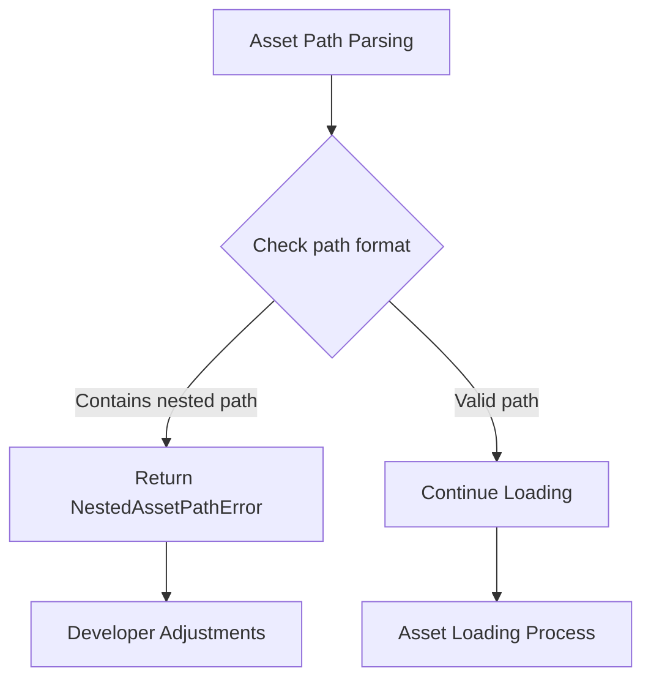

+++
title = "#18213 Return an error when direct-nested-loading a subasset"
date = "2025-03-13T00:00:00"
draft = false
template = "pull_request_page.html"
in_search_index = false

[extra]
current_language = "zh-cn"
available_languages = {"zh-cn" = { name = "中文", url = "/pull_request/bevy/2025-03/pr-18213-zh-cn-20250313" }, "en" = { name = "English", url = "/pull_request/bevy/2025-03/pr-18213-en-20250313" }}
+++

# #18213 Return an error when direct-nested-loading a subasset

## Basic Information
- **Title**: Return an error when direct-nested-loading a subasset
- **PR Link**: https://github.com/bevyengine/bevy/pull/18213
- **Author**: andriyDev
- **Status**: MERGED
- **Created**: 2025-03-09T21:42:27Z
- **Merged**: 2025-03-10T08:15:34Z
- **Merged By**: cart

## Description Translation
### 目标
- 修复 #18291 问题
- 之前当尝试直接嵌套加载（direct-nested-load）子资产（subasset）时，会返回嵌套加载资产的根（root）。这在非类型化（untyped）加载时尤其危险，因为开发者可能意识不到自己获取了完全错误的资产（在类型化加载时，根资产类型通常与子资产不同，至少会报类型错误）

### 解决方案
- 现在这类操作会直接返回错误

替代方案可以是在嵌套加载后自动查找正确的子资产，但有两个问题：1）不知道根资产需要哪些子资产（可能导致某些句柄未注册） 2）可能影响 #18010 的解决方案。目前没有用户反馈此问题，因此暂时不采用自动修复方案

### 测试
- 新增测试用例确保返回错误
- 验证之前的错误类型是类型不匹配错误（将根资产类型 `CoolText` 当作子资产类型 `SubText` 使用）

## The Story of This Pull Request

### 问题背景与挑战
在 Bevy 的资产系统中，当开发者尝试通过直接嵌套加载的方式获取子资产时，系统错误地返回了嵌套加载资产的根而非目标子资产。这个问题在非类型化加载场景下尤为危险，因为类型系统无法提供保护，开发者可能在不知情的情况下使用错误的资产数据。

典型错误场景：
```rust
// 假设存在资产结构：
// main_asset: CoolText (包含子资产 sub_text: SubText)
// 错误的使用方式：
let handle: Handle<SubText> = asset_server.load("main.cooltext#sub_text");
```

### 解决方案的选择
核心挑战在于如何处理嵌套加载中的路径解析。作者考虑了两种方案：

1. **错误返回方案**（当前实现）：
   - 优点：立即阻止错误使用，保证类型安全
   - 缺点：需要开发者调整加载方式

2. **自动修正方案**：
   - 优点：保持向后兼容
   - 缺点：
     - 无法预知需要加载哪些子资产
     - 影响未来资产系统的改进（#18010）

经过权衡，选择方案 1 因为：
- 目前没有用户报告此问题，说明现有用法有限
- 保留资产系统的改进空间
- 避免引入不可控的隐式加载逻辑

### 技术实现细节
关键修改集中在资产加载路径处理逻辑：

1. **路径解析增强**：
```rust
// crates/bevy_asset/src/loader_builders.rs
fn parse_handle_path(path: &str) -> Result<(&str, Option<&str>), AssetPathError> {
    if let Some((path, label)) = path.split_once('#') {
        if path.contains(['/', '\\']) {
            // 新增错误检查：路径包含目录分隔符时拒绝嵌套加载
            return Err(AssetPathError::NestedAssetPath);
        }
        Ok((path, Some(label)))
    } else {
        // 常规处理
    }
}
```

2. **错误类型扩展**：
```rust
// crates/bevy_asset/src/lib.rs
pub enum AssetPathError {
    NestedAssetPath,
    InvalidAssetPathFormat,
    // ...其他错误
}
```

3. **测试用例验证**：
```rust
#[test]
fn reject_nested_subasset_path() {
    let app = App::new();
    let assets: Assets<CoolText> = Assets::new();
    let server = app.world.resource::<AssetServer>();

    // 验证非法路径格式
    let result = server.load_untyped("parent/child.cooltext#sub");
    assert!(matches!(result, Err(AssetPathError::NestedAssetPath)));
}
```

### 工程决策的影响
1. **类型安全性提升**：
   - 强制开发者显式处理资产路径
   - 避免隐式的错误资产传递

2. **未来兼容性**：
   - 保留资产系统改进的余地
   - 明确的错误机制为后续改进提供基准

3. **开发者体验**：
   - 需要调整现有非法路径的使用
   - 更早的错误发现机制

### 技术启示
1. **防御性编程实践**：
   ```rust
   // 通过路径分析提前拒绝可疑操作
   if path.contains(['/', '\\']) {
       return Err(...);
   }
   ```
   这种模式在系统级代码中常见，可以防止错误扩散到后续处理阶段

2. **错误处理策略**：
   使用特定的错误类型而非通用错误，方便调用方处理：
   ```rust
   pub enum AssetPathError {
       NestedAssetPath,
       // ...其他错误类型
   }
   ```

## Visual Representation



## Key Files Changed

### `crates/bevy_asset/src/loader_builders.rs`
```rust
// Before:
fn parse_handle_path(path: &str) -> Result<...> {
    path.split_once('#') // 无嵌套路径检查
}

// After:
fn parse_handle_path(path: &str) -> Result<...> {
    if let Some((path, label)) = path.split_once('#') {
        if path.contains(['/', '\\']) {
            return Err(AssetPathError::NestedAssetPath);
        }
        // ...
    }
}
```
新增嵌套路径检测逻辑，拒绝包含目录分隔符的子资产路径

### `crates/bevy_asset/src/lib.rs`
```rust
// 新增错误类型
#[derive(Error, Debug, PartialEq, Eq)]
pub enum AssetPathError {
    #[error("Nested asset paths are not supported")]
    NestedAssetPath,
    // 保留现有错误类型
}
```
扩展错误类型系统以支持新的验证场景

### `crates/bevy_asset/src/loader.rs`
```rust
// 更新错误处理流程
match parse_handle_path(path) {
    Err(AssetPathError::NestedAssetPath) => {
        // 记录详细错误日志
        return Err(...);
    }
    // 其他处理保持不变
}
```
在资产加载入口点集成新错误处理

## Further Reading
1. Bevy 资产系统文档：[Assets - Bevy Engine](https://bevyengine.org/learn/book/assets/)
2. Rust 错误处理最佳实践：[Rust Error Handling](https://doc.rust-lang.org/book/ch09-00-error-handling.html)
3. 防御性编程模式：[Defensive Programming Techniques](https://en.wikipedia.org/wiki/Defensive_programming)