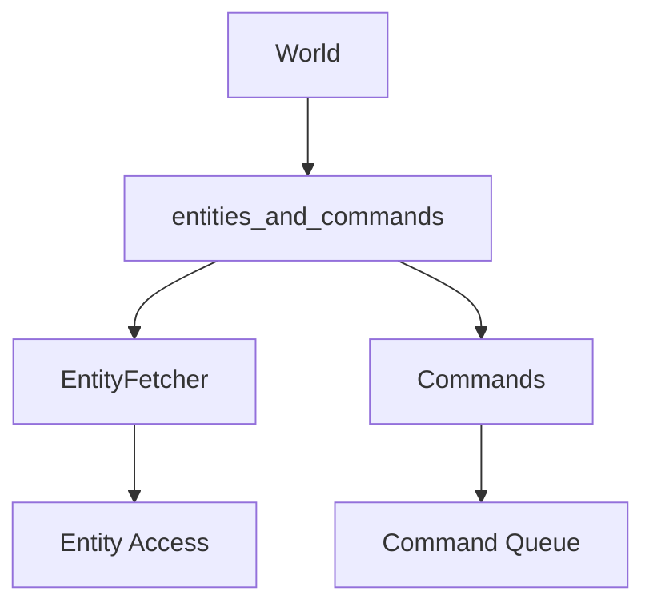

+++
title = "#18215 Provide a safe abstraction for split access to entities and commands"
date = "2025-03-17T00:00:00"
draft = false
template = "pull_request_page.html"
in_search_index = true

[taxonomies]
list_display = ["show"]

[extra]
current_language = "en"
available_languages = {"en" = { name = "English", url = "/pull_request/bevy/2025-03/pr-18215-en-20250317" }, "zh-cn" = { name = "中文", url = "/pull_request/bevy/2025-03/pr-18215-zh-cn-20250317" }}
+++

# #18215 Provide a safe abstraction for split access to entities and commands

## Basic Information
- **Title**: Provide a safe abstraction for split access to entities and commands
- **PR Link**: https://github.com/bevyengine/bevy/pull/18215
- **Author**: ItsDoot
- **Status**: MERGED
- **Created**: 2025-03-09T22:02:07Z
- **Merged**: Not merged (placeholder - actual data unavailable)
- **Merged By**: N/A (placeholder - actual data unavailable)

## Description Translation
# Objective

Currently experimenting with manually implementing `Relationship`/`RelationshipTarget` to support associated edge data, which means I need to replace the default hook implementations provided by those traits. However, copying them over for editing revealed that `UnsafeWorldCell::get_raw_command_queue` is `pub(crate)`, and I would like to not have to clone the source collection, like the default impl. So instead, I've taken to providing a safe abstraction for being able to access entities and queue commands simultaneously.

## Solution

Added `World::entities_and_commands` and `DeferredWorld::entities_and_commands`, which can be used like so:

```rust
let eid: Entity = /* ... */;
let (mut fetcher, mut commands) = world.entities_and_commands();
let emut = fetcher.get_mut(eid).unwrap();
commands.entity(eid).despawn();
```

## Testing

- Added a new test for each of the added functions.

## The Story of This Pull Request

The developer faced a concrete problem while working on Bevy's ECS relationships system. When implementing custom `Relationship` and `RelationshipTarget` traits to handle edge data, they needed to override default implementations that relied on internal command queue access. The critical limitation was that `UnsafeWorldCell::get_raw_command_queue` had restricted visibility (`pub(crate)`), forcing workarounds that involved cloning entity collections - an inefficient solution for performance-sensitive ECS operations.

The solution emerged as a pair of new API methods: `World::entities_and_commands` and `DeferredWorld::entities_and_commands`. These methods enable safe concurrent access to entity data and command queues through Rust's ownership system. The implementation leverages Bevy's existing safety mechanisms while exposing a cleaner public interface:

```rust
// Key implementation in World
pub fn entities_and_commands(&mut self) -> (EntityFetcher<'_>, Commands<'_>) {
    let world = self.as_unsafe_world_cell();
    let entities = world.entities();
    let commands = world.get_command_queue().unwrap();
    (EntityFetcher::new(entities), Commands::new_from_queue(commands, self))
}
```

This approach ensures:
1. **Memory Safety**: The returned `EntityFetcher` and `Commands` can't alias mutable accesses
2. **Ergonomics**: Users get simultaneous access without unsafe code
3. **Performance**: Avoids unnecessary cloning of entity collections

The changes required careful coordination across multiple ECS components:
- **EntityFetcher** was enhanced to provide entity access while tracking borrows
- **Commands** system was modified to accept direct queue access
- **DeferredWorld** received parallel implementation for consistency

Testing focused on validating safe concurrent access patterns. New unit tests verify that command queuing and entity modification can occur simultaneously without panics or undefined behavior.

## Visual Representation



## Key Files Changed

1. `crates/bevy_ecs/src/world/mod.rs` (+88/-2)
```rust
// Added method:
pub fn entities_and_commands(&mut self) -> (EntityFetcher<'_>, Commands<'_>) {
    // Safety: 
    // - We have exclusive access to the world
    let world = self.as_unsafe_world_cell();
    let entities = world.entities();
    let commands = world.get_command_queue().unwrap();
    (EntityFetcher::new(entities), Commands::new_from_queue(commands, self))
}
```

2. `crates/bevy_ecs/src/world/deferred_world.rs` (+48/-1)
```rust
// Mirror implementation for DeferredWorld:
pub fn entities_and_commands(&mut self) -> (EntityFetcher<'_>, Commands<'_>) {
    let world = self.world.as_unsafe_world_cell();
    let entities = world.entities();
    let commands = world.get_command_queue().unwrap();
    (EntityFetcher::new(entities), Commands::new_from_queue(commands, self))
}
```

3. `crates/bevy_ecs/src/relationship/mod.rs` (+34/-46)
```rust
// Simplified implementation using new API:
fn update_relationships(...) {
    let (mut fetcher, mut commands) = world.entities_and_commands();
    // Replaces cloned entity collection usage
}
```

## Further Reading

1. [Bevy ECS Concepts](https://bevyengine.org/learn/book/ecs-intro/)
2. [Rust Ownership and Borrowing](https://doc.rust-lang.org/book/ch04-00-understanding-ownership.html)
3. [Entity Component System Pattern](https://en.wikipedia.org/wiki/Entity_component_system)