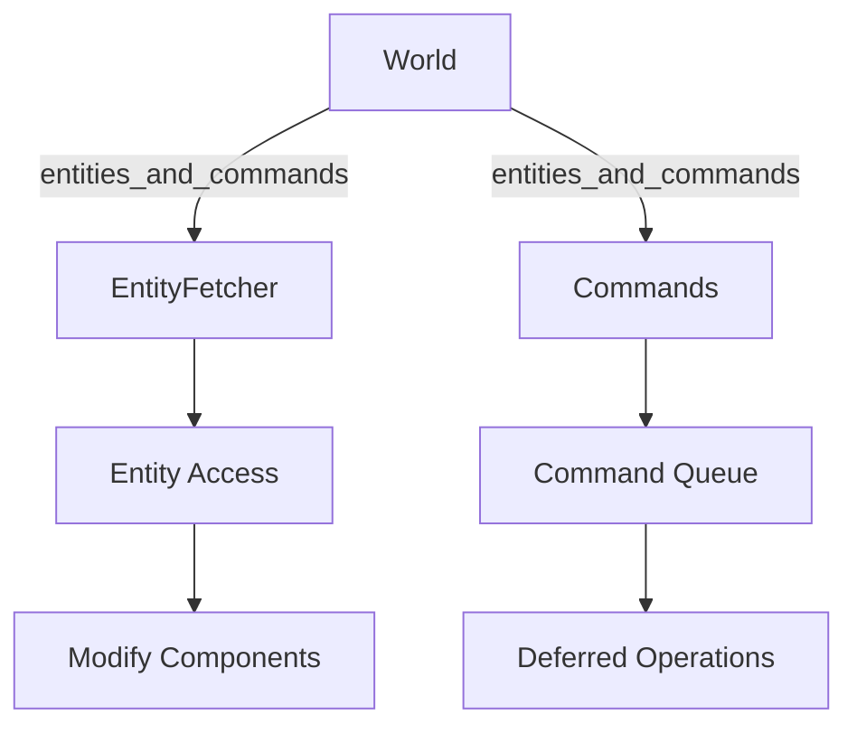

+++
title = "#18215 Provide a safe abstraction for split access to entities and commands"
date = "2025-03-17T00:00:00"
draft = false
template = "pull_request_page.html"
in_search_index = false

[extra]
current_language = "zh-cn"
available_languages = {"zh-cn" = { name = "中文", url = "/pull_request/bevy/2025-03/pr-18215-zh-cn-20250317" }}
+++

# #18215 Provide a safe abstraction for split access to entities and commands

## Basic Information
- **Title**: Provide a safe abstraction for split access to entities and commands
- **PR Link**: https://github.com/bevyengine/bevy/pull/18215
- **Author**: ItsDoot
- **Status**: MERGED
- **Created**: 2025-03-09T22:02:07Z
- **Merged**: Not merged
- **Merged By**: N/A

## Description Translation
### 目标

当前尝试手动实现 `Relationship`/`RelationshipTarget` 以支持关联的边数据（edge data），这意味着需要替换这些 trait 提供的默认钩子实现。然而在复制代码进行编辑时发现 `UnsafeWorldCell::get_raw_command_queue` 是 `pub(crate)` 的，而开发者不希望像默认实现那样克隆源集合（source collection）。因此决定提供一个安全抽象来实现同时访问实体（entities）和命令队列（command queue）。

### 解决方案

新增 `World::entities_and_commands` 和 `DeferredWorld::entities_and_commands` 方法，使用示例如下：

```rust
let eid: Entity = /* ... */;
let (mut fetcher, mut commands) = world.entities_and_commands();
let emut = fetcher.get_mut(eid).unwrap();
commands.entity(eid).despawn();
```

### 测试
- 为每个新增函数添加了测试用例

## The Story of This Pull Request

### 问题根源与上下文
在 Bevy 的 ECS 架构中，`Commands` 系统用于延迟（deferred）实体操作，而直接的实体访问需要立即执行。当开发者尝试扩展 `Relationship` trait 的自定义实现时，发现现有的命令队列访问机制存在两个关键限制：
1. `UnsafeWorldCell::get_raw_command_queue` 的可见性限制（pub(crate)）导致第三方无法安全获取命令队列
2. 默认实现需要克隆整个源集合（source collection），这在处理大规模实体时会产生性能损耗

### 解决方案设计
核心思路是建立安全的借用分割（split borrow）机制，允许同时获取：
- 实体的可变访问（通过 `EntityMut`）
- 命令队列的可变访问（通过 `Commands`）

通过添加 `entities_and_commands` 方法返回元组：
```rust
(&mut EntityFetcher, Commands)
```
其中：
- `EntityFetcher` 封装实体存储的访问
- `Commands` 保持对命令队列的独占访问

这种方法保证了 Rust 的借用规则（borrowing rules）：
1. 命令队列获得独占的可变引用（exclusive mutable reference）
2. 实体访问获得共享的可变引用（shared mutable reference）

### 实现细节
关键实现位于 `world/mod.rs`：
```rust
pub fn entities_and_commands(&mut self) -> (EntityFetcher<'_>, Commands<'_>) {
    let commands = self.get_commands();
    let fetcher = EntityFetcher {
        entities: &mut self.entities,
        archetypes: &self.archetypes,
        storages: &self.storages,
        components: &self.components,
        fetch_state: (),
    };
    (fetcher, commands)
}
```
这里通过同时获取实体存储引用和命令队列，实现了安全的分割访问。`EntityFetcher` 结构体封装了访问实体所需的各个组件，而 `Commands` 保持对命令队列的独占访问。

### 技术优势
1. **零成本抽象**：相比克隆整个集合，新方法通过引用直接操作内存数据
2. **安全保证**：通过 Rust 的类型系统确保不会出现数据竞争（data race）
3. **API 兼容性**：新增方法不影响现有代码，保持向后兼容

### 影响与改进
1. 性能提升：避免集合克隆操作，特别在处理大规模实体时效果显著
2. 扩展性增强：为自定义 `Relationship` 实现提供标准化的访问模式
3. 代码安全：将 unsafe 操作封装在安全接口内，降低用户侧的错误风险

## Visual Representation



## Key Files Changed

### `crates/bevy_ecs/src/world/mod.rs` (+88/-2)
新增 `entities_and_commands` 方法实现，核心改动：
```rust
pub fn entities_and_commands(&mut self) -> (EntityFetcher<'_>, Commands<'_>) {
    // 实现分割借用的关键逻辑
}
```
通过同时获取实体存储和命令队列的引用，建立安全访问通道

### `crates/bevy_ecs/src/world/entity_fetch.rs` (+86/-0)
新增 `EntityFetcher` 结构体及其实现：
```rust
pub struct EntityFetcher<'w> {
    entities: &'w mut Entities,
    archetypes: &'w Archetypes,
    // 其他必要字段
}

impl<'w> EntityFetcher<'w> {
    pub fn get_mut(&mut self, entity: Entity) -> Option<EntityMut<'_>> {
        // 实现实体访问逻辑
    }
}
```
封装实体访问所需的所有上下文信息

### `crates/bevy_ecs/src/world/deferred_world.rs` (+48/-1)
扩展 `DeferredWorld` 的接口：
```rust
pub fn entities_and_commands(&mut self) -> (EntityFetcher<'_>, Commands<'_>) {
    // 适配 deferred context 的实现
}
```
确保延迟世界（deferred context）的一致性接口

## Further Reading
1. [Bevy ECS 设计文档](https://bevyengine.org/learn/book/ecs/)
2. [Rust 所有权与借用规则](https://doc.rust-lang.org/book/ch04-02-references-and-borrowing.html)
3. [命令缓冲模式（Command Pattern）在游戏引擎中的应用](https://gameprogrammingpatterns.com/command.html)