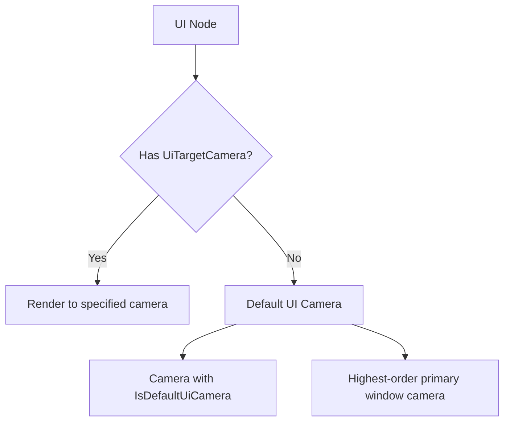

+++
title = "#18216 `UiTargetCamera` doc comment correction"
date = "2025-03-09T00:00:00"
draft = false
template = "pull_request_page.html"
in_search_index = true

[taxonomies]
list_display = ["show"]

[extra]
current_language = "en"
available_languages = {"en" = { name = "English", url = "/pull_request/bevy/2025-03/pr-18216-en-20250309" }, "zh-cn" = { name = "中文", url = "/pull_request/bevy/2025-03/pr-18216-zh-cn-20250309" }}
+++

# #18216 `UiTargetCamera` doc comment correction

## Basic Information
- **Title**: `UiTargetCamera` doc comment correction
- **PR Link**: https://github.com/bevyengine/bevy/pull/18216
- **Author**: ickshonpe
- **Status**: MERGED
- **Created**: 2025-03-09T22:27:34Z
- **Merged**: Not merged
- **Merged By**: N/A

## Description Translation
# Objective

As pointed out in #18177 this line in the doc comment for `UiTargetCamera`:

```
/// Optional if there is only one camera in the world. Required otherwise.
```

is incorrect. `UiTargetCamera` component is only needed when you want to display UI nodes using a camera other than the default camera.

## Solution

Change it to:
```
/// Root node's without an explicit [`UiTargetCamera`] will be rendered to the default UI camera,
/// which is either a single camera with the [`IsDefaultUiCamera`] marker component or the highest
/// order camera targeting the primary window.
```

## The Story of This Pull Request

The journey begins with a sharp-eyed community member discovering a documentation gremlin lurking in Bevy's UI system. In the shadows of `UiTargetCamera`'s doc comments, an innocent-sounding but misleading statement had taken root: "Optional if there is only one camera in the world. Required otherwise." This seemingly reasonable guidance hid a subtle misunderstanding of how Bevy's camera systems actually work.

The problem came to light through issue #18177, where developers realized the documentation was leading users astray. The original statement suggested camera count alone determined the need for `UiTargetCamera`, when in reality the component serves a more specific purpose: controlling which camera renders particular UI elements, regardless of the total number of cameras in the scene.

The developer embarked on a quest to clarify this crucial distinction. Through careful analysis of Bevy's rendering pipeline, they recognized that:

1. The default UI camera isn't determined by camera count, but through specific markers and window targeting
2. `UiTargetCamera` isn't about camera quantity, but about explicit control
3. The existing documentation could cause developers to add unnecessary components or miss required ones

The solution emerged as a surgical documentation update. The new explanation weaves together two key concepts:
```rust
/// Root node's without an explicit [`UiTargetCamera`] will be rendered to the default UI camera,
/// which is either a single camera with the [`IsDefaultUiCamera`] marker component or the highest
/// order camera targeting the primary window.
```

This revision does more than fix a typo - it maps the actual behavior of Bevy's camera selection system. By explaining the fallback mechanism (first `IsDefaultUiCamera`, then highest-order primary window camera), it helps developers understand when and why to use `UiTargetCamera`.

The change reflects a deeper truth about API documentation: precise wording matters. Where the original comment focused on presence/absence, the new version explains behavior flow. This helps developers reason about:
- How to override default rendering targets
- What constitutes the "default" camera
- The role of camera ordering in window targeting

## Visual Representation



## Key Files Changed

**crates/bevy_ui/src/ui_node.rs** (+3/-1)
```rust
// Before:
/// Optional if there is only one camera in the world. Required otherwise.

// After:
/// Root node's without an explicit [`UiTargetCamera`] will be rendered to the default UI camera,
/// which is either a single camera with the [`IsDefaultUiCamera`] marker component or the highest
/// order camera targeting the primary window.
```

This single-line change in documentation carries outsized importance. By clarifying the actual camera selection logic, it:
- Prevents misuse of the `UiTargetCamera` component
- Documents implicit system behavior that was previously unspecified
- Bridges the gap between API surface and underlying implementation

## Further Reading

1. [Bevy UI System Overview](https://bevyengine.org/learn/book/features/ui/)
2. [Camera and Rendering Documentation](https://docs.rs/bevy/latest/bevy/render/camera/struct.Camera.html)
3. [Component Markers in ECS](https://bevyengine.org/learn/book/ecs/components/)
4. [Window Management in Bevy](https://docs.rs/bevy/latest/bevy/window/struct.Window.html)