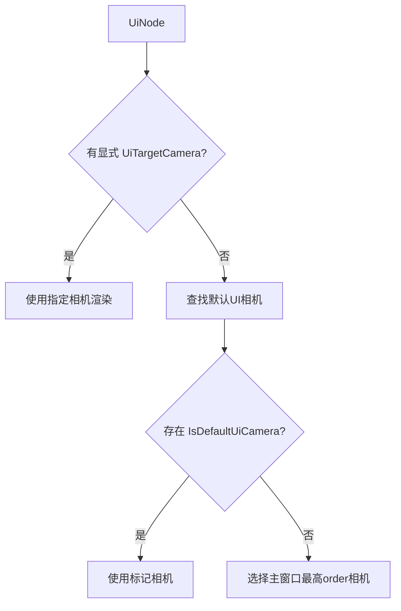

+++
title = "#18216 `UiTargetCamera` doc comment correction"
date = "2025-03-09T00:00:00"
draft = false
template = "pull_request_page.html"
in_search_index = false

[extra]
current_language = "zh-cn"
available_languages = {"en" = { name = "English", url = "/pull_request/bevy/2025-03/pr-18216-en-20250309" }, "zh-cn" = { name = "中文", url = "/pull_request/bevy/2025-03/pr-18216-zh-cn-20250309" }}
+++

# #18216 `UiTargetCamera` doc comment correction

## Basic Information
- **Title**: `UiTargetCamera` doc comment correction
- **PR Link**: https://github.com/bevyengine/bevy/pull/18216
- **Author**: ickshonpe
- **Status**: MERGED
- **Created**: 2025-03-09T22:27:34Z
- **Merged**: Not merged
- **Merged By**: N/A

## Description Translation
### 目标
正如在 #18177 中指出的，`UiTargetCamera` 的文档注释中的这句话：
```rust
/// Optional if there is only one camera in the world. Required otherwise.
```
存在错误。`UiTargetCamera` 组件仅在需要使用非默认相机渲染UI节点时才需要。

### 解决方案
将其修改为：
```rust
/// Root node's without an explicit [`UiTargetCamera`] will be rendered to the default UI camera,
/// which is either a single camera with the [`IsDefaultUiCamera`] marker component or the highest
/// order camera targeting the primary window.
```

## The Story of This Pull Request

### 问题的发现与背景
故事始于一个敏锐的社区成员在 issue #18177 中发现文档陷阱。在 Bevy 引擎的 UI 系统中，`UiTargetCamera` 组件原本的文档暗示其存在与否取决于场景中相机的数量，这种表述实际上与引擎的实际运作方式存在偏差。这个微小的文档错误可能误导开发者错误地添加或省略该组件，导致UI渲染到非预期的相机。

问题的核心在于理解 Bevy 的默认UI相机选择机制。默认情况下，UI系统会：
1. 寻找带有 `IsDefaultUiCamera` 标记的相机
2. 若无标记，则选择针对主窗口（primary window）的最高顺序（highest order）相机

### 认知转折点
开发者 ickshonpe 意识到文档中的条件判断（"只有一个相机时可选"）未能准确反映组件存在的真实意义。`UiTargetCamera` 的真正作用不是基于相机数量，而是基于开发者是否需要覆写默认的UI渲染目标。这个认知转变成为修正文档的关键突破口。

### 文档手术刀
修改的核心在于用精准的技术表述替换误导性的条件判断。原文档使用简单的二元条件（相机数量决定必要性），而新文档则：
1. 明确说明默认行为
2. 揭示背后的选择逻辑
3. 引入两个关键概念：`IsDefaultUiCamera` 标记和相机顺序（camera order）

```rust
/// Root node's without an explicit [`UiTargetCamera`] will be rendered to...
/// ...highest order camera targeting the primary window.
```
这段修改后的文档不仅修正了错误，还主动引导开发者理解系统的工作原理，体现了良好的API文档设计原则——不仅说明"怎么做"，还要解释"为什么"。

### 技术涟漪效应
这个看似微小的文档修正实际上影响着多个系统间的交互：
1. UI节点层级管理
2. 相机排序逻辑
3. 窗口系统集成

通过阐明 `UiTargetCamera` 与 `IsDefaultUiCamera` 的关系，开发者能更好地理解如何控制不同场景下的UI渲染层级，特别是在多窗口或多相机配置中。

## Visual Representation



## Key Files Changed

### `crates/bevy_ui/src/ui_node.rs` (+3/-1)
**修改说明**：  
这个文件包含了UI节点的核心逻辑。文档修正直接影响了开发者对UI渲染目标选择机制的理解。

**代码对比**：
```rust
// 修改前
/// Optional if there is only one camera in the world. Required otherwise.

// 修改后
/// Root node's without an explicit [`UiTargetCamera`] will be rendered to the default UI camera,
/// which is either a single camera with the [`IsDefaultUiCamera`] marker component or the highest
/// order camera targeting the primary window.
```

**关联性**：  
这个改动是PR的核心，通过精确描述组件行为来避免开发者误用API。

## Further Reading

1. [Bevy UI系统官方文档](https://bevyengine.org/learn/book/features/ui/) - 理解Bevy的UI架构基础
2. [Camera Ordering RFC](https://github.com/bevyengine/rfcs/pull/42) - 相机排序机制的设计理念
3. [ECS模式解析](https://github.com/bevyengine/bevy/blob/main/docs/ECS_FAQ.md) - 理解组件（Component）在Bevy中的角色
4. 原issue #18177 - 了解问题发现的完整上下文