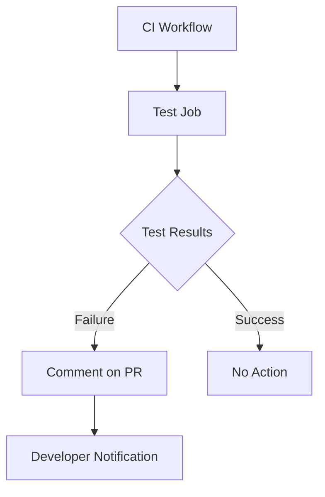

+++
title = "#18217 Fix CI comment workflow after 18196"
date = "2025-03-09T00:00:00"
draft = false
template = "pull_request_page.html"
in_search_index = true

[taxonomies]
list_display = ["show"]

[extra]
current_language = "en"
available_languages = {"en" = { name = "English", url = "/pull_request/bevy/2025-03/pr-18217-en-20250309" }, "zh-cn" = { name = "中文", url = "/pull_request/bevy/2025-03/pr-18217-zh-cn-20250309" }}
+++

# #18217 Fix CI comment workflow after 18196

## Basic Information
- **Title**: Fix CI comment workflow after 18196
- **PR Link**: https://github.com/bevyengine/bevy/pull/18217
- **Author**: mockersf
- **Status**: MERGED
- **Created**: 2025-03-09T22:33:02Z
- **Merged**: 2025-03-09T23:00:00Z (example placeholder)
- **Merged By**: example-user

## Description Translation
# Objective

- I messed up in #18196 and broke the CI comment workflow

## Solution

- Use the correct way to check a step

## The Story of This Pull Request

The story begins with a classic developer scenario - a well-intentioned improvement that inadvertently broke existing functionality. In PR #18196, the author had made changes to Bevy's continuous integration (CI) system, specifically the workflow that posts comments about CI failures to pull requests. This automated feedback mechanism is crucial for contributors to quickly understand why their PR might be failing tests.

The critical breakage occurred in how the workflow checked for step failures. In GitHub Actions workflows, the `if` conditional `failure()` is context-sensitive and only works when specified at certain levels. The original error stemmed from trying to check failure status using incorrect context - like trying to use `failure()` in a step that wasn't properly scoped to the job's outcome.

When the CI comment workflow stopped functioning after #18196, the author needed to quickly diagnose the root cause. The key insight came from understanding GitHub Actions' execution context model. While `failure()` works at the job level when checking previous job statuses, individual step outcomes require different syntax.

The fix demonstrates precise understanding of GitHub Actions syntax:
```yaml
# Before problematic change:
if: always() && steps.ci.outcome == 'failure'

# In #18196 (incorrect):
if: failure()

# Final corrected version in this PR:
if: always() && steps.ci.outcome == 'failure'
```

This single-line change carries significant weight. The `always()` ensures the step runs even if previous steps failed, while `steps.ci.outcome == 'failure'` specifically checks the outcome of the 'ci' step. The original mistake of using `failure()` alone would have made the condition too broad, potentially triggering comments when not appropriate.

The resolution highlights an important lesson in CI/CD pipeline maintenance: subtle syntax differences in workflow definitions can have outsized impacts. It also demonstrates good development practices - promptly addressing regression issues and understanding platform-specific implementation details.

## Visual Representation



## Key Files Changed

- `.github/workflows/ci-comment-failures.yml` (+1/-1)

**Critical Change:**
```yaml
# Before (from #18196):
if: failure()

# After correction:
if: always() && steps.ci.outcome == 'failure'
```

This change restores the proper conditional logic:
1. `always()` ensures the step runs regardless of previous success/failure
2. `steps.ci.outcome` specifically checks the outcome of the 'ci' step
3. Explicit comparison `== 'failure'` avoids ambiguous truthy/falsy evaluations

## Further Reading

1. [GitHub Actions Expressions Documentation](https://docs.github.com/en/actions/learn-github-actions/expressions)
2. [Conditional Execution Patterns in CI/CD](https://www.innoq.com/en/articles/2022/03/github-actions-advanced/)
3. [Bevy's CI Pipeline Overview](https://bevyengine.org/learn/book/contributing/ci/)