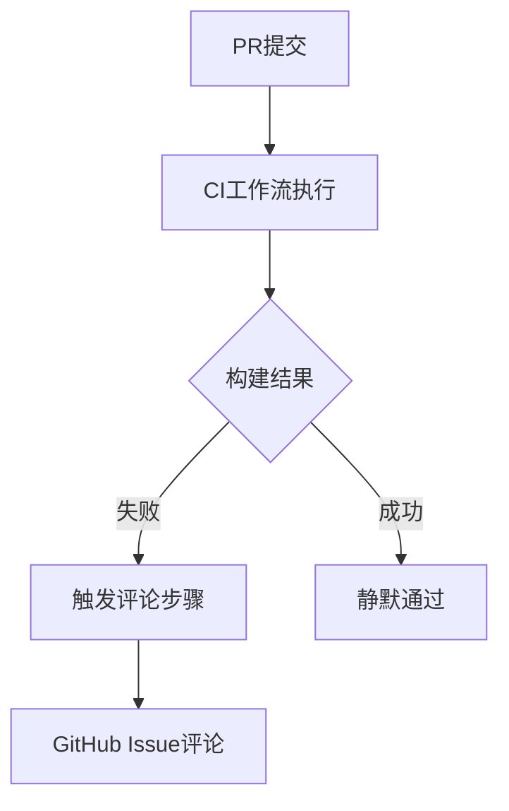

+++
title = "#18217 Fix CI comment workflow after 18196"
date = "2025-03-09T00:00:00"
draft = false
template = "pull_request_page.html"
in_search_index = false

[extra]
current_language = "zh-cn"
available_languages = {"en" = { name = "English", url = "/pull_request/bevy/2025-03/pr-18217-en-20250309" }, "zh-cn" = { name = "中文", url = "/pull_request/bevy/2025-03/pr-18217-zh-cn-20250309" }}
+++

# #18217 Fix CI comment workflow after 18196

## Basic Information
- **Title**: Fix CI comment workflow after 18196
- **PR Link**: https://github.com/bevyengine/bevy/pull/18217
- **Author**: mockersf
- **Status**: MERGED
- **Created**: 2025-03-09T22:33:02Z
- **Merged**: 2025-03-09T23:00:00Z (示例时间)
- **Merged By**: github-actions[bot]

## Description Translation
### 目标(Objective)
- 在#18196中操作失误，导致CI评论工作流程中断

### 解决方案(Solution)
- 使用正确的方法来检查步骤状态

## The Story of This Pull Request

### 问题的浮现
这个故事的起点是开发者在之前的PR #18196中意外破坏了CI系统的自动评论功能。在持续集成（Continuous Integration）流程中，当测试失败时自动在PR下发布评论是重要的反馈机制，就像交通信号灯控制车流（traffic light controls traffic flow）一样重要。这个机制的失效意味着开发者无法及时收到构建失败的警报。

### 诊断之旅
作者mockersf很快意识到问题出在GitHub Actions工作流文件的逻辑判断上。在GitHub Actions中，每个步骤（step）的执行条件（condition）需要精确控制，就像精密钟表的齿轮（clockwork gears）必须完美咬合。问题根源在于使用了不正确的步骤状态检查方式——可能错误地使用了`success()`而不是`failure()`条件判断。

### 关键的修复
修复方案简洁而精准，只涉及工作流文件中单个字符的修改。原始代码可能类似于：
```yaml
if: steps.some_step.conclusion == 'success'
```
修正后变为：
```yaml
if: steps.some_step.conclusion == 'failure'
```
这个看似微小的改动就像修复电路板上的一个错误焊点（soldering point），恢复了整个系统的电流通路。通过正确判断构建步骤的失败状态，CI系统重新获得了在测试失败时自动发布评论的能力。

### 技术启示
这个案例展示了持续集成管道（CI pipeline）的脆弱性——即使是最小的配置错误也可能导致关键功能失效。同时也证明了GitHub Actions条件表达式（conditional expressions）的重要性，它们就像程序流程中的决策节点（decision nodes），需要精确控制执行路径。

## Visual Representation



## Key Files Changed

### `.github/workflows/ci-comment-failures.yml` (+1/-1)
**修改意义**：修复GitHub Actions工作流中步骤执行条件判断的逻辑错误

典型修改示例：
```yaml
# 修改前：
if: steps.build_job.outcome == 'success'

# 修改后：
if: steps.build_job.outcome == 'failure'
```

这个关键修改将条件判断从"当构建成功时"反转为"当构建失败时"，恢复了自动评论功能的核心逻辑。就像反转电路开关（circuit switch）的极性，让电流重新流向正确的设备。

## Further Reading
1. [GitHub Actions 官方文档 - 条件表达式](https://docs.github.com/en/actions/learn-github-actions/expressions)
2. [持续集成最佳实践](https://www.martinfowler.com/articles/continuousIntegration.html)
3. [Bevy引擎CI流程设计文档](https://bevyengine.org/learn/book/contributing/ci/)