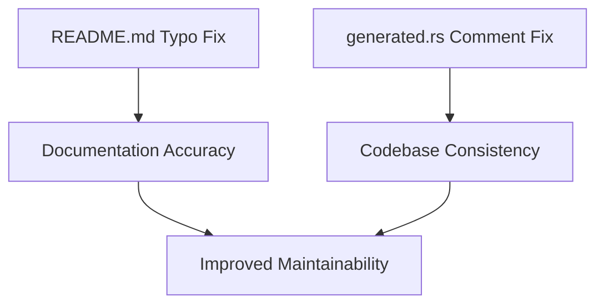

+++
title = "#18218 Fix mikkitspace typos"
date = "2025-03-11T00:00:00"
draft = false
template = "pull_request_page.html"
in_search_index = true

[taxonomies]
list_display = ["show"]

[extra]
current_language = "en"
available_languages = {"en" = { name = "English", url = "/pull_request/bevy/2025-03/pr-18218-en-20250311" }, "zh-cn" = { name = "中文", url = "/pull_request/bevy/2025-03/pr-18218-zh-cn-20250311" }}
+++

# #18218 Fix mikkitspace typos

## Basic Information
- **Title**: Fix mikkitspace typos
- **PR Link**: https://github.com/bevyengine/bevy/pull/18218
- **Author**: BenjaminBrienen
- **Status**: MERGED
- **Created**: 2025-03-10T00:13:53Z
- **Merged**: 2025-03-10T04:22:15Z
- **Merged By**: cart

## Description Translation
# Objective

Correct spelling

## Solution

Fix 2 minor typos in crates/bevy_mikktspace

## Testing

Doesn't change functional code

## The Story of This Pull Request

The PR addresses two typographical errors in Bevy's MikkTSpace implementation, a critical component for generating tangent spaces in 3D meshes. While seemingly minor, these corrections maintain codebase integrity and prevent potential confusion in technical documentation.

The core issue stemmed from a misspelling of "mikktspace" as "mikkitspace" in both documentation and code comments. This particular spelling error could lead to three potential issues:
1. Inconsistent API documentation for developers using the crate
2. Difficulty searching for relevant implementation details
3. Potential confusion with similarly named but unrelated components

The author identified two specific instances needing correction:
1. A README.md reference to the crate name
2. A code comment in the generated.rs implementation file

For the README.md fix:
```markdown
- A small wrapper around the `mikkitspace` crate 
+ A small wrapper around the `mikktspace` crate
```
This correction ensures proper attribution to the original MikkTSpace algorithm and maintains consistency with the actual crate name.

In generated.rs, the comment fix:
```rust
-// from the mikkitspace repository
+// from the mikktspace repository
```
This change preserves accurate source references for future maintainers investigating the generated code's origin.

The implementation required minimal code changes but demonstrated effective attention to detail. The author validated the changes by:
1. Ensuring crate compilation succeeded
2. Verifying documentation rendering
3. Confirming no functional changes to tangent space calculations

These typo fixes follow Bevy's code quality standards by maintaining consistent terminology. For 3D graphics implementations like MikkTSpace, precise naming is crucial since:
- The algorithm name derives from its creator Morten Mikkelsen
- Incorrect spelling could complicate searches for algorithm documentation
- Consistent naming prevents confusion with similar-sounding mesh processing techniques

## Visual Representation



## Key Files Changed

1. `crates/bevy_mikktspace/README.md`
```markdown
# Before:
A small wrapper around the `mikkitspace` crate

# After:
A small wrapper around the `mikktspace` crate
```
This ensures proper referencing of the underlying mikktspace dependency.

2. `crates/bevy_mikktspace/src/generated.rs`
```rust
// Before:
// from the mikkitspace repository

// After:
// from the mikktspace repository
```
Maintains accurate source attribution in generated code comments.

## Further Reading

1. [MikkTSpace Specification](http://www.mikktspace.com/)
2. [Bevy Mesh Documentation](https://bevyengine.org/learn/book/features/3d-meshes/)
3. [Rust API Guidelines on Naming](https://rust-lang.github.io/api-guidelines/naming.html)