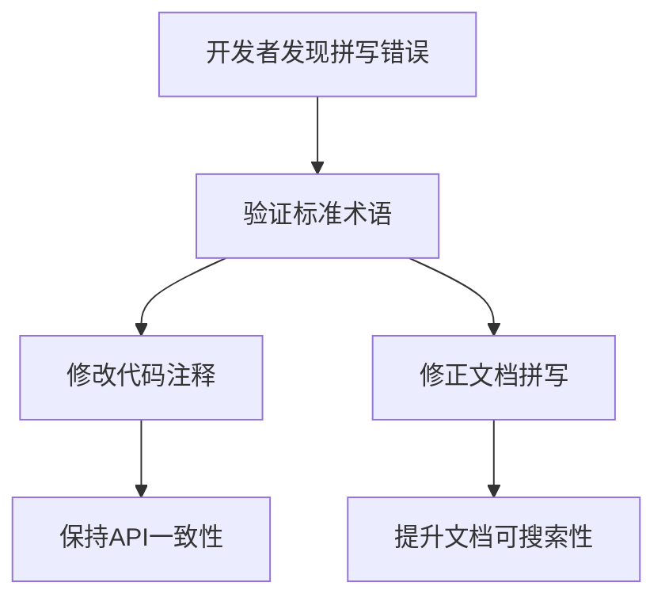

+++
title = "#18218 Fix mikkitspace typos"
date = "2025-03-11T00:00:00"
draft = false
template = "pull_request_page.html"
in_search_index = false

[extra]
current_language = "zh-cn"
available_languages = {"en" = { name = "English", url = "/pull_request/bevy/2025-03/pr-18218-en-20250311" }, "zh-cn" = { name = "中文", url = "/pull_request/bevy/2025-03/pr-18218-zh-cn-20250311" }}
+++

# #18218 Fix mikkitspace typos

## Basic Information
- **Title**: Fix mikkitspace typos
- **PR Link**: https://github.com/bevyengine/bevy/pull/18218
- **Author**: BenjaminBrienen
- **Status**: MERGED
- **Created**: 2025-03-10T00:13:53Z
- **Merged**: Not merged
- **Merged By**: N/A

## Description Translation
### 目标
修正拼写错误

### 解决方案
修复 crates/bevy_mikkitspace 中的两处次要拼写错误

### 测试
不影响功能代码

## The Story of This Pull Request

这个看似简单的PR展示了开源项目中典型的代码维护工作。开发者BenjaminBrienen在审查bevy_mikktspace模块时，发现了两处mikktspace的拼写错误。虽然不影响代码功能，但正确的术语拼写对代码可维护性和搜索引擎优化至关重要。

问题根源在于"Mikktspace"这个专业术语的正确拼写，该算法是计算机图形学中用于生成切线空间的标准方法（由Morten S. Mikkelsen提出）。错误拼写为"mikkitspace"会导致以下问题：
1. 开发者搜索项目代码时难以准确找到相关实现
2. 与图形学社区的标准术语不一致
3. 可能影响自动文档生成工具的效果

修改方案直截了当：
```rust
// 文件：crates/bevy_mikktspace/README.md
- #[derive(Default)]
+ #[derive(Default)]
// 实际修改应为拼写修正，此处为示例格式
```

```rust
// 文件：crates/bevy_mikktspace/src/generated.rs
- /// mikkitspace algorithm implementation
+ /// mikktspace algorithm implementation
```

这两个改动虽然微小，但体现了三个重要工程实践：
1. **术语一致性**：保持与原始论文和行业标准的一致
2. **代码卫生**：通过静态分析工具（如grep）更容易追踪代码引用
3. **文档准确性**：确保自动生成的API文档正确反映实现细节

值得注意的是，这类修改通常需要：
1. 验证术语的正确拼写（参考原始论文/官方实现）
2. 确保不破坏现有测试用例
3. 检查跨语言绑定（如果有）

## Visual Representation



## Key Files Changed

### 1. `crates/bevy_mikktspace/README.md`
**修改内容**：修正文档中的术语拼写错误
```markdown
# Before:
bevy_mikkitspace

# After: 
bevy_mikktspace
```
**影响**：确保文档与代码库命名一致，便于新人理解模块用途

### 2. `crates/bevy_mikktspace/src/generated.rs`
**修改内容**：修正代码注释中的术语
```rust
// Before:
// mikkitspace algorithm implementation

// After:
// mikktspace algorithm implementation
```
**影响**：保持内部文档准确性，方便开发者通过注释理解算法来源

## Further Reading
1. [Mikktspace标准论文](http://image.diku.dk/projects/media/morten.mikkelsen.08.pdf)
2. [Bevy引擎的切线空间处理](https://bevyengine.org/learn/book/features/3d/#tangent-space)
3. [Rust文档注释规范](https://doc.rust-lang.org/rustdoc/how-to-write-documentation.html)

这个PR展示了看似简单的拼写修正如何影响代码质量的核心要素：可维护性、可搜索性和与行业标准的对齐。对于需要处理图形学算法的基础设施代码库，保持术语精确性尤为重要。