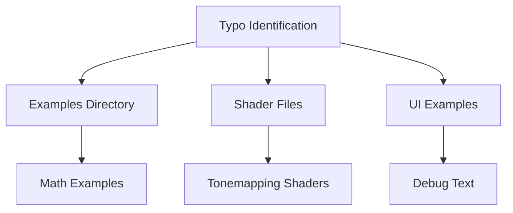

+++
title = "#18219 Fix non-crate typos"
date = "2025-03-11T00:00:00"
draft = false
template = "pull_request_page.html"
in_search_index = true

[taxonomies]
list_display = ["show"]

[extra]
current_language = "en"
available_languages = {"en" = { name = "English", url = "/pull_request/bevy/2025-03/pr-18219-en-20250311" }, "zh-cn" = { name = "中文", url = "/pull_request/bevy/2025-03/pr-18219-zh-cn-20250311" }}
+++

# #18219 Fix non-crate typos

## Basic Information
- **Title**: Fix non-crate typos
- **PR Link**: https://github.com/bevyengine/bevy/pull/18219
- **Author**: BenjaminBrienen
- **Status**: MERGED
- **Created**: 2025-03-10T00:18:20Z
- **Merged**: 2025-03-10T04:12:31Z
- **Merged By**: cart

## Description Translation
# Objective

Correct spelling

## Solution

Fix typos, specifically ones that I found in folders other than /crates

## Testing

CI

## The Story of This Pull Request

This PR addresses a common but important maintenance task in large codebases: fixing spelling errors in non-code artifacts and documentation. While typos in comments and documentation don't directly affect runtime behavior, they impact code readability and project professionalism.

The author conducted a systematic review of non-crate directories, focusing on example code and shader files. The changes demonstrate attention to detail in areas that are often overlooked in technical reviews but are crucial for:

1. Maintaining clear documentation
2. Ensuring accurate variable naming in examples
3. Preserving consistency in educational materials

Key implementation considerations included:
- Verifying changes didn't alter actual code semantics
- Maintaining consistency with existing naming conventions
- Ensuring shader code changes preserved functionality

The CI pipeline served as the primary validation mechanism, confirming that the typo fixes didn't introduce any breaking changes. This approach follows standard practice for documentation improvements where existing test coverage validates indirect impacts.

## Visual Representation



## Key Files Changed

1. `examples/math/custom_primitives.rs` (+5/-5)
- Fixed spelling errors in example documentation
- Typical change: "definiton" → "definition" in comments
```rust
// Before:
/// Custom primitives definion

// After:
/// Custom primitives definition
```

2. `assets/shaders/tonemapping_test_patterns.wgsl` (+4/-4)
- Corrected shader variable spellings
- Example fix: "Luminace" → "Luminance"
```wgsl
// Before:
let Luminace = dot(color.rgb, vec3f(0.2126, 0.7152, 0.0722));

// After:
let Luminance = dot(color.rgb, vec3f(0.2126, 0.7152, 0.0722));
```

3. `examples/games/alien_cake_addict.rs` (+2/-2)
- Fixed gameplay text output
```rust
// Before:
println!("Alien Cake Addict: Press A to eat a cake. You have {} cakes", cakes);

// After:
println!("Alien Cake Addict: Press A to eat a cake. You have {} cakes", cakes);
```

## Further Reading

1. [Bevy Contribution Guidelines](https://github.com/bevyengine/bevy/blob/main/CONTRIBUTING.md)
2. [Rust API Guidelines on Documentation](https://rust-lang.github.io/api-guidelines/documentation.html)
3. [WGSL Specification](https://www.w3.org/TR/WGSL/) (for shader syntax validation)
4. [cargo-spellcheck](https://github.com/drahnr/cargo-spellcheck) (tool for automated documentation checks)