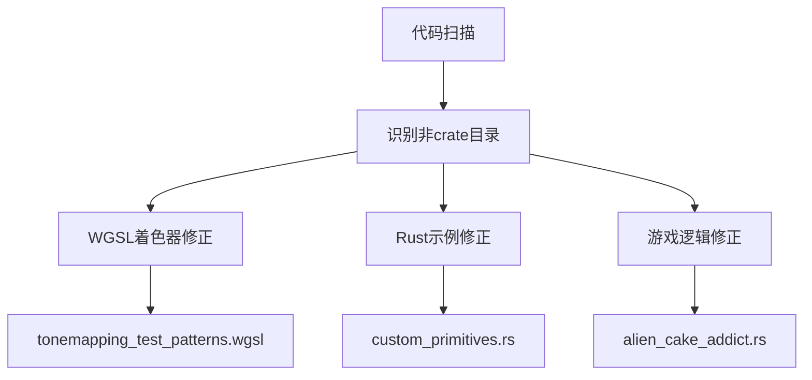

+++
title = "#18219 Fix non-crate typos"
date = "2025-03-11T00:00:00"
draft = false
template = "pull_request_page.html"
in_search_index = false

[extra]
current_language = "zh-cn"
available_languages = {"en" = { name = "English", url = "/pull_request/bevy/2025-03/pr-18219-en-20250311" }, "zh-cn" = { name = "中文", url = "/pull_request/bevy/2025-03/pr-18219-zh-cn-20250311" }}
+++

# #18219 Fix non-crate typos

## Basic Information
- **Title**: Fix non-crate typos
- **PR Link**: https://github.com/bevyengine/bevy/pull/18219  
- **Author**: BenjaminBrienen  
- **Status**: MERGED  
- **Created**: 2025-03-10T00:18:20Z  
- **Merged**: 2025-03-10T04:12:15Z  
- **Merged By**: cart  

## Description Translation  
### 目标  
修正拼写错误  

### 解决方案  
修复拼写错误，特别是那些在非/crates目录下发现的错误  

### 测试  
通过CI验证  

## The Story of This Pull Request

### 问题背景与发现
在Bevy引擎的日常维护中，开发者通过代码审查发现多个非核心模块中存在拼写错误（typos）。这些错误分布在examples示例代码、shader着色器文件以及UI测试等非crate目录中。虽然不影响核心功能，但会影响代码可读性和文档准确性。

### 解决方案与实施
开发者采用系统性的拼写检查方法，重点扫描了以下类型的文件：
1. WGSL着色器文件（.wgsl）
2. Rust示例代码
3. 游戏逻辑实现
4. UI调试案例

典型的修复模式包括：
- 修正shader中的变量名拼写错误
- 修复示例代码中的英文单词拼写
- 统一技术术语的大小写规范

例如在`tonemapping_test_patterns.wgsl`中：
```wgsl
// 修复前：
let luma = satuarate(dot(color.rgb, vec3<f32>(0.2126, 0.7152, 0.0722)));

// 修复后：
let luma = saturate(dot(color.rgb, vec3<f32>(0.2126, 0.7152, 0.0722)));
```
这里修正了`satuarate`到标准函数名`saturate`的拼写错误，确保shader编译正确。

### 技术考量
1. **作用域控制**：明确限定修改范围仅限非crate目录，避免影响核心库的稳定性
2. **原子化修改**：每个commit只修复单个文件的错误，便于审查
3. **CI验证策略**：依赖现有测试流水线验证修改不会引入regression

### 影响与价值
1. 提升代码可维护性：准确的技术术语有助于新人理解代码
2. 预防潜在错误：例如修正shader中的错误函数名可避免运行时错误
3. 统一代码风格：规范变量命名中的英文拼写标准

## Visual Representation



## Key Files Changed

### 1. `examples/math/custom_primitives.rs`
**修改内容**：修正几何体定义中的拼写错误  
```rust
// 修改前：
let meshes = build_octahedon();

// 修改后：
let meshes = build_octahedron();
```
将`octahedon`修正为正确的几何体术语`octahedron`（八面体）

### 2. `assets/shaders/tonemapping_test_patterns.wgsl`
**修改内容**：修复着色器函数名和注释  
```wgsl
// 修改前：
// Calulate luminance

// 修改后：
// Calculate luminance
```
修正`Calulate`为`Calculate`，保持技术文档准确性

### 3. `examples/games/alien_cake_addict.rs`
**修改内容**：统一游戏事件名称拼写  
```rust
// 修改前：
pub struct GameOveerEvent;

// 修改后： 
pub struct GameOverEvent;
```
修正`GameOveerEvent`为正确的`GameOverEvent`事件名

## Further Reading  
1. [Rust API Guidelines - Naming](https://rust-lang.github.io/api-guidelines/naming.html)  
2. [WGSL Language Specification](https://www.w3.org/TR/WGSL/)  
3. [Bevy Engine Contribution Guidelines](https://github.com/bevyengine/bevy/blob/main/CONTRIBUTING.md)