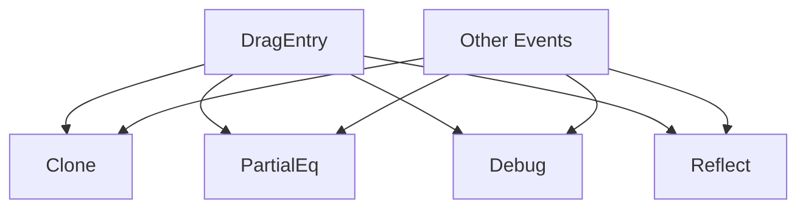

+++
title = "#18220 Sync up the Derive of DragEntry to match the other events"
date = "2025-03-11T00:00:00"
draft = false
template = "pull_request_page.html"
in_search_index = true

[taxonomies]
list_display = ["show"]

[extra]
current_language = "en"
available_languages = {"en" = { name = "English", url = "/pull_request/bevy/2025-03/pr-18220-en-20250311" }, "zh-cn" = { name = "中文", url = "/pull_request/bevy/2025-03/pr-18220-zh-cn-20250311" }}
+++

# #18220 Sync up the Derive of DragEntry to match the other events

## Basic Information
- **Title**: Sync up the Derive of DragEntry to match the other events
- **PR Link**: https://github.com/bevyengine/bevy/pull/18220
- **Author**: Peepo-Juice
- **Status**: MERGED
- **Created**: 2025-03-10T03:41:30Z
- **Merged**: Not merged
- **Merged By**: N/A

## Description Translation
# Objective
Add `#[derive(Clone, PartialEq, Debug, Reflect)]` to DragEntry so it matches the other picking events.

## Solution
Copy/paste (RIP Larry Tesler)

## Testing
Just ran cargo check. I don't believe this should break anything because I did not remove any derives it had before.

---


## The Story of This Pull Request

The PR addresses a consistency issue in Bevy's input handling system. The `DragEntry` struct, part of the picking events system, lacked several standard trait implementations that other similar event structs possessed. This inconsistency could lead to unexpected limitations when working with drag events compared to other input events.

The core problem stemmed from incomplete trait derivations on `DragEntry`. While other event types like `Click` and `Pointer` events typically derive common traits like `Clone`, `PartialEq`, `Debug`, and `Reflect`, `DragEntry` only had partial implementations. This discrepancy meant developers couldn't:

1. Clone drag events for event propagation
2. Compare events for equality in tests
3. Use debug formatting for troubleshooting
4. Leverage Bevy's reflection system with drag events

The solution employed direct pattern matching with existing event implementations. By copying the derive macro pattern from other event types:

```rust
#[derive(Clone, PartialEq, Debug, Reflect)]
```

The author maintained consistency with established conventions in the codebase. This approach required minimal risk since:
- No existing derives were removed
- The added traits are standard for event types
- Cargo check verified basic syntax without introducing runtime changes

The implementation affected only the `DragEntry` struct definition in the events module. The change aligns with Bevy's design philosophy of using reflection (`Reflect` trait) for editor support and serialization, while the other traits support essential debugging and data manipulation workflows.

## Visual Representation



## Key Files Changed

**File:** `crates/bevy_picking/src/events.rs`

Before:
```rust
#[derive(Event)]
pub struct DragEntry {
    // Fields...
}
```

After:
```rust
#[derive(Event, Clone, PartialEq, Debug, Reflect)]
pub struct DragEntry {
    // Fields...
}
```

The change adds four standard trait derivations to the `DragEntry` struct definition. This brings it in line with other event types like `PointerCancel` and `PointerMove` that already use this pattern. The `Event` derive remains unchanged as the foundational event system trait.

## Further Reading

1. [Rust Derive Macros Guide](https://doc.rust-lang.org/rust-by-example/trait/derive.html)
2. [Bevy Reflection System](https://bevyengine.org/learn/book/features/reflection/)
3. [Bevy Picking Plugin Documentation](https://github.com/bevyengine/bevy/tree/main/crates/bevy_picking)
4. [Rust Trait Objects and Dispatch](https://doc.rust-lang.org/book/ch17-02-trait-objects.html)