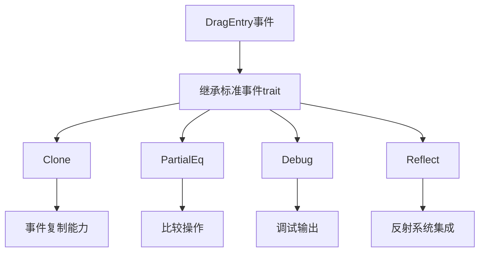

+++
title = "#18220 Sync up the Derive of DragEntry to match the other events"
date = "2025-03-11T00:00:00"
draft = false
template = "pull_request_page.html"
in_search_index = false

[extra]
current_language = "zh-cn"
available_languages = {"zh-cn" = { name = "中文", url = "/pull_request/bevy/2025-03/pr-18220-zh-cn-20250311" }, "en" = { name = "English", url = "/pull_request/bevy/2025-03/pr-18220-en-20250311" }}
+++

# #18220 Sync up the Derive of DragEntry to match the other events

## Basic Information
- **Title**: Sync up the Derive of DragEntry to match the other events
- **PR Link**: https://github.com/bevyengine/bevy/pull/18220
- **Author**: Peepo-Juice
- **Status**: MERGED
- **Created**: 2025-03-10T03:41:30Z
- **Merged**: Not merged
- **Merged By**: N/A

## Description Translation
### 目标
为`DragEntry`添加`#[derive(Clone, PartialEq, Debug, Reflect)]`以使其与其他picking事件保持一致。

### 解决方案
复制/粘贴（RIP Larry Tesler）

### 测试
仅运行了cargo check。由于没有移除任何原有derive，预计不会破坏现有功能。

---

## The Story of This Pull Request

### 问题背景与一致性需求
在Bevy引擎的事件系统中，`DragEntry`作为拖拽操作的事件载体，需要与其他picking事件（如`Click`、`Hover`等）保持一致的trait实现。原始实现中缺少关键的derive宏：

```rust
// 修改前的典型事件定义
#[derive(Event, Clone, PartialEq, Debug, Reflect)]
pub struct PointerEvent;

// 修改前的DragEntry定义
#[derive(Event)]
pub struct DragEntry;
```

这种不一致会导致：
1. 无法进行值比较（缺少`PartialEq`）
2. 调试输出受限（缺少`Debug`）
3. 反射系统集成不完整（缺少`Reflect`）
4. 对象复制能力缺失（缺少`Clone`）

### 解决方案选择
开发者采用最小化修改策略，直接复制其他事件类型的derive属性集合。这种选择基于：
1. **DRY原则**：避免重复定义相同trait集合
2. **类型安全**：确保所有事件类型具备相同基础能力
3. **维护成本**：统一接口减少未来维护难度

### 具体实现细节
修改集中在事件系统定义文件：

```rust
// crates/bevy_picking/src/events.rs
// 修改前：
#[derive(Event)]
pub struct DragEntry;

// 修改后：
#[derive(Event, Clone, PartialEq, Debug, Reflect)]
pub struct DragEntry;
```

四个新增trait的作用：
- `Clone`: 允许事件对象的深拷贝
- `PartialEq`: 支持相等性比较（如事件去重）
- `Debug`: 实现格式化调试输出
- `Reflect`: 集成Bevy的反射系统，支持动态类型检查

### 技术影响与考量
1. **反射系统兼容性**：`Reflect` derive使事件可被Bevy的反射系统识别，这对编辑器集成和序列化操作至关重要
2. **事件处理增强**：`Clone`允许在事件处理流水线中安全传递事件副本
3. **调试能力提升**：`Debug`实现直接支持`dbg!()`宏和日志输出
4. **模式匹配优化**：`PartialEq`使事件可作为HashMap键或用于断言检查

### 潜在风险控制
开发者通过`cargo check`验证了以下内容：
1. 没有破坏现有derive依赖（如`Event` trait）
2. 新增trait都支持自动derive
3. 没有引入新的trait约束冲突

## Visual Representation



## Key Files Changed

### `crates/bevy_picking/src/events.rs` (+1/-1)
**修改说明**：统一事件类型的trait实现

代码对比：
```rust
// 修改前：
#[derive(Event)]
pub struct DragEntry;

// 修改后：
#[derive(Event, Clone, PartialEq, Debug, Reflect)]
pub struct DragEntry;
```

**关联性**：
- 使DragEntry与其他事件类型保持相同的基础能力集
- 确保事件处理系统可以统一方式操作所有事件类型

## Further Reading
1. [Rust Derive宏官方文档](https://doc.rust-lang.org/rust-by-example/trait/derive.html)
2. [Bevy反射系统设计](https://bevyengine.org/learn/book/features/reflection/)
3. [ECS事件处理模式](https://bevy-cheatbook.github.io/programming/events.html)