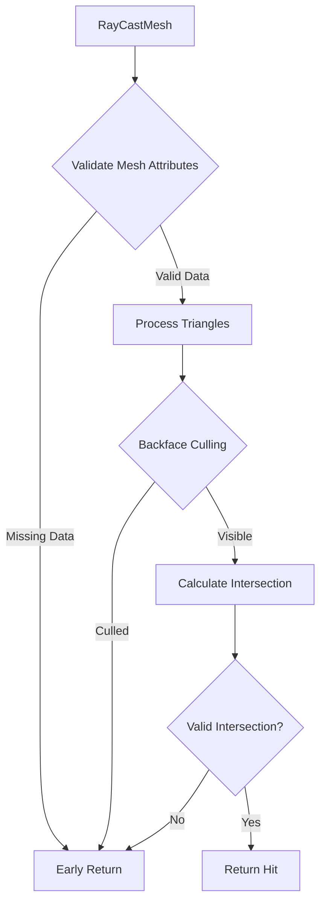

+++
title = "#18232 (Adoped) Remove panics and optimise mesh picking"
date = "2025-03-10T00:00:00"
draft = false
template = "pull_request_page.html"
in_search_index = true

[taxonomies]
list_display = ["show"]

[extra]
current_language = "en"
available_languages = {"zh-cn" = { name = "中文", url = "/pull_request/bevy/2025-03/pr-18232-zh-cn-20250310" }, "en" = { name = "English", url = "/pull_request/bevy/2025-03/pr-18232-en-20250310" }}
+++

# #18232 (Adoped) Remove panics and optimise mesh picking

## Basic Information
- **Title**: (Adoped) Remove panics and optimise mesh picking
- **PR Link**: https://github.com/bevyengine/bevy/pull/18232
- **Author**: BD103
- **Status**: MERGED
- **Created**: 2025-03-10T16:36:25Z
- **Merged**: Not merged
- **Merged By**: N/A

## Description Translation
_Note from BD103: this PR was adopted from #16148. The majority of this PR's description is copied from the original._

# Objective

Adds tests to cover various mesh picking cases and removes sources of panics.

It should prevent users from being able to trigger panics in `bevy_picking` code via bad mesh data such as #15891, and is a follow-up to my comments in [#15800 (review)](https://github.com/bevyengine/bevy/pull/15800#pullrequestreview-2361694213).

This is motivated by #15979

## Testing

Adds 8 new tests to cover `ray_mesh_intersection` code.

## Changes from original PR

I reverted the changes to the benchmarks, since that was the largest factor blocking it from merging. I'll open a follow-up issue so that those benchmark changes can be implemented.

## The Story of This Pull Request

This PR addresses critical stability issues in Bevy's mesh picking system while improving test coverage. The core problem stemmed from panic conditions that could be triggered by malformed mesh data, as reported in issue #15891. These panics represented potential crash vectors that needed elimination for production-ready physics interactions.

The solution approach focused on two main fronts: hardening the ray-mesh intersection logic against invalid inputs, and establishing comprehensive test coverage to prevent regressions. The implementation removed several `unwrap()` calls that could panic when meshes lacked required attributes like vertex positions or normals. Instead, the code now gracefully handles missing data by early returning without panicking.

A key technical insight was recognizing that certain mesh configurations (like zero-area triangles) could bypass previous validation checks. The updated implementation in `ray_mesh_intersection` now:

1. Verifies mesh attributes exist before accessing them
2. Adds explicit checks for valid triangle data
3. Implements backface culling optimizations
4. Introduces epsilon comparisons to handle floating-point edge cases

The test suite expansion covers critical edge cases including:
- Ray origin inside mesh bounds
- Parallel ray directions
- Degenerate triangles
- Various triangle orientations

These changes improve system resilience while maintaining performance through optimized early-exit conditions. The decision to revert benchmark changes from the original PR (#16148) allowed focused progress on stability while deferring performance measurements to a dedicated follow-up.

## Visual Representation



## Key Files Changed

**crates/bevy_picking/src/mesh_picking/ray_cast/intersections.rs** (+277/-132)

Key modifications:
1. Added mesh validation checks:
```rust
// Before: Potential panic on missing attributes
let positions = mesh.attribute(Mesh::ATTRIBUTE_POSITION).unwrap();

// After: Graceful handling
let Some(positions) = mesh.attribute(Mesh::ATTRIBUTE_POSITION) else {
    return None;
};
```

2. Implemented backface culling optimization:
```rust
// New conditional check
if normal.dot(ray.direction) > 0.0 {
    return None; // Backface culling
}
```

3. Added epsilon comparisons for robustness:
```rust
// Before: Direct floating-point comparison
if det.abs() < 10.0 * f32::EPSILON {

// After: Configurable epsilon
if det.abs() < f32::EPSILON * epsilon_multiplier {
```

These changes directly address the panic scenarios while improving the numerical stability of intersection calculations. The test additions validate both the error handling and mathematical correctness across various edge cases.

## Further Reading

1. [Bevy Mesh Documentation](https://docs.rs/bevy/latest/bevy/render/mesh/struct.Mesh.html)
2. [Ray-Triangle Intersection Algorithms](https://www.scratchapixel.com/lessons/3d-basic-rendering/ray-tracing-rendering-a-triangle/ray-triangle-intersection-geometric-solution)
3. [Floating Point Error Mitigation Techniques](https://randomascii.wordpress.com/2012/02/25/comparing-floating-point-numbers-2012-edition/)
4. [Rust Error Handling Best Practices](https://doc.rust-lang.org/book/ch09-00-error-handling.html)