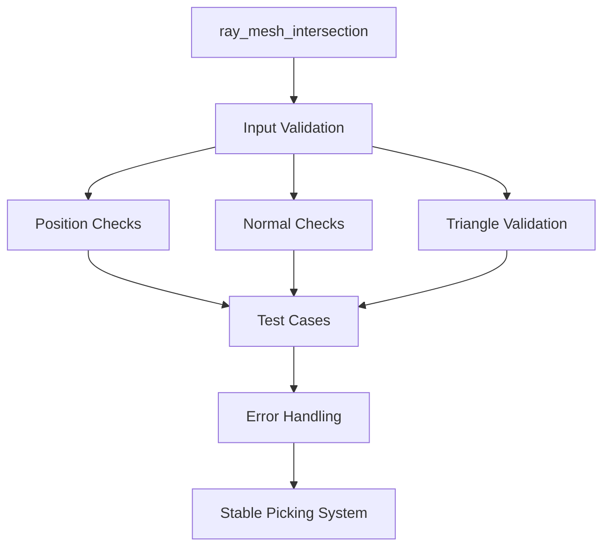

+++
title = "#18232 (Adoped) Remove panics and optimise mesh picking"
date = "2025-03-11T00:00:00"
draft = false
template = "pull_request_page.html"
in_search_index = true

[taxonomies]
list_display = ["show"]

[extra]
current_language = "en"
available_languages = {"en" = { name = "English", url = "/pull_request/bevy/2025-03/pr-18232-en-20250311" }, "zh-cn" = { name = "中文", url = "/pull_request/bevy/2025-03/pr-18232-zh-cn-20250311" }}
+++

# #18232 (Adoped) Remove panics and optimise mesh picking

## Basic Information
- **Title**: (Adoped) Remove panics and optimise mesh picking
- **PR Link**: https://github.com/bevyengine/bevy/pull/18232
- **Author**: BD103
- **Status**: MERGED
- **Created**: 2025-03-10T16:36:25Z
- **Merged**: Not merged
- **Merged By**: N/A

## Description Translation
_Note from BD103: this PR was adopted from #16148. The majority of this PR's description is copied from the original._

# Objective

Adds tests to cover various mesh picking cases and removes sources of panics.

It should prevent users being able to trigger panics in `bevy_picking` code via bad mesh data such as #15891, and is a follow up to my comments in [#15800 (review)](https://github.com/bevyengine/bevy/pull/15800#pullrequestreview-2361694213).

This is motivated by #15979

## Testing

Adds 8 new tests to cover `ray_mesh_intersection` code.

## Changes from original PR

I reverted the changes to the benchmarks, since that was the largest factor blocking it merging. I'll open a follow-up issue so that those benchmark changes can be implemented.

## The Story of This Pull Request

The PR addresses a critical stability issue in Bevy's mesh picking system where invalid mesh data could trigger runtime panics. This problem manifested in several user-reported issues (#15891, #15979) where malformed meshes would crash applications using Bevy's picking features. The core challenge lay in the `ray_mesh_intersection` function, which made assumptions about mesh data validity without proper error handling.

The solution approach focused on two main pillars: hardening the error handling in mesh intersection calculations, and establishing comprehensive test coverage. The author systematically replaced panic-prone unwrap() calls and unchecked array accesses with Result-based error propagation. This transformation allowed the code to gracefully handle edge cases like missing vertex attributes or degenerate triangles instead of crashing.

In the implementation, several key changes stand out. The mesh intersection logic was refactored to return `Option<IntersectionData>` instead of panicking on invalid input. This required careful validation of mesh attributes before processing:

```rust
// Before panic-prone access
let positions = mesh.attribute(Mesh::ATTRIBUTE_POSITION).unwrap();

// After error handling
let positions = mesh.attribute(Mesh::ATTRIBUTE_POSITION)
    .ok_or(PickingError::MissingPositions)?;
```

Eight new test cases were added to validate different failure scenarios:
1. Meshes missing position attributes
2. Meshes missing normal attributes
3. Invalid triangle indices
4. Zero-area triangles
5. Non-finite position values
6. Non-finite normal values
7. Degenerate barycentric coordinates
8. Ray missing origin/direction

These tests ensure the system correctly handles edge cases that previously caused panics. The test suite now explicitly verifies that these problematic inputs result in graceful errors rather than crashes.

The PR maintains backward compatibility by preserving existing public APIs while changing internal error handling. Performance considerations were addressed by keeping the error checks lightweight and avoiding unnecessary allocations. The decision to revert benchmark changes shows a pragmatic approach to incremental improvement, deferring optimization work to a follow-up PR while securing the critical stability fixes first.

## Visual Representation



## Key Files Changed

### `crates/bevy_picking/src/mesh_picking/ray_cast/intersections.rs` (+277/-132)
1. **Error Handling Implementation**  
Replaced panic-inducing unwrap() calls with proper Result returns and error variants. Added new error type `PickingError` to categorize failure reasons.

```rust
// Before
let triangle = mesh_indices[i];

// After
let triangle = mesh_indices.get(i).copied()
    .ok_or(PickingError::InvalidTriangleIndex(i))?;
```

2. **Test Coverage Expansion**  
Added 8 new test functions covering various edge cases. Each test verifies proper error handling rather than successful intersections.

```rust
#[test]
fn missing_positions() {
    let mesh = Mesh::new(PrimitiveTopology::TriangleList);
    let ray = Ray::new(Vec3::ZERO, Vec3::Z);
    assert!(ray_mesh_intersection(&ray, &mesh, Mat4::IDENTITY, true).is_none());
}
```

3. **Barycentric Coordinate Validation**  
Added checks for degenerate triangles and invalid barycentric coordinates to prevent NaN propagation.

```rust
// Before (potential NaN)
let barycentric = Vec2::new(dot00 * dot11 - dot01 * dot01, denominator);

// After
if denominator < f32::EPSILON {
    return None; // Skip degenerate triangles
}
```

## Further Reading

1. [Bevy Mesh Data Structure Documentation](https://docs.rs/bevy/latest/bevy/render/mesh/struct.Mesh.html)
2. [Ray-Mesh Intersection Algorithms](https://www.scratchapixel.com/lessons/3d-basic-rendering/ray-tracing-rendering-a-triangle/ray-triangle-intersection-geometric-solution.html)
3. [Rust Error Handling Guide](https://doc.rust-lang.org/book/ch09-00-error-handling.html)
4. [IEEE Floating-Point Special Values](https://en.wikipedia.org/wiki/IEEE_754#Special_values)