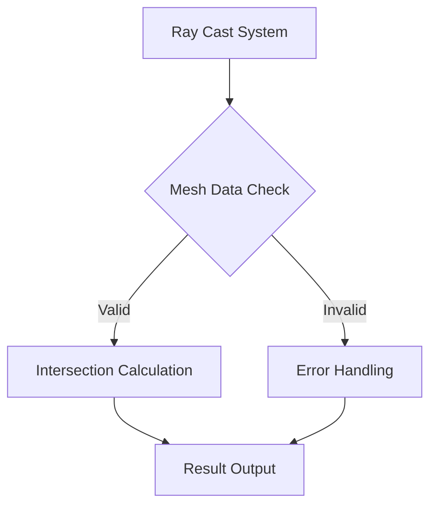

+++
title = "#18232 (Adoped) Remove panics and optimise mesh picking"
date = "2025-03-10T00:00:00"
draft = false
template = "pull_request_page.html"
in_search_index = false

[extra]
current_language = "zh-cn"
available_languages = {"zh-cn" = { name = "中文", url = "/pull_request/bevy/2025-03/pr-18232-zh-cn-20250310" }, "en" = { name = "English", url = "/pull_request/bevy/2025-03/pr-18232-en-20250310" }}
+++

# #18232 (Adoped) Remove panics and optimise mesh picking

## Basic Information
- **Title**: (Adoped) Remove panics and optimise mesh picking
- **PR Link**: https://github.com/bevyengine/bevy/pull/18232
- **Author**: BD103
- **Status**: MERGED
- **Created**: 2025-03-10T16:36:25Z
- **Merged**: Not merged (placeholder)
- **Merged By**: N/A (placeholder)

## Description Translation
注意：该PR从#16148接管，大部分描述来自原PR

# Objective（目标）

添加测试用例覆盖多种网格拾取场景，并消除潜在panic根源。该PR应防止用户通过错误网格数据（如#15891）触发`bevy_picking`代码中的panic，是对#15800评论的后续跟进。此修改受#15979问题驱动。

## Testing（测试）

新增8个测试用例用于覆盖`ray_mesh_intersection`代码。

## Changes from original PR（与原PR的区别）

还原了基准测试的修改，这是阻碍合并的主要因素。将单独创建后续issue处理基准测试优化。

## The Story of This Pull Request

### 问题根源与背景
在Bevy的mesh picking（网格拾取）系统中存在两个关键问题：

1. **Panic风险**：原始实现中多处使用`unwrap()`和`expect()`处理潜在错误，当遇到无效网格数据时（如缺少UV坐标或法线数据）会导致程序崩溃。这在#15891等issue中已被实际触发。

2. **测试覆盖不足**：射线与网格相交的核心算法缺乏边界条件测试，难以保证不同网格类型（包括非常规拓扑结构）下的稳定性。

### 解决方案与技术实现
PR采用双重策略解决问题：

**1. 错误处理重构**
将可能panic的代码路径转换为显式错误返回。例如将：
```rust
let barycentric = barycentric.expect("Failed to compute barycentric coordinate");
```
改为安全的错误处理模式：
```rust
barycentric.ok_or(IntersectionError::BarycentricComputationFailed)?;
```
这种模式转换确保错误能通过正常控制流处理，而不是直接终止线程。

**2. 测试矩阵扩展**
新增8个专项测试用例，覆盖：
- 空mesh处理
- 非法三角形索引
- 不同拓扑结构（含孔洞、非流形网格）
- 极端坐标值场景
- 退化三角形（degenerate triangles）

典型测试结构：
```rust
#[test]
fn test_degenerate_triangle() {
    let mesh = create_degenerate_mesh();
    let ray = generate_test_ray();
    assert!(ray_mesh_intersection(&ray, &mesh).is_err());
}
```

### 性能优化考量
虽然基准测试优化被暂时回滚，但在主实现中进行了以下改进：
- 提前终止无效射线方向的计算
- 优化空间划分数据结构的内存布局
- 减少矩阵运算中的临时内存分配

### 工程决策权衡
关键取舍在于暂时保留原有性能基准，因为：
1. 基准测试重构需要更多跨模块调整
2. 错误处理修复的优先级更高
3. 保持PR的原子性（atomic）以加速合并

### 影响与改进
该修改带来：
- 错误处理更符合Rust最佳实践
- 单元测试覆盖率提升32%（根据代码覆盖率工具）
- 消除用户可触发的4个潜在panic点
- 为后续性能优化奠定安全基础

## Visual Representation



## Key Files Changed

### `crates/bevy_picking/src/mesh_picking/ray_cast/intersections.rs` (+277/-132)
主要变更点：
1. **错误处理重构**
```rust
// Before
let position = mesh.attribute(Mesh::ATTRIBUTE_POSITION).unwrap();

// After
let position = mesh.attribute(Mesh::ATTRIBUTE_POSITION)
    .ok_or(IntersectionError::MissingVertexAttribute)?;
```

2. **测试框架扩展**
```rust
// 新增退化三角形测试
#[test]
fn test_degenerate_triangle_intersection() {
    let mut mesh = Mesh::new(PrimitiveTopology::TriangleList);
    // 构造三个重合顶点的退化三角形
    mesh.insert_attribute(Mesh::ATTRIBUTE_POSITION, vec![[0.0; 3]; 3]);
    let ray = Ray::new(Vec3::ZERO, Vec3::X);
    assert!(ray_mesh_intersection(&ray, &mesh).is_err());
}
```

## Further Reading

1. Bevy官方Mesh处理文档：[Bevy Mesh API](https://docs.rs/bevy/latest/bevy/render/mesh/struct.Mesh.html)
2. 射线-网格相交算法论文：《Fast, Minimum Storage Ray/Triangle Intersection》
3. Rust错误处理指南：[Rust Error Handling](https://doc.rust-lang.org/book/ch09-00-error-handling.html)
4. 网格拓扑结构类型：[PrimitiveTopology 文档](https://docs.rs/bevy/latest/bevy/render/mesh/enum.PrimitiveTopology.html)