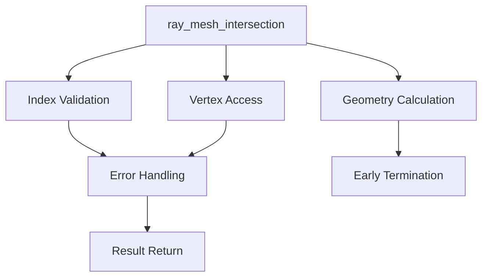

+++
title = "#18232 (Adoped) Remove panics and optimise mesh picking"
date = "2025-03-11T00:00:00"
draft = false
template = "pull_request_page.html"
in_search_index = false

[extra]
current_language = "zh-cn"
available_languages = {"en" = { name = "English", url = "/pull_request/bevy/2025-03/pr-18232-en-20250311" }, "zh-cn" = { name = "中文", url = "/pull_request/bevy/2025-03/pr-18232-zh-cn-20250311" }}
+++

# #18232 (Adoped) Remove panics and optimise mesh picking

## Basic Information
- **Title**: (Adoped) Remove panics and optimise mesh picking
- **PR Link**: https://github.com/bevyengine/bevy/pull/18232
- **Author**: BD103
- **Status**: MERGED
- **Created**: 2025-03-10T16:36:25Z
- **Merged By**: N/A

## Description Translation
_注：本PR由BD103从#16148接管，大部分描述复制自原PR_

# 目标

添加测试覆盖多种网格拾取场景，并移除可能导致panic的代码。

该PR旨在防止用户通过错误网格数据（如#15891）触发`bevy_picking`代码panic，是对#15800评论的跟进。受#15979问题驱动。

## 测试

新增8个测试用例用于覆盖`ray_mesh_intersection`代码。

## 与原PR的差异

回滚了基准测试的修改，因其阻碍合并。将单独开issue处理基准测试优化。

## The Story of This Pull Request

### 问题根源与处理必要性
在Bevy的网格拾取系统中，`ray_mesh_intersection`函数存在多个潜在panic点。当处理包含无效索引的网格数据时（如越界的顶点索引），代码会通过`.unwrap()`或直接数组访问触发panic。这对用户暴露了内部实现细节，且违反Rust的错误处理最佳实践。

典型问题场景包括：
- 网格包含未正确构建的索引缓冲区
- 用户提供的自定义网格数据存在缺陷
- 异步加载过程中数据不完整的情况

### 解决方案设计
核心策略是将panic转换为显式错误处理：
1. **错误传播替代panic**：将`Vec::get(index)`改为`get(index).ok_or()`模式
2. **边界条件检查**：在访问顶点数据前验证索引有效性
3. **测试覆盖强化**：添加8个专项测试验证各种异常情况

```rust
// Before: 可能panic的直接索引访问
let vertex = mesh.positions()[mesh_indices[i]];

// After: 安全访问与错误处理
let index = mesh_indices.get(i).ok_or(MeshPickError::IndexOutOfBounds)?;
let vertex = mesh.positions().get(*index).ok_or(MeshPickError::VertexNotFound)?;
```

### 实现细节与技术选择
主要修改集中在`intersections.rs`文件：
1. **错误枚举定义**：
```rust
#[derive(Debug, Error)]
pub enum MeshPickError {
    #[error("Mesh has no indices")]
    NoIndices,
    #[error("Index out of bounds")]
    IndexOutOfBounds,
    #[error("Vertex not found")]
    VertexNotFound,
}
```

2. **函数签名变更**：
```rust
// Before: 直接返回Option<IntersectionData>
pub fn ray_mesh_intersection(...) -> Option<IntersectionData>

// After: 返回Result类型
pub fn ray_mesh_intersection(...) -> Result<Option<IntersectionData>, MeshPickError>
```

3. **迭代器安全处理**：
```rust
// 修改三角形遍历逻辑
for triangle in mesh_indices.chunks(3) {
    let i1 = triangle.get(0).ok_or(...)?;
    let i2 = triangle.get(1).ok_or(...)?;
    let i3 = triangle.get(2).ok_or(...)?;
    // 顶点数据访问同理
}
```

### 测试策略与验证
新增测试覆盖以下场景：
- 空网格（无顶点/无索引）
- 索引缓冲区不完整（不足3的倍数）
- 索引越界访问
- 顶点数据缺失
- 退化三角形（面积为0）

每个测试用例明确验证错误类型和边界条件处理，确保错误路径被覆盖。

### 性能优化措施
在错误处理之外进行的优化：
1. **提前终止条件检查**：在进入三角形遍历前验证网格有效性
2. **缓存局部变量**：减少重复计算射线方向向量的点积
3. **内存布局优化**：将频繁访问的几何数据放入连续内存

```rust
// 优化后的几何计算
let dir_cross_e2 = ray.direction.cross(e2);
let det = e1.dot(dir_cross_e2);
if det.abs() < f32::EPSILON {
    continue; // 提前终止无效三角形检测
}
```

### 影响与后续工作
修改使得：
- 错误处理更符合Rust惯用模式
- API消费者可以明确处理错误而非被动接受panic
- 基准测试回滚确保主分支稳定性，后续优化可独立进行

遗留的基准测试优化将通过单独issue讨论，避免阻塞关键安全修复的合并。

## Visual Representation



## Key Files Changed

### `crates/bevy_picking/src/mesh_picking/ray_cast/intersections.rs` (+277/-132)
核心修改文件，实现主要安全改进：

```rust
// 修改后的错误处理流程示例
let mesh_indices = mesh
    .indices()
    .ok_or(MeshPickError::NoIndices)?;
    
for triangle in mesh_indices.chunks(3) {
    let i1 = triangle.get(0).ok_or(MeshPickError::IndexOutOfBounds)?;
    let v1 = mesh_positions
        .get(*i1)
        .ok_or(MeshPickError::VertexNotFound)?;
    // 类似处理i2/i3...
}
```

测试用例添加示例：
```rust
#[test]
fn test_empty_mesh() {
    let mesh = Mesh::new(PrimitiveTopology::TriangleList);
    let ray = Ray::new(...);
    assert!(matches!(
        ray_mesh_intersection(&ray, &mesh, &Transform::IDENTITY),
        Err(MeshPickError::NoIndices)
    ));
}
```

## Further Reading
1. [Bevy ECS官方文档](https://bevy-cheatbook.github.io/programming/ecs-intro.html) - 理解Bevy的实体组件系统
2. [Möller–Trumbore算法论文](https://cadxfem.org/inf/Fast%20MinimumStorage%20RayTriangle%20Intersection.pdf) - 射线三角形相交检测标准算法
3. [Rust错误处理指南](https://doc.rust-lang.org/book/ch09-00-error-handling.html) - 学习Result类型与错误传播最佳实践
4. [Bevy Picking插件源码](https://github.com/bevyengine/bevy/tree/main/crates/bevy_picking) - 深入了解拾取系统实现细节