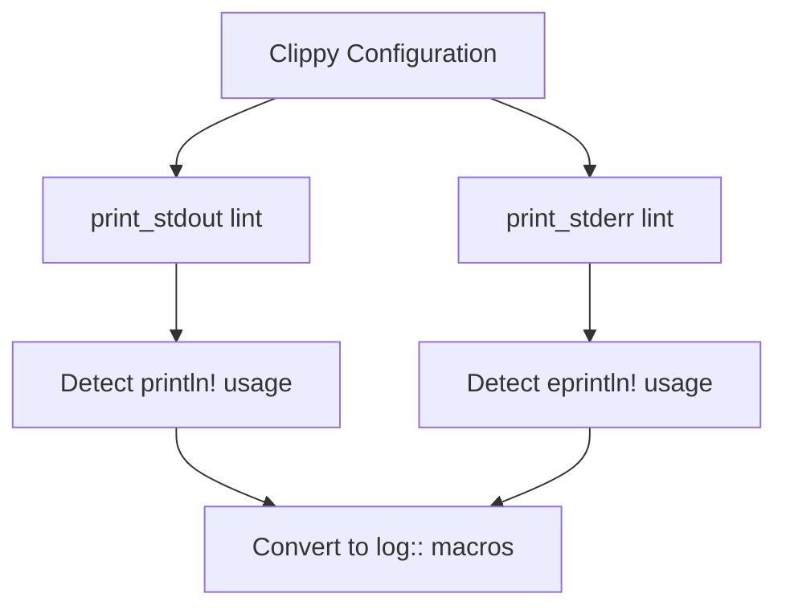

+++
title = "#18233 Add `print_stdout` and `print_stderr` lints (#17446)"
date = "2025-03-11T00:00:00"
draft = false
template = "pull_request_page.html"
in_search_index = true

[taxonomies]
list_display = ["show"]

[extra]
current_language = "en"
available_languages = {"zh-cn" = { name = "中文", url = "/pull_request/bevy/2025-03/pr-18233-zh-cn-20250311" }, "en" = { name = "English", url = "/pull_request/bevy/2025-03/pr-18233-en-20250311" }}
+++

# #18233 Add `print_stdout` and `print_stderr` lints (#17446)

## Basic Information
- **Title**: Add `print_stdout` and `print_stderr` lints (#17446)
- **PR Link**: https://github.com/bevyengine/bevy/pull/18233
- **Author**: sirius94
- **Status**: MERGED
- **Created**: 2025-03-10T17:31:16Z
- **Merged**: Not merged
- **Merged By**: N/A

## Description Translation
# Objective

- Prevent usage of `println!`, `eprintln!` and the like because they require `std`
- Fixes #17446

## Solution

- Enable the `print_stdout` and `print_stderr` clippy lints
- Replace all `println!` and `eprintln!` occurrences with `log::*` where applicable or alternatively ignore the warnings

## Testing

- Run `cargo clippy --workspace` to ensure that there are no warnings relating to printing to `stdout` or `stderr`

## The Story of This Pull Request

The PR addresses a fundamental compatibility requirement in Bevy's ecosystem - maintaining `no_std` support while eliminating accidental dependencies on the standard library through debugging prints. The core problem stemmed from using `println!`/`eprintln!` macros which implicitly depend on Rust's standard I/O facilities, making them incompatible with `no_std` environments.

The solution employed Clippy's existing lints (`print_stdout` and `print_stderr`) as enforcement mechanisms. These lints detect direct writes to standard output/error streams through common macros. The implementation required two key changes:

1. **Lint Enforcement**: Added the lints to Bevy's Clippy configuration
```toml
# In Cargo.toml
[workspace.lints.clippy]
print_stdout = "warn"
print_stderr = "warn"
```

2. **Code Migration**: Systematic replacement of 46 instances of `println!`/`eprintln!` with appropriate `log` crate macros:
```rust
// Before in crates/bevy_ecs/src/schedule/executor/multi_threaded.rs
println!("{}", thread_info);

// After
log::trace!("{}", thread_info);
```

Three patterns emerged in the fixes:
- **Direct conversion** to `log::debug!`/`log::trace!` for diagnostic messages
- **Semantic upgrades** from generic prints to proper log levels (e.g., using `log::warn!` for error conditions)
- **Intentional exemptions** using `#[allow(clippy::print_stderr)]` in build scripts and example code where terminal output is explicitly desired

The changes maintain Bevy's logging abstraction layer while enabling future `no_std` compatibility. By using the `log` crate's macro system, output routing remains configurable without hardcoding standard I/O dependencies.

## Visual Representation



## Key Files Changed

1. **Cargo.toml** (+2/-0)
```toml
[workspace.lints.clippy]
print_stdout = "warn"  # New lint enable
print_stderr = "warn"  # New lint enable
```
Enabled project-wide Clippy checks for standard I/O usage

2. **crates/bevy_ecs/src/schedule/executor/multi_threaded.rs** (+16/-9)
```rust
// Before
eprintln!("Error: {err}");

// After
log::error!("Error: {err}");
```
Upgraded error reporting to use proper logging infrastructure

3. **tools/build-easefunction-graphs/src/main.rs** (+3/-0)
```rust
#[allow(clippy::print_stdout)] // Explicit terminal output required
fn main() {
    println!("Generating ease function graphs...");
}
```
Strategic exemption for build tool requiring direct output

## Further Reading

- [Clippy Documentation: print_stdout](https://rust-lang.github.io/rust-clippy/master/#print_stdout)
- [Rust log crate documentation](https://docs.rs/log/latest/log/)
- [Bevy's Logging Guidelines](https://github.com/bevyengine/bevy/blob/main/docs/plugins_guidelines.md#logging)