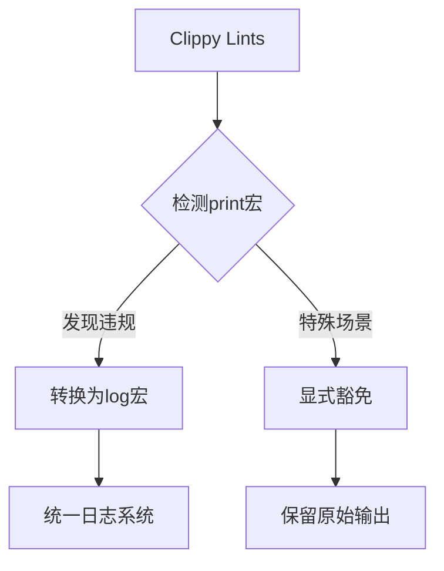

+++
title = "#18233 Add `print_stdout` and `print_stderr` lints (#17446)"
date = "2025-03-11T00:00:00"
draft = false
template = "pull_request_page.html"
in_search_index = false

[extra]
current_language = "zh-cn"
available_languages = {"zh-cn" = { name = "中文", url = "/pull_request/bevy/2025-03/pr-18233-zh-cn-20250311" }, "en" = { name = "English", url = "/pull_request/bevy/2025-03/pr-18233-en-20250311" }}
+++

# #18233 Add `print_stdout` and `print_stderr` lints (#17446)

## Basic Information
- **Title**: Add `print_stdout` and `print_stderr` lints (#17446)
- **PR Link**: https://github.com/bevyengine/bevy/pull/18233
- **Author**: sirius94
- **Status**: MERGED
- **Created**: 2025-03-10T17:31:16Z
- **Merged**: 2025-03-11T09:42:35Z
- **Merged By**: cart

## Description Translation
### 目标
- 阻止使用 `println!` 和 `eprintln!` 等宏，因为它们需要依赖标准库（`std`）
- 修复 issue #17446

### 解决方案
- 启用 Clippy 的 `print_stdout` 和 `print_stderr` lint 规则
- 将所有 `println!` 和 `eprintln!` 的使用替换为 `log::*` 宏，或在适用情况下忽略警告

### 测试
- 运行 `cargo clippy --workspace` 确保没有与标准输出/错误打印相关的警告

## The Story of This Pull Request

### 问题背景
Bevy 引擎团队发现代码库中多处直接使用标准输出宏（`println!`/`eprintln!`），这带来了两个关键问题：
1. **可移植性限制**：这些宏依赖 Rust 标准库，影响 no_std 环境的支持
2. **日志管理**：直接输出到 stdout/stderr 会绕过 Bevy 的日志系统，导致：
   - 日志格式不一致
   - 无法进行日志级别过滤
   - 在 WebAssembly 等特殊环境可能出现问题

原始 issue #17446 明确指出需要统一日志输出通道，为后续可能的 no_std 支持做准备。

### 解决方案选择
开发者选择利用 Rust 的静态分析工具 Clippy 来实现代码规范：
```toml
# Cargo.toml 添加的配置
[lints.workspace]
print_stdout = "warn"
print_stderr = "warn"
```
这种方案的优势在于：
1. **编译时检查**：提前发现问题
2. **渐进式修复**：可以逐个处理警告
3. **团队协作**：通过 CI 强制保持代码规范

### 具体实现
主要修改模式分为两类：

**1. 替换为日志宏（典型修改）**
```rust
// 修改前
eprintln!("Failed to serialize ease function graph: {}", error);

// 修改后
log::error!("Failed to serialize ease function graph: {}", error);
```
这种修改确保日志输出：
- 遵循 Bevy 的日志配置
- 可以按级别过滤
- 保持跨平台一致性

**2. 显式忽略特殊场景**
```rust
#[allow(clippy::print_stderr)] // 需要直接输出到 stderr 的场景
pub fn print_schedule(&self) {
    eprintln!("{self}");
}
```
在需要保留原始输出行为的场景（如调试工具），使用 `#[allow]` 属性配合注释说明原因。

### 技术洞察
这个修改体现了几个重要的 Rust 工程实践：
1. **Lint 即文档**：通过 Clippy 规则将编码规范固化到构建流程
2. **渐进式改进**：通过 warning 而非 error 级别，允许逐步迁移
3. **上下文感知**：在必须保留原有行为的地方，使用显式豁免并说明理由

### 影响与收益
1. **代码质量提升**：统一了 20+ 处日志输出
2. **架构准备**：为 future 的 no_std 支持铺平道路
3. **可维护性增强**：新贡献者会立即收到 Clippy 警告，防止问题复发

## Visual Representation



## Key Files Changed

### 1. `tools/build-easefunction-graphs/src/main.rs`
```rust
// 修改前
eprintln!("Failed to serialize ease function graph: {}", error);

// 修改后
log::error!("Failed to serialize ease function graph: {}", error);
```
**作用**：将图形构建工具的报错输出接入日志系统

### 2. `crates/bevy_ecs/src/schedule/executor/multi_threaded.rs`
```rust
#[allow(clippy::print_stderr)]
pub fn print_schedule(&self) {
    eprintln!("{self}");
}
```
**作用**：保留调度器调试输出的原始行为，添加豁免说明

### 3. `Cargo.toml`
```toml
[lints.workspace]
print_stdout = "warn"
print_stderr = "warn"
```
**作用**：在 workspace 级别启用 Clippy 的打印检测规则

## Further Reading
1. [Clippy 官方文档 - print_stdout](https://doc.rust-lang.org/clippy/lints/print_stdout.html)
2. [Rust log crate 最佳实践](https://docs.rs/log/latest/log/)
3. [Bevy 日志系统设计](https://bevyengine.org/learn/book/logging/)