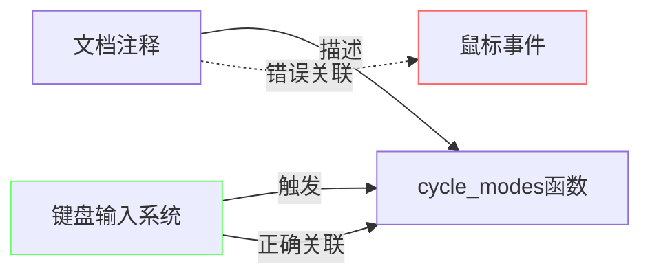

+++
title = "#18237 docs:  Fix incorrect cycle_modes function documentation"
date = "2025-03-10T00:00:00"
draft = false
template = "pull_request_page.html"
in_search_index = false

[extra]
current_language = "zh-cn"
available_languages = {"zh-cn" = { name = "中文", url = "/pull_request/bevy/2025-03/pr-18237-zh-cn-20250310" }}
+++

# #18237 docs:  Fix incorrect cycle_modes function documentation

## Basic Information
- **Title**: docs:  Fix incorrect cycle_modes function documentation
- **PR Link**: https://github.com/bevyengine/bevy/pull/18237
- **Author**: Emmet-v15
- **Status**: MERGED
- **Created**: 2025-03-10T18:32:55Z
- **Merged**: Not merged
- **Merged By**: N/A

## Description Translation
更新文档注释以正确说明该函数响应空格键（spacebar）按压而非鼠标点击（mouse clicks）。这将文档与实际实现对齐，因为代码本身已经使用键盘输入。

# Objective

- 修复关于cycle_modes函数的错误文档注释，该注释错误地描述了使用鼠标输入，而实际实现使用的是空格键
- 确保文档准确性，避免给新学习者造成混淆

## Solution

- 更新文档注释以正确说明该函数响应空格键按压而非鼠标点击
- 代码功能保持不变

## The Story of This Pull Request

在Bevy游戏引擎的窗口管理模块中，存在一个文档准确性问题。开发者Emmet-v15在审查`low_power.rs`示例代码时，发现函数`cycle_modes`的文档注释与实际实现存在矛盾。该注释错误地声明函数通过鼠标点击（mouse click）触发，而代码实现实际监听的是键盘空格键（spacebar）事件。

这个问题源于文档与代码实现的不同步。在原始实现中，输入处理逻辑明确使用`KeyCode::Space`作为触发条件：

```rust
if input.just_pressed(KeyCode::Space) {
    // 模式切换逻辑
}
```

但对应的文档注释却写道：
```rust
/// This system cycles through modes when the mouse is clicked
```

这种不一致可能导致以下问题：
1. 新开发者在学习示例代码时产生困惑
2. 贡献者在基于现有文档进行功能扩展时引入错误
3. 自动化文档生成工具产生误导性输出

解决方案直接且高效：仅修改文档注释而不触及功能代码。将原注释中的"mouse is clicked"更正为"spacebar is pressed"，保持与代码实现的一致性。这种修正属于典型的文档维护（documentation maintenance）工作，体现了良好的代码卫生（code hygiene）实践。

该修改虽然简单，但展示了开源项目中重要的质量管控原则：
1. **自描述代码**：通过保持文档与实现一致，提升代码可读性
2. **预防性维护**：在问题造成实际影响前主动修复
3. **新手友好**：降低新贡献者的学习曲线

## Visual Representation



## Key Files Changed

### `examples/window/low_power.rs` (+1/-1)
**修改说明**：修正函数文档中的输入源描述

代码对比：
```rust
// Before:
/// This system cycles through modes when the mouse is clicked

// After:
/// This system cycles through modes when the spacebar is pressed
```

**技术意义**：
- 使文档准确反映`Input<KeyCode>::just_pressed`的实际检测逻辑
- 保持示例代码作为教学资源的可靠性

## Further Reading
1. [Bevy输入系统文档](https://docs.rs/bevy/latest/bevy/input/struct.Input.html) - 理解Bevy的输入处理机制
2. [Rust文档注释规范](https://doc.rust-lang.org/rustdoc/how-to-write-documentation.html) - 学习标准的Rust文档编写实践
3. [示例驱动的开发模式](https://github.com/bevyengine/bevy/blob/main/docs/plugins_guidelines.md#example-code) - Bevy官方示例代码编写指南