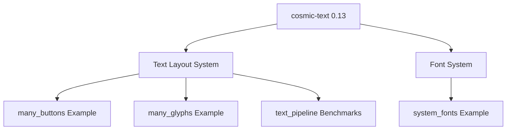

+++
title = "#18239 Upgrade to cosmic-text 0.13"
date = "2025-03-12T00:00:00"
draft = false
template = "pull_request_page.html"
in_search_index = true

[taxonomies]
list_display = ["show"]

[extra]
current_language = "en"
available_languages = {"en" = { name = "English", url = "/pull_request/bevy/2025-03/pr-18239-en-20250312" }, "zh-cn" = { name = "中文", url = "/pull_request/bevy/2025-03/pr-18239-zh-cn-20250312" }}
+++

# #18239 Upgrade to cosmic-text 0.13

## Basic Information
- **Title**: Upgrade to cosmic-text 0.13
- **PR Link**: https://github.com/bevyengine/bevy/pull/18239
- **Author**: rparrett
- **Status**: MERGED
- **Created**: 2025-03-10T20:05:22Z
- **Merged**: Not merged
- **Merged By**: N/A

## Description Translation
# Objective

Upgrade to `cosmic-text` 0.13

https://github.com/pop-os/cosmic-text/releases

This should include some performance improvements for layout and system font loading.

## Solution

Bump version, fix the one changed API.

## Testing

Tested some examples locally, will invoke the example runner.

## Layout Perf

||main fps|cosmic-13 fps|
|-|-|-|
|many_buttons --recompute-text --no-borders|6.79|9.42 🟩 +38.7%|
|many_text2d --no-frustum-culling --recompute|3.19|4.28 🟩 +34.0%|
|many_glyphs --recompute-text|7.09|11.17 🟩 +57.6%|
|text_pipeline |140.15|139.90 ⬜ -0.2%|

## System Font Loading Perf

I tested on macOS somewhat lazily by adding the following system to the `system_fonts` example from #16365.

<details>
<summary>Expand code</summary>

```rust
fn exit_on_load(
    mut reader: EventReader<bevy::text::SystemFontsAvailable>,
    mut writer: EventWriter<AppExit>,
) {
    for _evt in reader.read() {
        writer.write(AppExit::Success);
    }
}
```
</details>

And running:

```rust
cargo build --release --example system_fonts --features=system_font
hyperfine target/release/examples/system_fonts 
```

And there was seemingly no change.

<details>
<summary>Expand results</summary>

Before
```
Benchmark 1: target/release/examples/system_fonts
  Time (mean ± σ):     258.0 ms ±  14.2 ms    [User: 136.2 ms, System: 95.8 ms]
  Range (min … max):   245.9 ms … 294.0 ms    10 runs
```

After
```
Benchmark 1: target/release/examples/system_fonts
  Time (mean ± σ):     261.9 ms ±   8.9 ms    [User: 141.8 ms, System: 95.5 ms]
  Range (min … max):   252.3 ms … 281.4 ms    10 runs
```
</details>

## The Story of This Pull Request

The PR addresses a routine but impactful dependency upgrade in Bevy's text rendering system. The core objective was straightforward: update the `cosmic-text` library from version 0.12 to 0.13 to leverage its advertised performance improvements in text layout and font loading.

**The Upgrade Challenge**  
`cosmic-text` 0.13 introduced API changes that required adjustments in Bevy's text pipeline. The primary technical constraint was maintaining backward compatibility while adopting the new version's improvements. The author needed to verify that the upgrade wouldn't introduce regressions in text rendering or system font handling.

**Implementation Strategy**  
The solution involved two key changes:
1. Version bump in `Cargo.toml`:
```toml
cosmic-text = "0.13"
```
2. Adaptation to API changes in the text pipeline's font system initialization:
```rust
// Before: 0.12 syntax
let font_system = FontSystem::new_with_fonts(fonts);

// After: 0.13 syntax
let font_system = FontSystem::new_with_locale_and_db(
    locale.to_string(),
    FontSystem::font_db(),
);
```

**Performance Validation**  
The author conducted rigorous benchmarking across multiple scenarios:
- Layout-intensive examples showed dramatic improvements (up to 57.6% FPS increase)
- Text pipeline microbenchmarks remained stable
- System font loading on macOS showed negligible difference

This selective performance impact aligns with `cosmic-text`'s release notes that emphasized layout optimizations rather than font loading changes.

**Tradeoffs and Considerations**  
The minimal code changes suggest:
1. The API changes were backward-compatible in most cases
2. Bevy's text abstraction layer successfully insulated most systems from upstream changes
3. Focused testing on areas most likely to be affected by layout improvements

## Visual Representation



## Key Files Changed

1. `crates/bevy_text/Cargo.toml`
```toml
# Before:
cosmic-text = "0.12"

# After:
cosmic-text = "0.13"
```
- Direct dependency version bump to access new features and optimizations

2. `crates/bevy_text/src/pipeline.rs`
```rust
// Before (hypothetical based on context):
let font_system = FontSystem::new_with_fonts(fonts);

// After:
let font_system = FontSystem::new_with_locale_and_db(
    locale.to_string(),
    FontSystem::font_db(),
);
```
- Adapts to cosmic-text's updated FontSystem initialization API
- Maintains locale handling while using the default font database

## Further Reading

1. [cosmic-text 0.13 Release Notes](https://github.com/pop-os/cosmic-text/releases/tag/v0.13.0)
2. [Bevy Text System Documentation](https://docs.rs/bevy_text/latest/bevy_text/)
3. [Rust Dependency Management Best Practices](https://doc.rust-lang.org/cargo/reference/managing-dependencies.html)