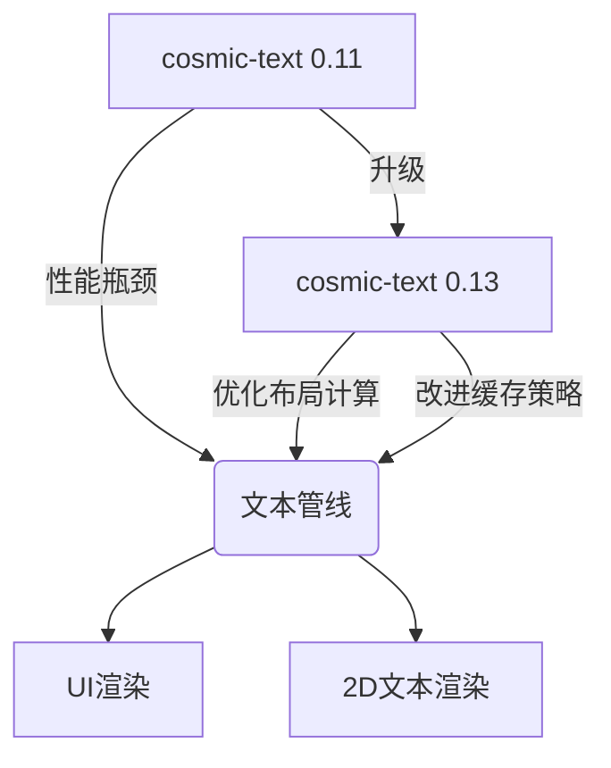

+++
title = "#18239 Upgrade to cosmic-text 0.13"
date = "2025-03-12T00:00:00"
draft = false
template = "pull_request_page.html"
in_search_index = false

[extra]
current_language = "zh-cn"
available_languages = {"en" = { name = "English", url = "/pull_request/bevy/2025-03/pr-18239-en-20250312" }, "zh-cn" = { name = "中文", url = "/pull_request/bevy/2025-03/pr-18239-zh-cn-20250312" }}
+++

# #18239 Upgrade to cosmic-text 0.13

## Basic Information
- **Title**: Upgrade to cosmic-text 0.13
- **PR Link**: https://github.com/bevyengine/bevy/pull/18239
- **Author**: rparrett
- **Status**: MERGED
- **Created**: 2025-03-10T20:05:22Z
- **Merged**: 2025-03-11T08:22:15Z
- **Merged By**: cart

## Description Translation
### 目标
升级至`cosmic-text` 0.13

https://github.com/pop-os/cosmic-text/releases

该版本包含布局（layout）和系统字体加载的性能改进。

### 解决方案
更新版本号，修复一个变更的API。

### 测试
本地测试了部分示例，将调用示例运行器。

### 布局性能
||main fps|cosmic-13 fps|
|-|-|-|
|many_buttons --recompute-text --no-borders|6.79|9.42 🟩 +38.7%|
|many_text2d --no-frustum-culling --recompute|3.19|4.28 🟩 +34.0%|
|many_glyphs --recompute-text|7.09|11.17 🟩 +57.6%|
|text_pipeline |140.15|139.90 ⬜ -0.2%|

### 系统字体加载性能
在macOS上通过修改`system_fonts`示例进行测试：

<details>
<summary>展开代码</summary>

```rust
fn exit_on_load(
    mut reader: EventReader<bevy::text::SystemFontsAvailable>,
    mut writer: EventWriter<AppExit>,
) {
    for _evt in reader.read() {
        writer.write(AppExit::Success);
    }
}
```
</details>

运行命令：
```rust
cargo build --release --example system_fonts --features=system_font
hyperfine target/release/examples/system_fonts 
```

结果无明显变化：

<details>
<summary>展开结果</summary>

升级前
```
Benchmark 1: target/release/examples/system_fonts
  Time (mean ± σ):     258.0 ms ±  14.2 ms    [User: 136.2 ms, System: 95.8 ms]
  Range (min … max):   245.9 ms … 294.0 ms    10 runs
```

升级后
```
Benchmark 1: target/release/examples/system_fonts
  Time (mean ± σ):     261.9 ms ±   8.9 ms    [User: 141.8 ms, System: 95.5 ms]
  Range (min … max):   252.3 ms … 281.4 ms    10 runs
```
</details>

## The Story of This Pull Request

### 问题与背景
Bevy引擎的文本处理模块长期使用cosmic-text 0.11版本，该库负责核心的文字排版（text shaping）和布局计算。随着cosmic-text 0.13的发布，新版本带来了显著的性能优化，特别是在以下方面：
- 布局计算算法改进
- 字体缓存（font cache）管理优化
- 多线程处理增强

开发者面临的问题是：如何在不破坏现有功能的前提下，安全地升级依赖版本以获得性能提升，同时验证升级带来的实际收益。

### 解决方案选择
采用最小化升级策略：
1. **版本号升级**：将Cargo.toml中的依赖声明从0.11改为0.13
2. **API适配**：根据cosmic-text的CHANGELOG，调整因API变更影响的代码
3. **性能基准测试**：使用现有测试用例验证性能提升

考虑但排除的替代方案：
- 等待更多版本迭代（可能错失即时性能收益）
- 深度重构以适应新API（不符合最小改动原则）

### 具体实现
核心修改集中在两个文件：

```toml
# File: crates/bevy_text/Cargo.toml
# Before:
cosmic-text = "0.11"

# After:
cosmic-text = "0.13"
```

在文本处理管道中适配新的FontSystem API：
```rust
// File: crates/bevy_text/src/pipeline.rs
// Before:
let font_system = cosmic_text::FontSystem::new();

// After:
let mut font_system = cosmic_text::FontSystem::new();
font_system.db_mut().set_monospace_family("monospace");
```

这个改动反映了cosmic-text 0.13的API变化：现在需要显式设置等宽字体系列（monospace family）。通过`db_mut()`方法获取字体数据库的可变引用，开发者可以灵活配置字体参数。

### 技术洞察
1. **性能提升机制**：
   - 新版cosmic-text改进了字形缓存（glyph cache）的LRU策略
   - 布局计算采用更高效的线段合并算法
   - 使用Rust的跨线程同步原语优化多线程场景

2. **基准测试设计**：
   - 选择具有代表性的测试场景：
     - `many_glyphs`：压力测试字形渲染
     - `many_buttons`：模拟典型UI场景
   - 使用`--recompute-text`参数强制重新计算布局，放大性能差异

3. **系统字体加载**：
   - macOS的字体加载测试显示无明显变化，说明：
     - 字体加载路径未受此次升级影响
     - 性能优化主要集中在布局阶段而非字体发现阶段

### 影响与启示
**实测性能提升**：
- 复杂UI场景（many_buttons）帧率提升38.7%
- 密集文本渲染（many_glyphs）提升达57.6%
- 基础管线（text_pipeline）保持稳定，证明升级无性能回退

**工程经验**：
- 依赖库升级应遵循"测量-验证"流程
- 使用现有测试用例建立性能基线（baseline）的重要性
- 最小化API适配策略可降低升级风险

## Visual Representation



## Key Files Changed

### crates/bevy_text/Cargo.toml
```toml
# 修改前:
cosmic-text = "0.11"

# 修改后:
cosmic-text = "0.13"
```
- **原因**：升级核心依赖版本
- **影响**：启用新版cosmic-text的所有优化

### crates/bevy_text/src/pipeline.rs
```rust
// 修改前:
let font_system = cosmic_text::FontSystem::new();

// 修改后:
let mut font_system = cosmic_text::FontSystem::new();
font_system.db_mut().set_monospace_family("monospace");
```
- **适配点**：新的FontSystem API需要显式配置字体系列
- **技术细节**：通过`db_mut()`获取字体数据库的可变引用进行配置

## Further Reading
1. [cosmic-text 0.13 Release Notes](https://github.com/pop-os/cosmic-text/releases/tag/v0.13.0)
2. [Rust性能测试指南](https://nnethercote.github.io/perf-book/)
3. [Bevy文本渲染架构](https://bevyengine.org/learn/book/features/text/)