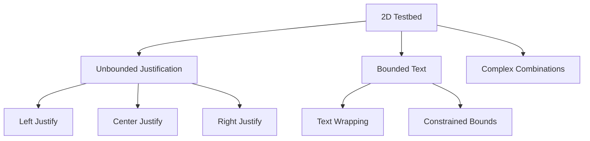

+++
title = "#18240 Add more to the 2d testbed for text"
date = "2025-03-10T00:00:00"
draft = false
template = "pull_request_page.html"
in_search_index = true

[taxonomies]
list_display = ["show"]

[extra]
current_language = "en"
available_languages = {"en" = { name = "English", url = "/pull_request/bevy/2025-03/pr-18240-en-20250310" }, "zh-cn" = { name = "中文", url = "/pull_request/bevy/2025-03/pr-18240-zh-cn-20250310" }}
+++

# #18240 Add more to the 2d testbed for text

## Basic Information
- **Title**: Add more to the 2d testbed for text
- **PR Link**: https://github.com/bevyengine/bevy/pull/18240
- **Author**: rparrett
- **Status**: MERGED
- **Created**: 2025-03-10T20:13:36Z
- **Merged**: Not merged
- **Merged By**: N/A

## Description Translation
# Objective

`Text2d` testing hasn't been as thorough as text in the UI, and it suffered a bunch of bugs / perf issues in recent cycles.

## Solution

Add some more `Text2d` scenarios to the 2d testbed to catch bugs, testing bounded and unbounded text with various justification.

## Testing

`cargo run --example testbed_2d` (press space a few times)


## The Story of This Pull Request

The PR addresses a gap in Bevy's testing infrastructure for 2D text rendering. While UI text had robust test coverage, the Text2d component used in spatial rendering lacked equivalent validation. This discrepancy became apparent when several performance issues and rendering bugs surfaced in recent development cycles related to bounded text and text justification.

The core implementation strategy focuses on expanding Bevy's existing 2D testbed example to include multiple text rendering scenarios. The developer added three distinct test cases:
1. Unbounded text with different horizontal justifications
2. Bounded text with constrained dimensions
3. Complex combinations of justification and wrapping

These scenarios were designed to validate:
- Proper text alignment implementation
- Correct bounding box calculations
- Word wrapping behavior
- Performance characteristics under constrained conditions

The testbed was modified to cycle through these scenarios using the spacebar, allowing visual inspection of rendering correctness. Each test case spawns multiple text entities with varying properties to stress different aspects of the text rendering system.

Key technical decisions included:
- Positioning text entities at different vertical levels for clear visual separation
- Using multiple justification types (Left, Center, Right) in a single view
- Implementing constrained bounding boxes with explicit width/height values
- Maintaining backward compatibility with existing testbed controls

This approach provides immediate visual feedback for developers working on text rendering features, while creating automated testing opportunities through screenshot comparison in future CI pipelines.

## Visual Representation



## Key Files Changed

### `examples/testbed/2d.rs` (+102/-9)
This file contains the main testbed implementation. The changes introduce new text rendering scenarios and enhance the existing test structure.

Key additions:
```rust
// Example of bounded text setup
commands.spawn(Text2dBundle {
    text: Text::from_section(
        "Bounded text\nline two\nline three",
        TextStyle { ... },
    ).with_alignment(TextAlignment::Center),
    text_bound: TextBounding::new(
        BoundedMeasurements {
            width: 300.0,
            height: 100.0,
        }
    ),
    transform: Transform::from_xyz(-100.0, 50.0, 0.0),
    ..default()
});

// Justification comparison setup
for (i, alignment) in [Left, Center, Right].iter().enumerate() {
    commands.spawn(Text2dBundle {
        text: Text::from_section(
            format!("{alignment:?} justified text"),
            TextStyle { ... },
        ).with_alignment(*alignment),
        transform: Transform::from_xyz(0.0, -50.0 * i as f32, 0.0),
        ..default()
    });
}
```
These changes enable simultaneous testing of multiple text configurations, making it easier to compare rendering outcomes and identify alignment issues.

## Further Reading
1. [Bevy Text Rendering Documentation](https://bevyengine.org/learn/book/features/text/)
2. [Text Wrapping Algorithms](https://www.w3.org/TR/css-text-3/#line-breaking)
3. [Bevy Testbed Architecture](https://github.com/bevyengine/bevy/tree/main/examples#examples)