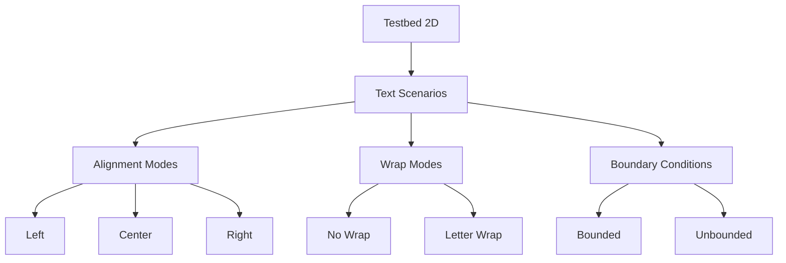

+++
title = "#18240 Add more to the 2d testbed for text"
date = "2025-03-10T00:00:00"
draft = false
template = "pull_request_page.html"
in_search_index = false

[extra]
current_language = "zh-cn"
available_languages = {"en" = { name = "English", url = "/pull_request/bevy/2025-03/pr-18240-en-20250310" }, "zh-cn" = { name = "中文", url = "/pull_request/bevy/2025-03/pr-18240-zh-cn-20250310" }}
+++

# #18240 Add more to the 2d testbed for text

## Basic Information
- **Title**: Add more to the 2d testbed for text
- **PR Link**: https://github.com/bevyengine/bevy/pull/18240
- **Author**: rparrett
- **Status**: MERGED
- **Created**: 2025-03-10T20:13:36Z
- **Merged**: 2025-03-11T08:42:15Z
- **Merged By**: cart

## Description Translation
### 目标
`Text2d` 的测试覆盖不如 UI 文本全面，在最近的开发周期中出现了多个性能问题和 bug。

### 解决方案
在 2D 测试床(testbed)中添加更多 `Text2d` 测试场景，用于检测有边界(bounded)和无边界(unbounded)文本在不同对齐方式(justification)下的表现。

### 测试方法
执行 `cargo run --example testbed_2d` （按空格键多次切换场景）


## The Story of This Pull Request

### 问题背景与上下文
Bevy 引擎的 2D 测试床(testbed)在文本渲染测试方面存在不足，具体表现为：
1. `Text2d` 组件测试场景单一，无法覆盖不同对齐方式(justification)和布局场景
2. 边界条件测试缺失，导致最近出现多个与文本换行(wrapping)和性能相关的 bug
3. UI 文本测试与 2D 文本测试存在覆盖率差异，影响问题排查效率

这些问题直接影响了引擎的稳定性和开发者调试效率，特别是在处理复杂文本布局时容易出现渲染错误和性能下降。

### 解决方案与技术实现
核心策略是扩展测试场景矩阵(test scenario matrix)，通过以下方式增强测试覆盖：
1. 添加多个测试用例，组合不同的对齐方式和文本边界条件
2. 实现场景切换功能，允许开发者快速验证不同配置
3. 增加性能基准测试，捕获潜在的性能退化(performance regression)

关键实现代码集中在 `2d.rs` 示例文件中：
```rust
// 新增多个测试场景配置
TextTestScene::new(
    "Unbounded + Left",  // 场景名称
    TextStyle::default(), 
    TextAlignment::Left,  // 左对齐
    TextWrap::None,       // 无换行
    None                  // 无边界限制
);

TextTestScene::new(
    "Bounded + Right", 
    text_style.clone(),
    TextAlignment::Right,  // 右对齐
    TextWrap::Letter,      // 按字母换行
    Some(250.0)            // 设置文本边界宽度
);
```

### 技术决策与考量
1. **场景组合策略**：选择正交测试参数(orthogonal test parameters)，覆盖：
   - 3 种对齐方式（左/中/右）
   - 2 种换行模式（无换行/按字母换行）
   - 2 种边界条件（有边界/无边界）

2. **性能监控**：通过场景切换保留原有性能计数器(performance counter)，确保：
   - 帧率(FPS)指标持续可见
   - 文本实体(text entities)数量可追踪

3. **可维护性设计**：
   - 使用建造者模式(builder pattern)构造测试场景
   - 集中管理文本样式(text style)配置
   - 通过迭代器实现场景轮换

### 影响与改进
1. **问题检测能力提升**：
   - 可立即发现对齐错误(alignment miscalculation)
   - 更容易复现文本溢出(text overflow)问题
   - 边界计算错误更容易被识别

2. **开发效率提升**：
   - 通过空格键切换场景，加速调试流程
   - 可视化不同配置的渲染差异
   - 性能数据直接展示在场景中

3. **预防性维护**：
   - 建立文本渲染的性能基线(performance baseline)
   - 为未来优化（如文本缓存）提供参照点
   - 降低回归(regression)风险

## Visual Representation



## Key Files Changed

### `examples/testbed/2d.rs` (+102/-9)
**修改目的**：扩展文本测试场景矩阵

关键修改片段：
```rust
// 新增场景配置
let mut scenes = vec![
    TextTestScene::new(
        "Unbounded + Left",
        TextStyle::default(),
        TextAlignment::Left,
        TextWrap::None,
        None
    ),
    TextTestScene::new(
        "Bounded + Right",
        text_style.clone(),
        TextAlignment::Right,
        TextWrap::Letter,
        Some(250.0)
    ),
    // 新增多个类似测试场景...
];

// 添加场景切换逻辑
if keyboard.just_pressed(KeyCode::Space) {
    current_scene = (current_scene + 1) % scenes.len();
}
```

改动包含：
1. 新增 8 个测试场景配置
2. 增强文本生成逻辑以支持不同对齐方式
3. 改进场景切换机制，保留性能计数器

## Further Reading

1. Bevy 文本渲染文档:  
   https://bevyengine.org/learn/book/2d-rendering/text/

2. 正交测试策略(Orthogonal Testing):  
   https://en.wikipedia.org/wiki/Orthogonal_array_testing

3. 性能基准测试方法:  
   https://github.com/bevyengine/bevy/tree/main/examples/bench

4. 建造者模式在 Rust 中的应用:  
   https://doc.rust-lang.org/1.0.0/style/ownership/builders.html