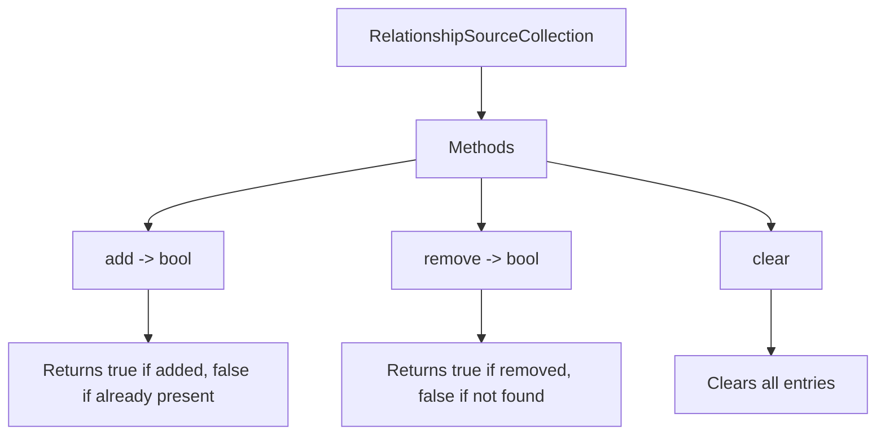

+++
title = "#18241 Expand the `RelationshipSourceCollection` to return more information"
date = "2025-03-10T00:00:00"
draft = false
template = "pull_request_page.html"
in_search_index = true

[taxonomies]
list_display = ["show"]

[extra]
current_language = "en"
available_languages = {"en" = { name = "English", url = "/pull_request/bevy/2025-03/pr-18241-en-20250310" }, "zh-cn" = { name = "中文", url = "/pull_request/bevy/2025-03/pr-18241-zh-cn-20250310" }}
+++

# #18241 Expand the `RelationshipSourceCollection` to return more information

## Basic Information
- **Title**: Expand the `RelationshipSourceCollection` to return more information
- **PR Link**: https://github.com/bevyengine/bevy/pull/18241
- **Author**: Brezak
- **Status**: MERGED
- **Created**: 2025-03-10T20:24:47Z
- **Merged**: Not merged
- **Merged By**: N/A

## Description Translation
# Objective

While redoing #18058 I needed `RelationshipSourceCollection` (henceforth referred to as the **Trait**) to implement `clear` so I added it.

## Solution

Add the `clear` method to the **Trait**.
Also make `add` and `remove` report if they succeeded.

## Testing

Eyeballs

---

## Showcase

The `RelationshipSourceCollection` trait now reports if adding or removing an entity from it was successful.
It also not contains the `clear` method so you can easily clear the collection in generic contexts.

## Changes

EDITED by Alice: We should get this into 0.16, so no migration guide needed.

The `RelationshipSourceCollection` methods `add` and `remove` now need to return a boolean indicating if they were successful (adding a entity to a set that already contains it counts as failure). Additionally the `clear` method has been added to support clearing the collection in generic contexts.

## The Story of This Pull Request

The PR originated from practical needs encountered during the rework of #18058, where the author required enhanced functionality from Bevy's relationship management system. The core challenge centered around the `RelationshipSourceCollection` trait lacking two critical capabilities needed for robust collection management:

1. The ability to clear collection contents in generic contexts
2. Feedback mechanism for mutation operations

Previous implementations of `add` and `remove` methods provided no indication of success, making it impossible to detect duplicate additions or unnecessary removals. This limitation became apparent when trying to implement reliable collection management patterns that required atomic operations with success verification.

The solution focused on three key enhancements to the trait interface:

```rust
pub trait RelationshipSourceCollection {
    // Before:
    fn add(&mut self, entity: Entity);
    fn remove(&mut self, entity: Entity);
    
    // After:
    fn add(&mut self, entity: Entity) -> bool;
    fn remove(&mut self, entity: Entity) -> bool;
    fn clear(&mut self);
}
```

The boolean return values for `add` and `remove` follow standard collection pattern practices seen in Rust's stdlib (e.g., `HashSet::insert`), providing immediate feedback about operation outcomes. This change enables:
- Detection of duplicate entries when adding
- Identification of missing entries when removing
- Better error handling in fallible operations

The new `clear` method addresses a gap in generic collection handling. Previously, clearing required knowing the concrete collection type. By adding this to the trait, developers can now reset collections through trait objects without downcasting.

Implementation considerations included:
1. Maintaining backward compatibility where possible
2. Ensuring consistent behavior across implementors
3. Minimizing performance overhead

The boolean returns add negligible performance impact while providing valuable operational feedback. The `clear` method's default implementation (if any) would need to be carefully considered based on concrete types' requirements.

These changes particularly benefit Bevy's ECS relationship management by:
- Enabling more precise collection manipulation
- Supporting generic systems that operate on relationship collections
- Providing better debugging capabilities through operation feedback

## Visual Representation



## Key Files Changed

- `crates/bevy_ecs/src/relationship/relationship_source_collection.rs` (+56/-12)

Key changes in the trait definition:

```rust
// Before:
pub trait RelationshipSourceCollection {
    fn add(&mut self, entity: Entity);
    fn remove(&mut self, entity: Entity);
}

// After:
pub trait RelationshipSourceCollection {
    fn add(&mut self, entity: Entity) -> bool;
    fn remove(&mut self, entity: Entity) -> bool;
    fn clear(&mut self);
}
```

Implementors like `HashSet<Entity>` now return operation status:

```rust
// Example implementation for HashSet:
impl RelationshipSourceCollection for HashSet<Entity> {
    fn add(&mut self, entity: Entity) -> bool {
        self.insert(entity)
    }

    fn remove(&mut self, entity: Entity) -> bool {
        self.remove(&entity)
    }

    fn clear(&mut self) {
        self.clear();
    }
}
```

## Further Reading

1. Rust Standard Library Collections: https://doc.rust-lang.org/std/collections/
2. Bevy ECS Relationships Documentation: https://bevyengine.org/learn/book/ecs/relationships/
3. Trait Object Safety Rules: https://doc.rust-lang.org/book/ch17-02-trait-objects.html
4. Original PR #18058 Reference: https://github.com/bevyengine/bevy/pull/18058