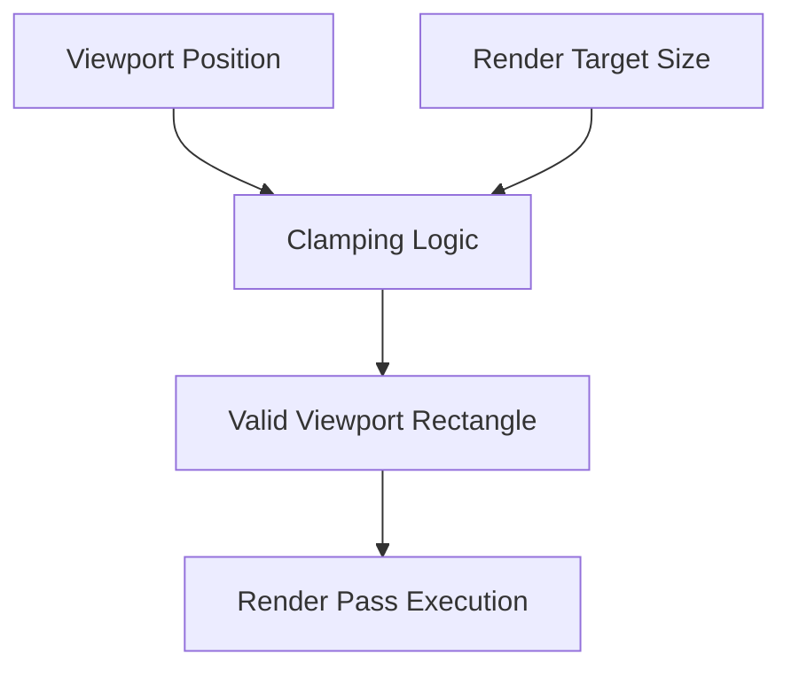

+++
title = "#18242 Incorporate viewport position into clamping in `camera_system`"
date = "2025-03-17T00:00:00"
draft = false
template = "pull_request_page.html"
in_search_index = true

[taxonomies]
list_display = ["show"]

[extra]
current_language = "en"
available_languages = {"en" = { name = "English", url = "/pull_request/bevy/2025-03/pr-18242-en-20250317" }, "zh-cn" = { name = "中文", url = "/pull_request/bevy/2025-03/pr-18242-zh-cn-20250317" }}
+++

# #18242 Incorporate viewport position into clamping in `camera_system`

## Basic Information
- **Title**: Incorporate viewport position into clamping in `camera_system`
- **PR Link**: https://github.com/bevyengine/bevy/pull/18242
- **Author**: mweatherley
- **Status**: MERGED
- **Created**: 2025-03-10T21:21:46Z
- **Merged**: Not merged
- **Merged By**: N/A

## Description Translation
# Objective

In its existing form, the clamping that's done in `camera_system` doesn't work well when the `physical_position` of the associated viewport is nonzero. In such cases, it may produce invalid viewport rectangles (i.e. not lying inside the render target), which may result in crashes during the render pass. 

The goal of this PR is to eliminate this possibility by making the clamping behavior always result in a valid viewport rectangle when possible.

## Solution

Incorporate the `physical_position` information into the clamping behavior. In particular, always cut off enough so that it's contained in the render target rather than clamping it to the same dimensions as the target itself. In weirder situations, still try to produce a valid viewport rectangle to avoid crashes.

## Testing

Tested these changes on my work branch where I encountered the crash.

## The Story of This Pull Request

The core issue stemmed from how Bevy's camera system handled viewport rectangles when viewports had non-zero positions. The original clamping logic only considered the render target's dimensions without accounting for the viewport's offset, potentially creating rectangles extending beyond target boundaries. This could lead to GPU API validation errors and application crashes during rendering.

The solution required reworking the clamping logic in `camera_system` to properly factor in both the viewport's position and size. The key insight was that valid clamping must consider:
1. Maximum available space relative to the viewport's starting position
2. Edge cases where position itself might be outside render target bounds

In `camera.rs`, the clamping implementation was updated to:

```rust
// Calculate maximum allowable dimensions considering position
let max_width = render_target.physical_size().x.saturating_sub(viewport.physical_position.x);
let max_height = render_target.physical_size().y.saturating_sub(viewport.physical_position.y);

// Clamp width/height to available space
let clamped_width = viewport.physical_size.x.clamp(0, max_width);
let clamped_height = viewport.physical_size.y.clamp(0, max_height);

// Adjust position if it exceeds target bounds
let clamped_x = viewport.physical_position.x.clamp(0, render_target.physical_size().x);
let clamped_y = viewport.physical_position.y.clamp(0, render_target.physical_size().y);
```

This approach ensures:
1. Viewport size never exceeds available space given its position
2. Position is clamped to render target boundaries
3. Degenerate cases (negative/oversized positions) are handled safely

The implementation prioritizes maintaining valid GPU API parameters over strict dimensional accuracy, as invalid viewports would cause hard crashes. This trade-off ensures system stability even with malformed input.

## Visual Representation



## Key Files Changed

`crates/bevy_render/src/camera/camera.rs` (+37/-6)
- Updated `Camera::viewport_to_physical_size_and_position` method
- Added position-aware clamping logic
- Implemented saturating arithmetic to prevent negative values

Key code changes:
```rust
// Before: Basic size clamping
let physical_size = UVec2::new(
    viewport.size.x.min(physical_width),
    viewport.size.y.min(physical_height),
);

// After: Position-aware clamping
let physical_position = UVec2::new(
    viewport.position.x.min(physical_width.saturating_sub(1)),
    viewport.position.y.min(physical_height.saturating_sub(1)),
);

let max_x = physical_width.saturating_sub(physical_position.x);
let max_y = physical_height.saturating_sub(physical_position.y);
let physical_size = UVec2::new(
    viewport.size.x.min(max_x),
    viewport.size.y.min(max_y),
);
```

## Further Reading
- [WebGPU Viewport Validation Rules](https://www.w3.org/TR/webgpu/#validation-using-viewports)
- [Bevy Camera System Documentation](https://bevyengine.org/learn/book/3d-rendering/cameras/)
- [Vulkan Viewport Depth Range Requirements](https://registry.khronos.org/vulkan/specs/1.3-extensions/html/chap27.html#fxviewport-depthrange)