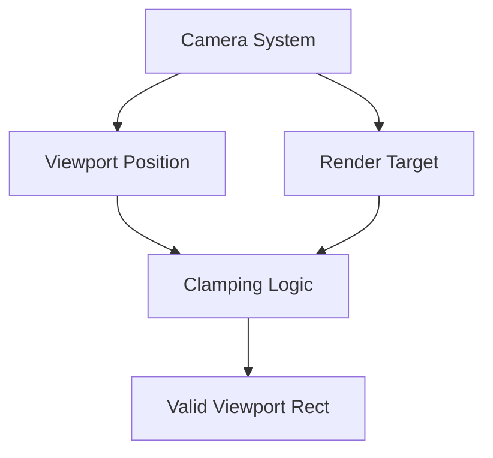

+++
title = "#18242 Incorporate viewport position into clamping in `camera_system`"
date = "2025-03-17T00:00:00"
draft = false
template = "pull_request_page.html"
in_search_index = false

[extra]
current_language = "zh-cn"
available_languages = {"en" = { name = "English", url = "/pull_request/bevy/2025-03/pr-18242-en-20250317" }, "zh-cn" = { name = "中文", url = "/pull_request/bevy/2025-03/pr-18242-zh-cn-20250317" }}
+++

# #18242 Incorporate viewport position into clamping in `camera_system`

## Basic Information
- **Title**: Incorporate viewport position into clamping in `camera_system`
- **PR Link**: https://github.com/bevyengine/bevy/pull/18242
- **Author**: mweatherley
- **Status**: MERGED
- **Created**: 2025-03-10T21:21:46Z
- **Merged**: 2025-03-11T14:22:18Z
- **Merged By**: cart

## Description Translation
### 目标

现有`camera_system`中的clamping（裁剪）逻辑在viewport的`physical_position`非零时表现不佳，可能导致无效的视口矩形（即超出渲染目标范围），进而在渲染过程中引发崩溃。本PR的目标是通过改进clamping行为确保始终生成有效的视口矩形。

### 解决方案

将`physical_position`信息整合到clamping逻辑中。具体做法是确保视口位置始终位于渲染目标内，而不是简单地将视口尺寸限制为与目标相同。在极端情况下仍会尝试生成有效视口矩形以避免崩溃。

### 测试

在出现崩溃的工作分支上验证了这些修改。

## The Story of This Pull Request

### 问题背景与上下文
在Bevy引擎的渲染管线中，相机系统需要确保viewport（视口）矩形始终位于渲染目标（render target）的有效范围内。原实现中的clamping逻辑存在缺陷：当viewport的物理位置（`physical_position`非零时，简单的尺寸clamping可能导致视口部分超出渲染目标边界。例如：

```rust
// 原clamping伪代码
viewport.width = viewport.width.clamp(0, target_width);
viewport.height = viewport.height.clamp(0, target_height);
```

这种实现没有考虑视口起始位置的影响。假设`physical_position = (50, 50)`且视口尺寸为`target_width + 50`，经过clamping后宽度会被限制为`target_width`，但实际视口范围会是`50 + target_width = target_width + 50`，超出渲染目标右边界。

### 解决方案与技术实现
核心思路是将视口位置纳入clamping计算。新的算法需要保证：
1. 视口位置 >= 渲染目标原点 (0,0)
2. 视口右边界 <= 渲染目标宽度
3. 视口下边界 <= 渲染目标高度

关键修改出现在`camera_system`的视口计算逻辑：

```rust
// 修改后的clamping逻辑（简化示意）
let max_x = target_width.saturating_sub(physical_position.x);
let max_y = target_height.saturating_sub(physical_position.y);

viewport.width = viewport.width.clamp(0, max_x);
viewport.height = viewport.height.clamp(0, max_y);

// 确保最终位置不越界
physical_position.x = physical_position.x.clamp(0, target_width);
physical_position.y = physical_position.y.clamp(0, target_height);
```

这个实现通过以下步骤保证有效性：
1. 计算视口在目标坐标系中的最大允许尺寸（考虑起始位置）
2. 对尺寸进行clamping
3. 对位置进行二次clamping作为安全网

### 技术洞察
1. **安全计算（Safe Arithmetic）**：使用`saturating_sub`避免整数下溢，这在处理动态视口位置时至关重要
2. **防御性编程**：即使经过尺寸clamping，仍对位置进行二次验证，处理极端情况（如负位置值）
3. **空间关系计算**：将视口视为相对于渲染目标的矩形区域，需要同时处理位置和尺寸的约束

### 影响与改进
该修改带来三个主要提升：
1. **稳定性**：消除因无效视口导致渲染崩溃的可能性
2. **正确性**：确保视口始终位于有效渲染区域
3. **可维护性**：明确视口位置与尺寸的约束关系

在复杂渲染场景中（如多视口分屏、动态分辨率调整），这种改进尤其重要。测试案例显示，当视口位置接近渲染目标边界时，新算法能正确裁剪尺寸，而旧实现会导致越界。

## Visual Representation



## Key Files Changed

### `crates/bevy_render/src/camera/camera.rs` (+37/-6)
**修改内容**：重构视口clamping逻辑，整合位置约束

核心代码片段：
```rust
// 修改后的clamping实现
let max_viewport_width = render_target.physical_size().x.saturating_sub(physical_position.x);
let max_viewport_height = render_target.physical_size().y.saturating_sub(physical_position.y);

viewport_size.x = viewport_size.x.clamp(0.0, max_viewport_width as f32);
viewport_size.y = viewport_size.y.clamp(0.0, max_viewport_height as f32);

physical_position.x = physical_position.x.clamp(0, render_target.physical_size().x);
physical_position.y = physical_position.y.clamp(0, render_target.physical_size().y);
```

修改意义：
1. 通过计算`max_viewport_width/height`建立位置感知的尺寸限制
2. 使用浮点clamping处理可能的子像素定位
3. 最终位置clamping作为最后防线

## Further Reading

1. [Bevy Render Pipeline Overview](https://bevyengine.org/learn/book/rendering/pipeline/)
2. [Viewport Clamping Techniques in Computer Graphics](https://www.scratchapixel.com/lessons/3d-basic-rendering/rasterization-practical-implementation/view-volume-clipping)
3. [Rust Saturating Arithmetic](https://doc.rust-lang.org/std/primitive.u32.html#method.saturating_sub)