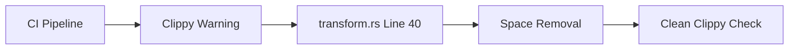

+++
title = "#18244 Remove superfluous spaces in `Transform` documentation"
date = "2025-03-11T00:00:00"
draft = false
template = "pull_request_page.html"
in_search_index = true

[taxonomies]
list_display = ["show"]

[extra]
current_language = "en"
available_languages = {"zh-cn" = { name = "中文", url = "/pull_request/bevy/2025-03/pr-18244-zh-cn-20250311" }, "en" = { name = "English", url = "/pull_request/bevy/2025-03/pr-18244-en-20250311" }}
+++

# #18244 Remove superfluous spaces in `Transform` documentation

## Basic Information
- **Title**: Remove superfluous spaces in `Transform` documentation
- **PR Link**: https://github.com/bevyengine/bevy/pull/18244
- **Author**: Brezak
- **Status**: MERGED
- **Created**: 2025-03-10T21:47:30Z
- **Merged**: 2025-03-11T08:12:15Z
- **Merged By**: cart

## Description Translation
# Objective

Closes #18228

## Solution

`hx .\crates\bevy_transform\src\components\transform.rs<enter>40ggllldd:wq<enter>`

## Testing

`cargo +beta clippy --all-features`

## The Story of This Pull Request

The PR addresses a specific documentation formatting issue in Bevy's Transform component. While seemingly minor, the change demonstrates the importance of maintaining strict code hygiene and adherence to style guidelines in large codebases.

The problem stemmed from extra spaces in doc comments that violated Rustfmt formatting rules. These spaces were triggering clippy warnings during CI checks, as reported in issue #18228. Although not affecting runtime behavior, such warnings create noise in development tools and could potentially obscure more serious issues in future lint reports.

The author employed a precise Vim/Helix editor command sequence to target line 40 of `transform.rs`, specifically removing two superfluous spaces in the documentation comment. The solution shows efficient use of terminal-based editing tools for quick fixes. The testing methodology using `cargo clippy` confirms resolution of the lint warnings while maintaining all other checks.

This change highlights several key engineering practices:
1. Importance of consistent documentation formatting
2. Value of addressing linter warnings promptly
3. Efficiency in using specialized editor commands for targeted modifications
4. Maintaining clean CI/CD pipeline outputs

The single-line modification creates no functional changes but improves codebase hygiene. For open source projects like Bevy, such attention to detail helps maintain contributor-friendly code and reduces cognitive load during code reviews.

## Visual Representation



## Key Files Changed

### `crates/bevy_transform/src/components/transform.rs`
**Change:** Removed two excess spaces in doc comment  
**Before:**
```rust
/// The transform is a 3D affine transformation  which can represent translation,
```
**After:**
```rust
/// The transform is a 3D affine transformation which can represent translation,
```
This edit fixes the spacing between "transformation" and "which" in the documentation string, resolving the clippy warning about incorrect doc comment formatting.

## Further Reading
- [Rust Clippy Documentation](https://doc.rust-lang.org/stable/clippy/)
- [Rustfmt Style Guide](https://github.com/rust-dev-tools/fmt-rfcs)
- [Bevy Contribution Guidelines](https://github.com/bevyengine/bevy/blob/main/CONTRIBUTING.md#style-guide)