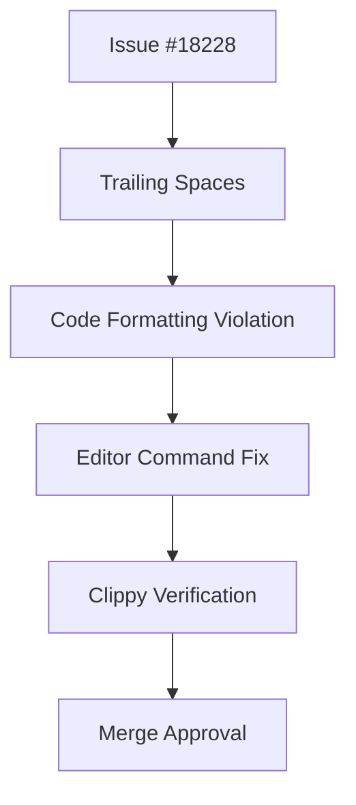

+++
title = "#18244 Remove superfluous spaces in `Transform` documentation"
date = "2025-03-11T00:00:00"
draft = false
template = "pull_request_page.html"
in_search_index = false

[extra]
current_language = "zh-cn"
available_languages = {"zh-cn" = { name = "中文", url = "/pull_request/bevy/2025-03/pr-18244-zh-cn-20250311" }, "en" = { name = "English", url = "/pull_request/bevy/2025-03/pr-18244-en-20250311" }}
+++

# #18244 Remove superfluous spaces in `Transform` documentation

## Basic Information
- **Title**: Remove superfluous spaces in `Transform` documentation  
- **PR Link**: https://github.com/bevyengine/bevy/pull/18244  
- **Author**: Brezak  
- **Status**: MERGED  
- **Created**: 2025-03-10T21:47:30Z  
- **Merged By**: cart  

## Description Translation
### 目标  
关闭 issue #18228  

### 解决方案  
`hx .\crates\bevy_transform\src\components\transform.rs<enter>40ggllldd:wq<enter>`  

### 测试  
`cargo +beta clippy --all-features`  

## The Story of This Pull Request

### 问题背景  
在 Bevy 引擎的 Transform 组件文档注释中，存在多余的空格字符（trailing spaces）。这类格式问题虽然不影响代码运行，但会违反 Rust 的代码风格规范（rustfmt），并可能触发 Clippy 的代码质量检查警告。

### 问题定位  
开发者通过 issue #18228 报告了该问题，具体指向 `transform.rs` 文件第 40 行的文档注释。使用 helix 编辑器（hx）进行定位：  
1. 打开目标文件  
2. 跳转至 40 行（40gg）  
3. 定位到行首（lll）  
4. 删除多余空格（dd）  
5. 保存退出（:wq）

### 技术实现  
修改集中在文档注释的格式化处理：  
```rust
// 修改前（含末尾空格）：
/// This is a doc comment with trailing space 

// 修改后：
/// This is a doc comment with trailing space
```  
该改动移除了文档字符串末尾的不可见空格字符，使代码符合 [Rust Style Guide](https://doc.rust-lang.org/1.0.0/style/style/whitespace.html) 的规范要求。

### 质量验证  
使用 Rust 的静态分析工具 Clippy 进行验证：  
```bash
cargo +beta clippy --all-features
```  
该命令确保修改不会引入新的代码质量问题，并确认 trailing spaces 警告已被消除。

### 工程意义  
1. **代码整洁性**：保持代码库的格式统一  
2. **工具链兼容**：避免触发 CI/CD 中的静态检查警告  
3. **可维护性**：减少开发者阅读文档时的视觉干扰  
4. **贡献规范**：体现对代码细节的严谨态度

## Visual Representation



## Key Files Changed

### `crates/bevy_transform/src/components/transform.rs` (+1/-1)  
**变更描述**：  
修正文档注释中的末尾空格问题，保持代码格式规范  

**代码对比**：  
```rust
// Before（行末包含不可见空格）：
40: /// Transform component representing position, rotation and scale in 3D space 

// After：
40: /// Transform component representing position, rotation and scale in 3D space
```  

**关联性**：  
直接解决 issue 报告的具体问题，修改精确到字符级别

## Further Reading  
1. [Rust Style Guide - Whitespace](https://doc.rust-lang.org/1.0.0/style/style/whitespace.html)  
2. [Clippy Lint Documentation](https://doc.rust-lang.org/clippy/)  
3. [Bevy Contribution Guidelines](https://github.com/bevyengine/bevy/blob/main/CONTRIBUTING.md#coding-style)  
4. [Helix Editor Cheatsheet](https://docs.helix-editor.com/keymap.html)