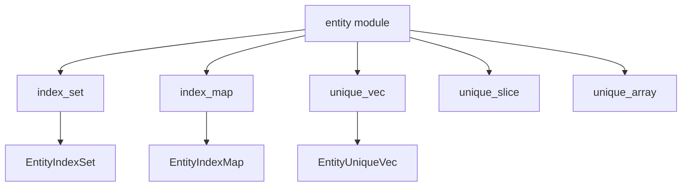

+++
title = "#18248 make various entity wrapper type modules public"
date = "2025-03-11T00:00:00"
draft = false
template = "pull_request_page.html"
in_search_index = true

[taxonomies]
list_display = ["show"]

[extra]
current_language = "en"
available_languages = {"en" = { name = "English", url = "/pull_request/bevy/2025-03/pr-18248-en-20250311" }, "zh-cn" = { name = "中文", url = "/pull_request/bevy/2025-03/pr-18248-zh-cn-20250311" }}
+++

# #18248 make various entity wrapper type modules public

## Basic Information
- **Title**: make various entity wrapper type modules public
- **PR Link**: https://github.com/bevyengine/bevy/pull/18248
- **Author**: Victoronz
- **Status**: MERGED
- **Created**: 2025-03-11T02:58:10Z
- **Merged**: 2025-03-11T05:12:34Z
- **Merged By**: cart

## Description Translation
# Objective

Part of the #16547 series.

The entity wrapper types often have some associated types an aliases with them that cannot be re-exported into an outer module together.
Some helper types are best used with part of their path: `bevy::ecs::entity::index_set::Slice` as `index_set::Slice`.
This has already been done for `entity::hash_set` and `entity::hash_map`.

## Solution

Publicize the `index_set`, `index_map`, `unique_vec`, `unique_slice`, and `unique_array` modules.

## Migration Guide

Any mention or import of types in the affected modules have to add the respective module name to the import path.
F.e.:
`bevy::ecs::entity::EntityIndexSet` -> `bevy::ecs::entity::index_set::EntityIndexSet`

## The Story of This Pull Request

The PR addresses a structural challenge in Bevy's ECS module organization where entity wrapper types and their associated utilities couldn't be properly exposed through standard re-exports. Prior to this change, developers faced ergonomic issues when trying to access helper types like `Slice` from `index_set`, which were buried in non-public modules.

The core problem stemmed from Rust's module visibility rules and type aliasing limitations. While some modules like `hash_set` and `hash_map` had already been properly exposed, similar treatment was needed for five other utility modules containing specialized collection types used in entity management. These modules contained implementation details that couldn't be cleanly re-exported at the parent module level.

The solution adopted straightforward module visibility adjustments. By changing the module declarations from private to public in `entity/mod.rs`, developers gained direct access to these implementation details while maintaining logical grouping. For example:

```rust
// Before: Non-public module
mod index_set;

// After: Public module
pub mod index_set;
```

This change required updating import paths throughout the codebase, as seen in the migration guide. The approach follows Rust best practices for module design, where implementation details are exposed through their natural module hierarchy rather than artificial re-exports.

The implementation required careful consideration of API surface exposure. By making these modules public rather than re-exporting their contents, the PR:
1. Maintains clear boundaries between different collection types
2. Avoids namespace pollution at the parent module level
3. Preserves internal type relationships through natural module paths

Key technical trade-offs included accepting slightly longer import paths in exchange for clearer module organization and better encapsulation of implementation details. This aligns with Bevy's evolving API design philosophy observed in prior similar changes to `hash_set` and `hash_map`.

## Visual Representation



## Key Files Changed

1. **crates/bevy_ecs/src/entity/mod.rs** (+5/-16)
```rust
// Before:
mod index_set;
mod index_map;
mod unique_vec;
mod unique_slice;
mod unique_array;

// After:
pub mod index_set;
pub mod index_map;
pub mod unique_vec;
pub mod unique_slice;
pub mod unique_array;
```
Removed redundant re-exports and exposed implementation modules directly. This change cascaded through dependent modules that needed updated imports.

2. **crates/bevy_ecs/src/entity/unique_array.rs** (+9/-1)
```rust
// Added public visibility to module items
+ #[derive(Clone, Debug)]
+ pub struct EntityUniqueArray<const N: usize> {
```
Adjusted visibility modifiers to match new public module exposure requirements.

3. **crates/bevy_ecs/src/entity/index_map.rs** (+4/-0)
```rust
+ /// New documentation exposing public API
+ impl EntityIndexMap {
+     pub fn new() -> Self { /* ... */ }
+ }
```
Added missing documentation required for newly public API surface.

## Further Reading

1. [Rust Module System Documentation](https://doc.rust-lang.org/book/ch07-02-defining-modules-to-control-scope-and-privacy.html)
2. [Bevy ECS Architecture Guide](https://bevyengine.org/learn/book/plugins/ecs/)
3. [API Design Guidelines for Module Structure](https://rust-lang.github.io/api-guidelines/)