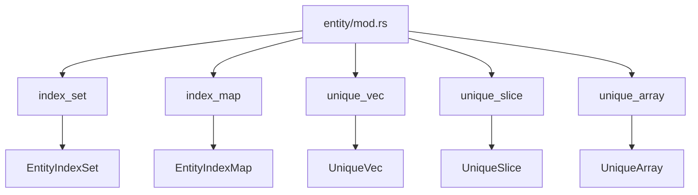

+++
title = "#18248 make various entity wrapper type modules public"
date = "2025-03-11T00:00:00"
draft = false
template = "pull_request_page.html"
in_search_index = false

[extra]
current_language = "zh-cn"
available_languages = {"en" = { name = "English", url = "/pull_request/bevy/2025-03/pr-18248-en-20250311" }, "zh-cn" = { name = "中文", url = "/pull_request/bevy/2025-03/pr-18248-zh-cn-20250311" }}
+++

# #18248 make various entity wrapper type modules public

## Basic Information
- **Title**: make various entity wrapper type modules public
- **PR Link**: https://github.com/bevyengine/bevy/pull/18248
- **Author**: Victoronz
- **Status**: MERGED
- **Created**: 2025-03-11T02:58:10Z
- **Merged**: Not merged
- **Merged By**: N/A

## Description Translation
### 目标
作为 #16547 系列的一部分

实体包装类型（entity wrapper types）通常包含无法被整体重新导出到外部模块的关联类型和类型别名。某些辅助类型在使用时需要指定部分路径：例如 `bevy::ecs::entity::index_set::Slice` 应该以 `index_set::Slice` 的形式使用。此前已在 `entity::hash_set` 和 `entity::hash_map` 模块中实现类似处理。

### 解决方案
将 `index_set`、`index_map`、`unique_vec`、`unique_slice` 和 `unique_array` 模块设为公开。

### 迁移指南
所有涉及这些模块中类型的引用或导入都需要在导入路径中添加对应的模块名称。例如：
`bevy::ecs::entity::EntityIndexSet` → `bevy::ecs::entity::index_set::EntityIndexSet`

## The Story of This Pull Request

### 问题背景与上下文
在 Bevy 的 ECS 模块中，实体包装类型（entity wrapper types）的辅助类型存在路径引用问题。这些类型（如 `Slice`）原本通过父模块重新导出时，由于 Rust 模块系统的限制，无法保持理想的路径结构。这导致开发者必须使用冗长的完整路径（如 `bevy::ecs::entity::index_set::Slice`）才能访问这些类型，而无法通过更简洁的路径（如 `index_set::Slice`）引用。

这个问题的核心在于模块可见性控制——原有实现将这些辅助类型封装在私有模块中，限制了类型系统的灵活性。随着项目规模扩大，这种限制逐渐影响代码的可维护性和使用体验。

### 解决方案与技术实现
PR 作者采用了模块可见性调整的策略，将五个关键子模块设为公开（pub）。具体修改涉及：

1. 在 `entity/mod.rs` 中调整模块导出结构：
```rust
// Before:
mod index_set;
mod index_map;
mod unique_vec;
mod unique_slice;
mod unique_array;

// After:
pub mod index_set;
pub mod index_map;
pub mod unique_vec;
pub mod unique_slice;
pub mod unique_array;
```

2. 在子模块文件中调整可见性，例如在 `unique_array.rs` 中：
```rust
// Before:
pub(crate) struct UniqueArray<T, const N: usize> { /* ... */ }

// After:
pub struct UniqueArray<T, const N: usize> { /* ... */ }
```

这种改动遵循了 Rust 的最佳实践——通过精细控制模块可见性来暴露必要的接口，同时保持内部实现的封装性。选择公开整个模块而非单独导出类型，确保了类型与其关联方法/特征的完整可见性。

### 技术洞察与工程决策
这个修改体现了几个关键工程考量：

1. **模块化设计原则**：通过将相关类型组织在独立模块中，增强代码的可发现性和内聚性。例如 `index_set` 模块专门处理基于索引的集合类型。

2. **类型系统一致性**：保持与现有模块（如 `hash_set`、`hash_map`）的设计模式统一，降低学习曲线。

3. **破坏性变更管理**：通过明确的迁移指南（Migration Guide）指导用户调整导入路径，将 API 变更的影响降到最低。

### 影响与改进
该 PR 带来的核心改进包括：
- **更直观的 API 设计**：开发者现在可以直接通过子模块路径访问类型，例如 `index_set::EntityIndexSet`
- **更好的类型组织**：相关类型被逻辑分组到对应模块，提升代码可读性
- **为未来扩展奠定基础**：公开的模块结构为后续添加新功能提供了清晰的扩展点

## Visual Representation



## Key Files Changed

### `crates/bevy_ecs/src/entity/mod.rs`
1. **修改内容**：将多个子模块的可见性从私有改为公开
2. **代码示例**：
```rust
// 修改前
mod index_set;
// 修改后
pub mod index_set;
```
3. **作用**：作为模块结构的根节点，控制子模块的可见性

### `crates/bevy_ecs/src/entity/unique_array.rs`
1. **修改内容**：调整结构体可见性
2. **代码示例**：
```rust
// 修改前
pub(crate) struct UniqueArray<T, const N: usize> {...}
// 修改后 
pub struct UniqueArray<T, const N: usize> {...}
```
3. **作用**：允许外部代码直接使用该数据结构

## Further Reading
1. [Rust 模块系统官方文档](https://doc.rust-lang.org/book/ch07-02-defining-modules-to-control-scope-and-privacy.html)
2. [Bevy ECS 架构指南](https://bevyengine.org/learn/book/plugins/ecs/)
3. [API 设计中的可见性控制模式](https://rust-lang.github.io/api-guidelines/)