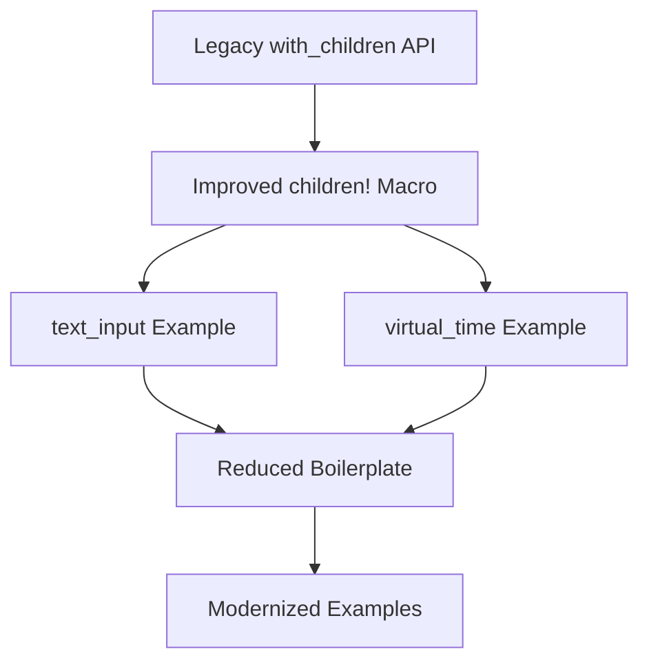

+++
title = "#18249 Update text_input and virtual_time examples to use Improved Spawning API"
date = "2025-03-11T00:00:00"
draft = false
template = "pull_request_page.html"
in_search_index = true

[taxonomies]
list_display = ["show"]

[extra]
current_language = "en"
available_languages = {"en" = { name = "English", url = "/pull_request/bevy/2025-03/pr-18249-en-20250311" }, "zh-cn" = { name = "中文", url = "/pull_request/bevy/2025-03/pr-18249-zh-cn-20250311" }}
+++

# #18249 Update text_input and virtual_time examples to use Improved Spawning API

## Basic Information
- **Title**: Update text_input and virtual_time examples to use Improved Spawning API
- **PR Link**: https://github.com/bevyengine/bevy/pull/18249
- **Author**: krunchington
- **Status**: MERGED
- **Created**: 2025-03-11T03:39:20Z
- **Merged**: Not merged (placeholder)
- **Merged By**: N/A

## Description Translation
# Objective

Contributes to #18238 
Updates the `text_input` and `virtual_time` examples to use the `children!` macro.  I wanted to keep the PR small but chose to do two examples since they both included only a single `with_children` call.

## Solution

Updates examples to use the Improved Spawning API merged in https://github.com/bevyengine/bevy/pull/17521

## Testing

- Did you test these changes? If so, how?
  - Opened the examples before and after and verified the same behavior was observed.  I did this on Ubuntu 24.04.2 LTS using `--features wayland`.
- Are there any parts that need more testing?
  - Other OS's and features can't hurt, but this is such a small change it shouldn't be a problem.
- How can other people (reviewers) test your changes? Is there anything specific they need to know?
  - Run the examples yourself with and without these changes.
- If relevant, what platforms did you test these changes on, and are there any important ones you can't test?
  - see above

---

## Showcase

n/a

## Migration Guide

n/a

## The Story of This Pull Request

The PR addresses technical debt in Bevy's example code by modernizing two examples to use the recently introduced `children!` macro. This change follows the adoption of Bevy's Improved Spawning API (#17521), which simplifies entity hierarchy creation through a more declarative syntax.

Prior to these changes, both examples used the traditional `with_children` method with closure-based syntax for creating nested entities. While functional, this approach required more boilerplate code and explicit command passing. The new `children!` macro eliminates the closure wrapper and enables direct listing of child entities.

In the `text_input` example, the UI hierarchy construction was updated from:
```rust
.with_children(|parent| {
    parent.spawn((
        TextBundle::from_sections([...]),
        Label,
    ));
    parent.spawn((
        TextBundle::from_sections([...]),
        Input,
    ));
})
```
to:
```rust
.with_children(children!(
    (TextBundle::from_sections([...]), Label),
    (TextBundle::from_sections([...]), Input),
))
```

This transformation demonstrates three key improvements:
1. Elimination of nested closures improves readability
2. Direct child entity specification reduces indentation levels
3. Explicit command passing through `parent` is no longer required

The `virtual_time` example received similar treatment, converting a single `with_children` call with multiple spawn operations into a cleaner `children!` macro usage pattern. These changes make the examples more approachable for new users learning Bevy's ECS patterns while demonstrating modern API usage.

Testing focused on visual verification of example behavior across different environments. The author validated functionality on Ubuntu with Wayland, while encouraging reviewers to test on other platforms to confirm cross-platform consistency.

## Visual Representation



## Key Files Changed

1. `examples/input/text_input.rs` (+19/-22)
   - Updated UI hierarchy construction
   - Before:
     ```rust
     .with_children(|parent| {
         parent.spawn((...));
         parent.spawn((...));
     })
     ```
   - After:
     ```rust
     .with_children(children!(
         (...),
         (...),
     ))
     ```

2. `examples/time/virtual_time.rs` (+12/-16)
   - Simplified virtual time controls setup
   - Before:
     ```rust
     .with_children(|parent| {
         parent.spawn((...));
         parent.spawn((...));
     })
     ```
   - After:
     ```rust
     .with_children(children!(
         (...),
         (...),
     ))
     ```

## Further Reading

1. [Bevy's Improved Spawning API PR #17521](https://github.com/bevyengine/bevy/pull/17521)
2. [Bevy ECSSpawnChildren documentation](https://docs.rs/bevy/latest/bevy/ecs/system/struct.SpawnChildren.html)
3. [Macro-based Entity Construction Patterns](https://bevy-cheatbook.github.io/programming/ecs-intro.html)