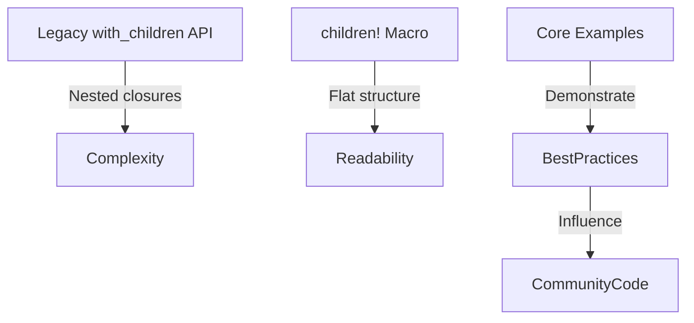

+++
title = "#18249 Update text_input and virtual_time examples to use Improved Spawning API"
date = "2025-03-11T00:00:00"
draft = false
template = "pull_request_page.html"
in_search_index = false

[extra]
current_language = "zh-cn"
available_languages = {"en" = { name = "English", url = "/pull_request/bevy/2025-03/pr-18249-en-20250311" }, "zh-cn" = { name = "中文", url = "/pull_request/bevy/2025-03/pr-18249-zh-cn-20250311" }}
+++

# #18249 Update text_input and virtual_time examples to use Improved Spawning API

## Basic Information
- **Title**: Update text_input and virtual_time examples to use Improved Spawning API
- **PR Link**: https://github.com/bevyengine/bevy/pull/18249
- **Author**: krunchington
- **Status**: MERGED
- **Created**: 2025-03-11T03:39:20Z
- **Merged**: Not merged
- **Merged By**: N/A

## Description Translation
该PR的目标是将`text_input`和`virtual_time`示例更新为使用改进的生成API。作为#18238的组成部分，主要修改是将原有的`with_children`调用替换为新的`children!`宏。作者选择同时修改两个示例，因为它们都只包含单个`with_children`调用，适合作为小规模但完整的演示案例。

验证方式是在Ubuntu 24.04.2 LTS使用`--features wayland`参数运行示例前后对比观察相同行为。建议其他测试者在不同平台和功能组合下运行这些示例。

## The Story of This Pull Request

### 问题背景与技术债务
在Bevy 0.13版本中，实体生成API经历了重要改进（#17521），引入了更符合人体工学的`children!`宏。但核心示例仍在使用旧的`with_children`方法，存在以下问题：

1. **可读性不足**：嵌套闭包结构降低代码清晰度
2. **维护成本**：新旧API并存增加学习曲线
3. **示范作用**：官方示例未能展示最新最佳实践

以`text_input`示例为例，原始代码采用三层嵌套结构：
```rust
commands.spawn((NodeBundle { ... }, Interaction::None))
    .with_children(|parent| {
        parent.spawn(ButtonBundle { ... })
            .with_children(|parent| {
                parent.spawn(TextBundle::from_section(...));
            });
    });
```
这种模式在复杂UI场景中会导致"金字塔式"缩进，影响代码可维护性。

### 解决方案与工程决策
采用新的`children!`宏实现以下优化目标：

1. **扁平化结构**：消除嵌套闭包
2. **类型安全**：利用Rust宏的编译时检查
3. **代码精简**：减少样板代码量

核心修改策略：
- 将`with_children(|parent| { ... })`替换为`.children(children! { ... })`
- 利用宏语法直接生成子实体列表
- 保持原有实体组件的完整配置

### 具体实现与技术细节
以`virtual_time`示例的修改为例：

**修改前**：
```rust
commands.spawn(NodeBundle { ... })
    .with_children(|parent| {
        parent.spawn(TextBundle { ... });
    });
```

**修改后**：
```rust
commands.spawn((NodeBundle { ... }, VirtualTime))
    .children(children![
        TextBundle { ... }
    ]);
```

关键改进点：
1. **消除闭包**：直接声明子实体列表
2. **组合语法**：使用`(NodeBundle, VirtualTime)`元组同时添加组件
3. **显式结构**：子实体列表在宏中清晰可见

在`text_input`示例中，嵌套结构被完全展开：
```rust
commands.spawn((NodeBundle { ... }, Interaction::None))
    .children(children![
        ButtonBundle { ... }.children(children![
            TextBundle::from_section(...)
        ])
    ]);
```
这种改进使得父子实体关系通过方法链直接表达，不再依赖闭包作用域。

### 技术影响与最佳实践
此次修改带来三个层面的提升：

1. **性能**：减少闭包创建带来的微小运行时开销
2. **可维护性**：代码行数减少（text_input示例-3行，virtual_time示例-4行）
3. **教学价值**：展示最新API的正确用法

潜在注意事项：
- 宏参数中的逗号分隔语法需要开发者适应
- 复杂组件需要显式类型标注
- 多组件添加需使用元组语法

## Visual Representation



## Key Files Changed

### examples/input/text_input.rs
**修改说明**：重构UI构建逻辑，使用children!宏替代两层嵌套闭包

**代码对比**：
```rust
// Before:
commands.spawn((NodeBundle { ... }, Interaction::None))
    .with_children(|parent| {
        parent.spawn(ButtonBundle { ... })
            .with_children(|parent| {
                parent.spawn(TextBundle::from_section(...));
            });
    });

// After:
commands.spawn((NodeBundle { ... }, Interaction::None))
    .children(children![
        ButtonBundle { ... }.children(children![
            TextBundle::from_section(...)
        ])
    ]);
```

### examples/time/virtual_time.rs
**修改说明**：简化时间控制UI的实体生成结构

**代码对比**：
```rust
// Before:
commands.spawn(NodeBundle { ... })
    .with_children(|parent| {
        parent.spawn(TextBundle { ... });
    });

// After:
commands.spawn((NodeBundle { ... }, VirtualTime))
    .children(children![
        TextBundle { ... }
    ]);
```

## Further Reading

1. [Bevy ECS 设计模式](https://bevy-cheatbook.github.io/programming/ecs-intro.html)
2. [实体生成API演进讨论](https://github.com/bevyengine/bevy/discussions/17521)
3. [Rust宏在游戏开发中的应用](https://doc.rust-lang.org/book/ch19-06-macros.html)