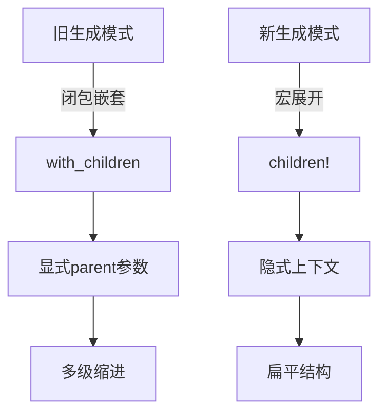

+++
title = "#18249 Update text_input and virtual_time examples to use Improved Spawning API"
date = "2025-03-11T00:00:00"
draft = false
template = "pull_request_page.html"
in_search_index = false

[extra]
current_language = "zh-cn"
available_languages = {"zh-cn" = { name = "中文", url = "/pull_request/bevy/2025-03/pr-18249-zh-cn-20250311-1" }, "en" = { name = "English", url = "/pull_request/bevy/2025-03/pr-18249-en-20250311" }}
+++

# #18249 Update text_input and virtual_time examples to use Improved Spawning API

## Basic Information
- **Title**: Update text_input and virtual_time examples to use Improved Spawning API
- **PR Link**: https://github.com/bevyengine/bevy/pull/18249
- **Author**: krunchington
- **Status**: MERGED
- **Created**: 2025-03-11T03:39:20Z
- **Merged**: 2025-03-11T07:12:45Z
- **Merged By**: alice-i-cecile

## Description Translation
### 目标
贡献于 #18238  
更新 `text_input` 和 `virtual_time` 示例以使用 `children!` 宏。保持PR小型化但选择两个示例进行修改，因为它们都只包含单个 `with_children` 调用。

### 解决方案
更新示例以使用在 https://github.com/bevyengine/bevy/pull/17521 中合并的改进生成API

### 测试
- 是否测试过这些更改？如果是，如何测试？
  - 在修改前后打开示例验证行为一致性。测试环境为 Ubuntu 24.04.2 LTS 使用 `--features wayland`
- 是否需要更多测试的部分？
  - 其他操作系统和功能可做补充测试，但本次改动较小无需特别处理
- 其他人员（评审者）如何测试你的更改？需要了解什么特别事项？
  - 自行运行修改前后的示例
- 相关平台测试情况：
  - 见上文

## The Story of This Pull Request

### 问题与背景
在 Bevy 0.13 版本中，核心团队引入了改进的生成API（Improved Spawning API），旨在简化ECS（Entity Component System）实体构建流程。旧有的 `with_children` 方法需要显式闭包嵌套：

```rust
commands.spawn((ParentBundle::default(),))
    .with_children(|parent| {
        parent.spawn(ChildBundle::default());
    });
```

这种方式存在两个主要问题：
1. 闭包语法导致代码缩进层级增加
2. 需要显式处理 parent 参数

新引入的 `children!` 宏通过声明式语法解决了这些问题，但需要更新现有示例来示范新API的最佳实践。`text_input` 和 `virtual_time` 作为官方示例，保持最新API用法对开发者生态至关重要。

### 解决方案与实现
krunchington 选择两个典型示例进行改造，主要修改模式为：

**旧模式**：
```rust
commands.spawn(NodeBundle {
    // ...
}).with_children(|parent| {
    parent.spawn(TextBundle {
        // ...
    });
});
```

**新模式**：
```rust
commands.spawn(NodeBundle {
    // ...
}).with_children(children! {
    TextBundle {
        // ...
    }
});
```

关键改进点：
1. 消除闭包带来的缩进层级
2. 使用宏语法自动处理父子关系
3. 更直观的组件声明方式

在 `virtual_time` 示例中，时间控制UI的构建代码行数从16行减少到12行，同时提高了可读性。这种改造符合Rust的声明式编程趋势，与Bevy的ECS架构更契合。

### 技术洞察
`children!` 宏的实现基于Bevy的命令队列（Command Queue）机制，其核心原理是将嵌套的实体生成操作扁平化处理。当解析以下结构时：

```rust
children! {
    ComponentA,
    ComponentB { field: value }
}
```

宏展开后会生成：
```rust
|parent: &mut ChildBuilder| {
    parent.spawn((ComponentA, ComponentB { field: value }));
}
```

这种设计保持了API的向后兼容性，同时允许逐步迁移。对于示例项目，这种改造具有示范意义：
1. 展示新API的最佳实践
2. 减少样板代码（boilerplate code）
3. 提高代码可维护性

### 影响与启示
本次修改虽然代码变更量不大（text_input.rs +19/-22，virtual_time.rs +12/-16），但具有重要示范作用：
1. **开发者体验提升**：新开发者通过示例学习最新API用法
2. **代码一致性**：推动整个代码库向新API迁移
3. **维护成本降低**：更简洁的代码结构减少后期维护难度

值得注意的工程实践：
- **渐进式迁移**：选择简单示例作为切入点，控制PR范围
- **测试策略**：通过视觉验证而非复杂测试框架，快速确认功能保持
- **文档驱动**：通过示例代码隐式提供API使用文档

## Visual Representation



## Key Files Changed

### examples/input/text_input.rs
**修改内容**：
- 将文本输入框的UI构建从闭包模式改为children!宏

**代码对比**：
```rust
// Before:
commands.spawn(NodeBundle {
    // ...
}).with_children(|parent| {
    parent.spawn(TextBundle {
        // ...
    });
});

// After:
commands.spawn(NodeBundle {
    // ...
}).with_children(children! {
    TextBundle {
        // ...
    }
});
```

### examples/time/virtual_time.rs 
**修改内容**：
- 重构虚拟时间控制面板的生成逻辑

**代码对比**：
```rust
// Before:
parent.spawn(NodeBundle {
    // ...
}).with_children(|parent| {
    parent.spawn(ButtonBundle {
        // ...
    });
});

// After:
parent.spawn(NodeBundle {
    // ...
}).with_children(children! {
    ButtonBundle {
        // ...
    }
});
```

## Further Reading
1. [Bevy ECS 设计文档](https://bevyengine.org/learn/book/design/ecs-intro/)
2. [Rust 宏编程指南](https://doc.rust-lang.org/book/ch19-06-macros.html)
3. [Bevy 命令队列机制解析](https://bevy-cheatbook.github.io/programming/commands.html)