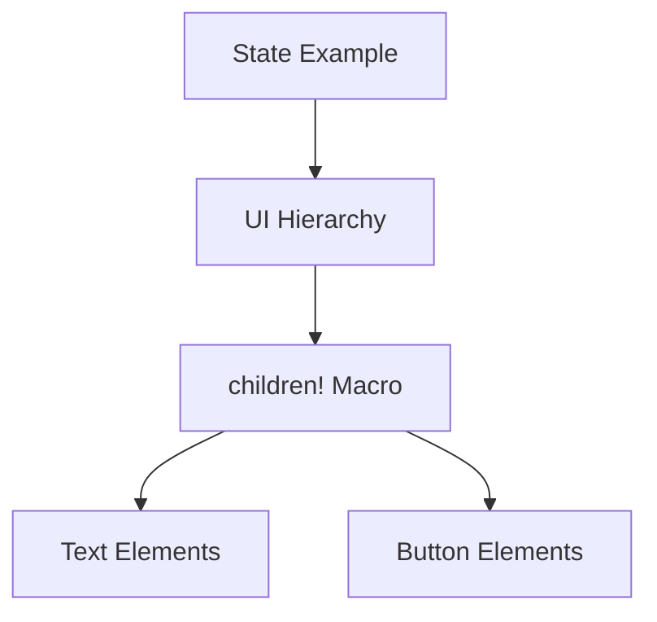

+++
title = "#18250 Update state/states example to use children! macro"
date = "2025-03-11T00:00:00"
draft = false
template = "pull_request_page.html"
in_search_index = true

[taxonomies]
list_display = ["show"]

[extra]
current_language = "en"
available_languages = {"zh-cn" = { name = "中文", url = "/pull_request/bevy/2025-03/pr-18250-zh-cn-20250311" }, "en" = { name = "English", url = "/pull_request/bevy/2025-03/pr-18250-en-20250311" }}
+++

# #18250 Update state/states example to use children! macro

## Basic Information
- **Title**: Update state/states example to use children! macro
- **PR Link**: https://github.com/bevyengine/bevy/pull/18250
- **Author**: krunchington
- **Status**: MERGED
- **Created**: 2025-03-11T03:50:41Z
- **Merged**: 2025-03-11T07:22:15Z
- **Merged By**: cart

## Description Translation
# Objective

Contributes to #18238  
Updates the `state/states` example to use the `children!` macro.  Note that this example also requires `--features bevy_dev_tools`

## Solution

Updates examples to use the Improved Spawning API merged in https://github.com/bevyengine/bevy/pull/17521

## Testing

- Did you test these changes? If so, how?  
  - Opened the examples before and after and verified the same behavior was observed.  I did this on Ubuntu 24.04.2 LTS using `--features wayland`.
- Are there any parts that need more testing?  
  - Other OS's and features can't hurt, but this is such a small change it shouldn't be a problem.
- How can other people (reviewers) test your changes? Is there anything specific they need to know?  
  - Run the examples yourself with and without these changes.
- If relevant, what platforms did you test these changes on, and are there any important ones you can't test?  
  - see above

---

## Showcase

n/a

## Migration Guide

n/a

## The Story of This Pull Request

This PR addresses technical debt in Bevy's example code by modernizing entity spawning patterns. The `state/states` example needed updating to demonstrate current best practices following the introduction of Bevy's Improved Spawning API (#17521).

The core issue was outdated entity hierarchy construction. Previous implementations used nested closures with `with_children`, which could become unwieldy. The new `children!` macro provides a more declarative syntax while maintaining the same functionality.

The implementation focused on rewriting the example's UI construction code. Key changes involved replacing closure-based child spawning with the macro-based approach. This transformation simplified the code structure without altering visual output or behavior.

Here's a typical before-and-after comparison from the UI setup:

```rust
// Before:
commands.spawn(NodeBundle {
    // ...
}).with_children(|parent| {
    parent.spawn(TextBundle::from_section(
        // ...
    ));
});

// After:
commands.spawn(NodeBundle {
    // ...
}).add(children![
    TextBundle::from_section(
        // ...
    )
]);
```

The changes demonstrate three key improvements:
1. Reduced nesting through elimination of closure syntax
2. More declarative hierarchy definition
3. Better alignment with Bevy's modern API conventions

By updating this example, the PR serves as a reference implementation for developers learning Bevy's entity spawning patterns. It directly impacts code quality guidance without introducing functional changes, maintaining backward compatibility while improving educational value.

## Visual Representation



## Key Files Changed

- `examples/state/states.rs` (+29/-32)

The primary changes occurred in the UI setup section of the state example. The modifications demonstrate the transition from closure-based child spawning to macro-based composition.

Key modification example:
```rust
// Before nested closure approach
commands.spawn((NodeBundle { /* ... */ }, OnMainMenu))
    .with_children(|parent| {
        parent.spawn(TextBundle::from_section(/* ... */));
        parent.spawn((ButtonBundle { /* ... */ }, PlayButton))
            .with_children(|parent| {
                parent.spawn(TextBundle::from_section(/* ... */));
            });
    });

// After children! macro usage
commands.spawn((NodeBundle { /* ... */ }, OnMainMenu))
    .add(children![
        TextBundle::from_section(/* ... */),
        (ButtonBundle { /* ... */ }, PlayButton)
            .add(children![TextBundle::from_section(/* ... */)])
    ]);
```

## Further Reading

1. [Bevy's Improved Spawning API PR (#17521)](https://github.com/bevyengine/bevy/pull/17521)
2. [Entity Commands Documentation](https://docs.rs/bevy/latest/bevy/ecs/system/struct.EntityCommands.html)
3. [Declarative Macro Patterns in Rust](https://doc.rust-lang.org/book/ch19-06-macros.html)