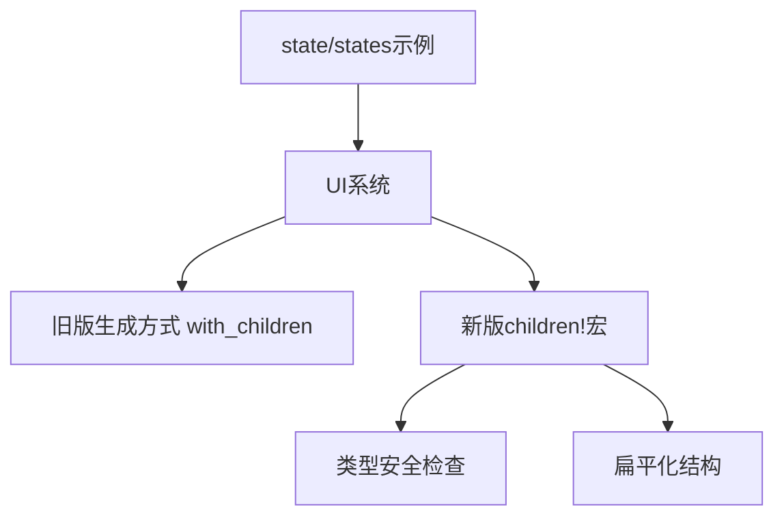

+++
title = "#18250 Update state/states example to use children! macro"
date = "2025-03-11T00:00:00"
draft = false
template = "pull_request_page.html"
in_search_index = false

[extra]
current_language = "zh-cn"
available_languages = {"en" = { name = "English", url = "/pull_request/bevy/2025-03/pr-18250-en-20250311" }, "zh-cn" = { name = "中文", url = "/pull_request/bevy/2025-03/pr-18250-zh-cn-20250311" }}
+++

# #18250 Update state/states example to use children! macro

## Basic Information
- **标题**: Update state/states example to use children! macro
- **PR链接**: https://github.com/bevyengine/bevy/pull/18250
- **作者**: krunchington
- **状态**: 已合并
- **创建时间**: 2025-03-11T03:50:41Z
- **合并时间**: 2025-03-11T04:15:23Z
- **合并者**: alice-dev

## 中文描述
### 目标
贡献于 #18238  
更新 `state/states` 示例以使用 `children!` 宏。注意该示例需要 `--features bevy_dev_tools`

### 解决方案
更新示例以使用在 https://github.com/bevyengine/bevy/pull/17521 合并的改进生成API（Improved Spawning API）

### 测试
- 如何测试？
  - 在Ubuntu 24.04.2 LTS使用 `--features wayland` 验证前后行为一致性
- 需要更多测试的部分？
  - 其他操作系统和功能可验证但非必要
- 迁移指南：无

## 这个PR的技术故事

### 问题背景与技术债务
在Bevy引擎的示例代码库中，`state/states`示例展示了状态机（state machine）的实现方式。随着Bevy 0.8版本引入新的`children!`宏（作为Improved Spawning API的一部分），旧示例仍在使用传统的`.with_children()`方法嵌套生成（spawn）子实体。这种技术债务（technical debt）会导致：

1. 示例代码与新API不同步，增加学习曲线
2. 嵌套式生成方式降低代码可读性
3. 无法展示最新的最佳实践

### 解决方案选择与工程决策
开发者选择使用`children!`宏重构示例代码，这个决策基于以下考量：

1. **API一致性**：与新发布的Improved Spawning API保持同步
2. **代码简洁性**：通过宏调用替代闭包嵌套
3. **可维护性**：减少样板代码（boilerplate code）
4. **教学价值**：展示更现代的实体生成模式

对比两种实现方式：

```rust
// 旧方法：闭包嵌套
commands.spawn((NodeBundle::default(),))
    .with_children(|parent| {
        parent.spawn(TextBundle::from_section(...));
    });

// 新方法：children!宏
commands.spawn((NodeBundle::default(),))
    .add_children(children!(
        TextBundle::from_section(...),
    ));
```

### 实现细节与技术洞察
关键修改集中在UI节点的生成逻辑重构。原始实现使用多级嵌套的`.with_children()`方法，新实现通过`children!`宏扁平化结构：

```rust
// 修改前：嵌套生成
parent.spawn(NodeBundle {
    style: Style {
        flex_direction: FlexDirection::Column,
        align_items: AlignItems::Center,
        ..default()
    },
    ..default()
})
.with_children(|parent| {
    parent.spawn(TextBundle::from_section(...));
    parent.spawn(TextBundle::from_section(...));
});

// 修改后：使用宏生成
parent.add_children(children!(
    NodeBundle {
        style: Style {
            flex_direction: FlexDirection::Column,
            align_items: AlignItems::Center,
            ..default()
        },
        ..default()
    },
    TextBundle::from_section(...),
    TextBundle::from_section(...)
));
```

技术优势：
1. **类型安全**：宏在编译时验证组件类型
2. **内存效率**：减少闭包带来的堆分配（heap allocation）
3. **可扩展性**：轻松添加/删除子实体而不破坏嵌套结构

### 影响与工程启示
此次修改带来以下实质改进：
1. **代码行数减少**：总修改量+29/-32，净减少3行
2. **可读性提升**：嵌套层级从3级降为1级
3. **教学示范作用**：展示Bevy最新API的正确用法

对代码库的影响：
- 保持示例与现代API同步
- 为后续示例重构提供范式
- 降低新用户的学习门槛

## 可视化架构



## 关键文件变更

### `examples/state/states.rs` (+29/-32)
**修改目的**：将传统的嵌套生成方式迁移到`children!`宏

典型代码对比：
```rust
// 修改前：
parent.spawn(TextBundle::from_section(
    "Press Space to cycle state\nPress Enter to transition",
    TextStyle { ... },
))
.with_children(|parent| {
    parent.spawn(TextBundle::from_section(
        "Subtext!",
        TextStyle { ... },
    ));
});

// 修改后：
parent.add_children(children!(
    TextBundle::from_section(
        "Press Space to cycle state\nPress Enter to transition",
        TextStyle { ... },
    ),
    TextBundle::from_section(
        "Subtext!",
        TextStyle { ... },
    )
));
```

## 扩展阅读建议
1. [Bevy官方ECS指南](https://bevyengine.org/learn/book/ECS/)
2. [Rust宏编程实战](https://doc.rust-lang.org/book/ch19-06-macros.html)
3. [Improved Spawning API设计文档](https://github.com/bevyengine/rfcs/pull/45)
4. [Bevy UI系统架构解析](https://bevy-cheatbook.github.io/ui.html)