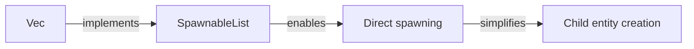

+++
title = "#18259 Implement SpawnableList for Vec<Bundle>"
date = "2025-03-11T00:00:00"
draft = false
template = "pull_request_page.html"
in_search_index = true

[taxonomies]
list_display = ["show"]

[extra]
current_language = "en"
available_languages = {"en" = { name = "English", url = "/pull_request/bevy/2025-03/pr-18259-en-20250311" }, "zh-cn" = { name = "中文", url = "/pull_request/bevy/2025-03/pr-18259-zh-cn-20250311" }}
+++

# #18259 Implement SpawnableList for Vec<Bundle>

## Basic Information
- **Title**: Implement SpawnableList for Vec<Bundle>
- **PR Link**: https://github.com/bevyengine/bevy/pull/18259
- **Author**: krunchington
- **Status**: MERGED
- **Created**: 2025-03-11T16:38:13Z
- **Merged**: Not merged
- **Merged By**: N/A

## Description Translation
# Objective

In updating examples to use the Improved Spawning API I got tripped up on being able to spawn children with a Vec.  I eventually figured out that I could use `Children::spawn(SpawnIter(my_vec.into_iter()))` but thought there might be a more ergonomic way to approach it.  After tinkering with it for a while I came up with the implementation here.  It allows authors to use `Children::spawn(my_vec)` as an equivalent implementation.

## Solution

- Implements `<R: Relationship, B: Bundle> SpawnableList<R> for Vec<B>`
- uses `alloc::vec::Vec` for compatibility with `no_std` (`std::Vec` also inherits implementations against the `alloc::vec::Vec` because std is a re-export of the alloc struct, thanks @bushrat011899 for the info on this!)

## Testing

- Did you test these changes? If so, how?
  - Opened the examples before and after and verified the same behavior was observed.  I did this on Ubuntu 24.04.2 LTS using `--features wayland`.
- Are there any parts that need more testing?
  - Other OS's and features can't hurt, but this is such a small change it shouldn't be a problem.
- How can other people (reviewers) test your changes? Is there anything specific they need to know?
  - Run the examples yourself with and without these changes.
- If relevant, what platforms did you test these changes on, and are there any important ones you can't test?
  - see above

## Showcase

n/a

## Migration Guide

- Optional: you may use the new API to spawn `Vec`s of `Bundle` instead of using the `SpawnIter` approach.

## The Story of This Pull Request

The PR addresses a friction point in Bevy's entity spawning API when working with collections of bundles. While updating examples to use the improved spawning system, the author encountered unexpected complexity when attempting to spawn multiple child entities from a Vec<Bundle>. The existing workaround required wrapping the vector in a SpawnIter, adding cognitive overhead and boilerplate to common spawning operations.

The core solution introduces a new SpawnableList implementation for Vec<Bundle> through careful trait engineering. By implementing SpawnableList<R> for Vec<B> where B: Bundle and R: Relationship, the PR enables direct use of Vec<Bundle> in spawning contexts. This eliminates the need for explicit SpawnIter wrappers, streamlining common entity creation patterns.

Key implementation details include:
1. Using alloc::vec::Vec instead of std::vec::Vec to maintain no_std compatibility
2. Leveraging Rust's trait system to extend spawning functionality without breaking changes
3. Maintaining backward compatibility while introducing more ergonomic APIs

The changes manifest most visibly in example code, where spawning operations become more concise. For instance:

```rust
// Before
children.spawn(SpawnIter(vec![
    NodeBundle::default(),
    // ... other bundles
].into_iter()));

// After
children.spawn(vec![
    NodeBundle::default(), 
    // ... other bundles
]);
```

This simplification reduces boilerplate while maintaining the same underlying behavior. The technical implementation ensures compatibility with Bevy's existing spawning infrastructure by implementing the required traits for standard collection types.

From an architectural perspective, the change demonstrates effective use of Rust's trait system to enhance API ergonomics. By extending SpawnableList to cover common collection types, the PR follows the principle of making common patterns easy while keeping advanced use cases possible.

## Visual Representation



## Key Files Changed

1. `crates/bevy_ecs/src/spawn.rs` (+13/-1)
- Added SpawnableList implementation for Vec<Bundle>
- Enables direct spawning of vectorized bundles

```rust
// Before: No Vec implementation
impl<R: Relationship, B: Bundle> SpawnableList<R> for B { ... }

// After: Added Vec support
impl<R: Relationship, B: Bundle> SpawnableList<R> for alloc::vec::Vec<B> {
    fn spawn(self, parent: &mut dyn Spawner) {
        parent.spawn_batch(self);
    }
}
```

2. `examples/tools/scene_viewer/morph_viewer_plugin.rs` (+10/-15)
- Updated example to use new Vec spawning API
- Demonstrates real-world usage simplification

```rust
// Before: Explicit SpawnIter usage
children.spawn(SpawnIter(
    vec![/* bundles */].into_iter()
));

// After: Direct Vec usage 
children.spawn(vec![/* bundles */]);
```

## Further Reading

- Bevy ECS Spawning Guide: https://bevyengine.org/learn/book/ecs/spawning/
- Rust Trait Implementation Patterns: https://doc.rust-lang.org/book/ch10-02-traits.html
- Bevy no_std Support Documentation: https://github.com/bevyengine/bevy/wiki/no_std-Support