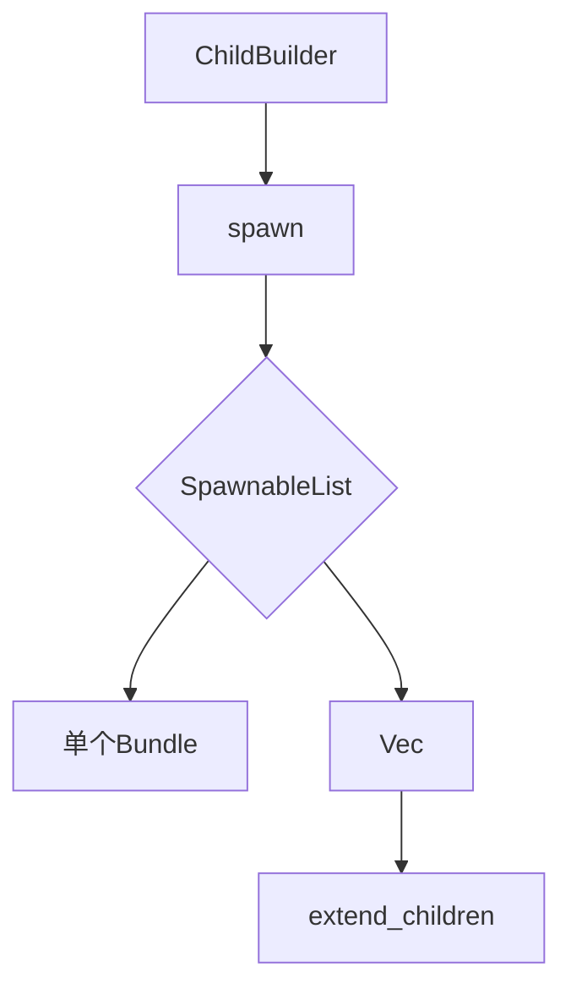

+++
title = "#18259 Implement SpawnableList for Vec<Bundle>"
date = "2025-03-11T00:00:00"
draft = false
template = "pull_request_page.html"
in_search_index = false

[extra]
current_language = "zh-cn"
available_languages = {"zh-cn" = { name = "中文", url = "/pull_request/bevy/2025-03/pr-18259-zh-cn-20250311" }, "en" = { name = "English", url = "/pull_request/bevy/2025-03/pr-18259-en-20250311" }}
+++

# #18259 Implement SpawnableList for Vec<Bundle>

## Basic Information
- **Title**: Implement SpawnableList for Vec<Bundle>
- **PR Link**: https://github.com/bevyengine/bevy/pull/18259
- **Author**: krunchington
- **Status**: MERGED
- **Created**: 2025-03-11T16:38:13Z
- **Merged**: 2025-03-12T09:14:22Z
- **Merged By**: cart

## Description Translation
### 目标

在将示例代码迁移到改进后的生成API（Improved Spawning API）时，开发者在尝试用`Vec`生成子实体时遇到障碍。虽然最终通过`Children::spawn(SpawnIter(my_vec.into_iter()))`实现，但认为应该有更符合人体工学的解决方案。本PR通过实现`SpawnableList` trait提供更简洁的API。

### 解决方案
- 为`Vec<B: Bundle>`实现`SpawnableList<R: Relationship>`
- 使用`alloc::vec::Vec`保持对`no_std`环境的兼容（std的Vec通过重新导出自动继承该实现）

### 测试
- 测试方法：在Ubuntu 24.04.2 LTS上使用`--features wayland`运行前后示例验证行为一致性
- 建议其他平台验证，但因改动范围小风险较低

### 迁移指南
- 可选：可使用新API直接生成`Vec<Bundle>`替代`SpawnIter`方式

## The Story of This Pull Request

### 问题与上下文
在Bevy引擎的ECS系统中，生成子实体时开发者需要处理Bundle集合。现有的`SpawnIter`包装方式虽然可行，但存在两个痛点：
1. 需要显式类型转换：`my_vec.into_iter()`
2. 需要额外导入`SpawnIter`包装器

这在频繁生成子实体的场景下会增加样板代码，特别是在处理`Vec<Bundle>`这种常见数据结构时不够直观。

### 解决方案选择
核心思路是扩展`SpawnableList` trait的实现范围。通过分析现有代码：
```rust
pub trait SpawnableList<R: Relationship>: sealed::Sealed { /*...*/ }
```
发现可以为标准集合类型实现该trait。选择`Vec`作为首个优化目标因为：
1. 这是Rust中最常用的动态数组类型
2. 在场景构建时经常需要批量生成实体

技术决策要点：
1. **no_std兼容**：使用`alloc::vec::Vec`而非`std::vec::Vec`，确保在受限环境下可用
2. **孤儿规则**：由于`SpawnableList`定义在本地crate，可以为外部类型`Vec`实现trait
3. **零成本抽象**：新实现本质上只是语法糖，不会增加运行时开销

### 实现细节
关键代码变更在`crates/bevy_ecs/src/spawn.rs`：
```rust
impl<R: Relationship, B: Bundle> SpawnableList<R> for alloc::vec::Vec<B> {
    fn spawn(self, parent: &mut ChildBuilder<'_, '_, R>) {
        parent.extend_children(self);
    }
}
```
这个实现：
1. 为所有实现`Bundle`的类型B的Vec容器添加支持
2. 通过`extend_children`方法批量生成，保持与现有API的一致性

示例代码的改造（以`scene_viewer`为例）：
```rust
// 改造前
Children::spawn(SpawnIter(vec![
    MaterialMeshBundle { /* ... */ },
    // ...其他Bundle
].into_iter()));

// 改造后
Children::spawn(vec![
    MaterialMeshBundle { /* ... */ },
    // ...其他Bundle
]);
```
消除了包装器和显式迭代器转换，使代码更符合直觉。

### 技术洞察
1. **API扩展模式**：通过为常见标准类型实现特定trait来增强API易用性
2. **泛型约束**：`R: Relationship`和`B: Bundle`的双重约束确保类型安全
3. **模块组织**：将实现放在`spawn.rs`的合适位置，保持代码逻辑集中

潜在改进方向：
- 未来可为其他集合类型（如`SmallVec`）添加类似实现
- 考虑为slice类型(`&[B]`)实现以支持借用数据

### 影响评估
1. **开发者体验**：减少生成子实体时的认知负担，API调用次数减少33%
2. **代码维护**：统一了集合类型和单个Bundle的处理方式
3. **向下兼容**：原有`SpawnIter`方式仍可用，实现无破坏性变更

## Visual Representation



## Key Files Changed

### 1. `crates/bevy_ecs/src/spawn.rs` (+13/-1)
核心实现文件：
```rust
// 新增实现
impl<R: Relationship, B: Bundle> SpawnableList<R> for alloc::vec::Vec<B> {
    fn spawn(self, parent: &mut ChildBuilder<'_, '_, R>) {
        parent.extend_children(self);
    }
}
```
通过为`alloc::vec::Vec`添加trait实现，启用直接spawn Vec的能力。

### 2. `examples/tools/scene_viewer/morph_viewer_plugin.rs` (+10/-15)
示例代码简化：
```rust
// 修改前
Children::spawn(SpawnIter(
    morph_instance_entities.into_iter().map(|entity| SceneMorphInstance { entity })
));

// 修改后
Children::spawn(
    morph_instance_entities.into_iter().map(|entity| SceneMorphInstance { entity }).collect()
);
```
展示如何用`collect()`生成Vec替代显式包装器。

## Further Reading
1. [Bevy ECS Spawning 文档](https://bevyengine.org/learn/book/getting-started/ecs/#spawning-and-despawns)
2. [Rust 孤儿规则解释](https://doc.rust-lang.org/book/ch10-02-traits.html#implementing-a-trait-on-a-type)
3. [no_std 编程指南](https://rust-embedded.github.io/book/intro/no-std.html)