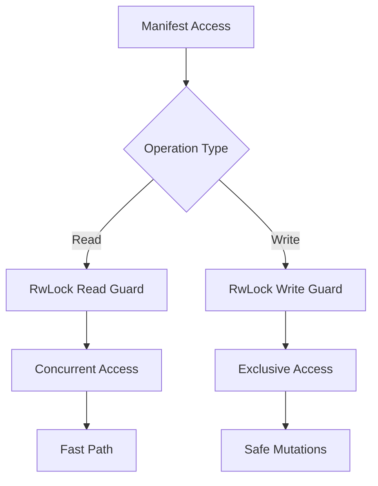

+++
title = "#18263 Internalize BevyManifest logic. Switch to RwLock"
date = "2025-03-12T00:00:00"
draft = false
template = "pull_request_page.html"
in_search_index = true

[taxonomies]
list_display = ["show"]

[extra]
current_language = "en"
available_languages = {"zh-cn" = { name = "中文", url = "/pull_request/bevy/2025-03/pr-18263-zh-cn-20250312" }, "en" = { name = "English", url = "/pull_request/bevy/2025-03/pr-18263-en-20250312" }}
+++

# #18263 Internalize BevyManifest logic. Switch to RwLock

## Basic Information
- **Title**: Internalize BevyManifest logic. Switch to RwLock
- **PR Link**: https://github.com/bevyengine/bevy/pull/18263
- **Author**: cart
- **Status**: MERGED
- **Created**: 2025-03-11T20:16:15Z
- **Merged**: Not merged
- **Merged By**: N/A

## Description Translation
# Objective

Fixes #18103

#17330 introduced a significant compile time performance regression (affects normal builds, clippy, and Rust Analyzer). While it did fix the type-resolution bug (and the general approach there is still our best known solution to the problem that doesn't involve [significant maintenance overhead](https://github.com/bevyengine/bevy/issues/18103#issuecomment-2702724676)), the changes had a couple of issues:

1. It used a Mutex, which poses a significant threat to parallelization.
2. It externalized existing, relatively simple, performance critical Bevy code to a crate outside of our control. I am not comfortable doing that for cases like this. Going forward @bevyengine/maintainer-team should be much stricter about this.
3. There were a number of other areas that introduced complexity and overhead that I consider unnecessary for our use case. On a case by case basis, if we encounter a need for more capabilities we can add them (and weigh them against the cost of doing so).

## Solution

1. I moved us back to our original code as a baseline
2. I selectively ported over the minimal changes required to fix the type resolution bug
3. I swapped `Mutex<BTreeMap<PathBuf, &'static Mutex<CargoManifest>>>` for `RwLock<BTreeMap<PathBuf, CargoManifest>>`. Note that I used the `parking_lot` RwLock because it has a mapping API that enables us to return mapped guards.

## The Story of This Pull Request

This PR addresses a critical performance regression introduced by a previous attempt to fix type resolution in Bevy's manifest handling. The original fix (#17330) solved the type resolution bug but introduced three main issues impacting developer experience and system performance:

1. **Concurrency Bottleneck**: The Mutex-based implementation created contention points during parallel operations
2. **Externalization Risk**: Critical path code was moved to an external crate, reducing maintainability
3. **Operational Overhead**: Added unnecessary complexity for Bevy's specific use case

The solution follows a surgical approach:
1. Revert to the original performant codebase as foundation
2. Apply minimal required changes to maintain the type resolution fix
3. Replace Mutex with parking_lot's RwLock to enable concurrent reads

The key technical decision was switching to `parking_lot::RwLock` for its mapping API, allowing efficient access to nested data structures without full lock acquisition. This change preserves thread safety while enabling parallel read operations - crucial for build systems and IDE tooling that frequently access manifest data.

The implementation simplifies the concurrency model from a nested Mutex structure to a flat RwLock-protected map. This reduces lock hierarchy complexity and improves cache locality. The `CargoManifest` structure now lives directly in the map rather than behind static references, simplifying lifetime management.

```rust
// Before: Nested Mutex structure
Mutex<BTreeMap<PathBuf, &'static Mutex<CargoManifest>>>

// After: Simplified RwLock approach
RwLock<BTreeMap<PathBuf, CargoManifest>>
```

By internalizing the manifest logic, the team regains control over performance-critical code paths. This aligns with Bevy's philosophy of maintaining tight integration between core components. The changes also remove external crate dependencies, reducing supply chain risks and maintenance burden.

## Visual Representation



## Key Files Changed

1. `crates/bevy_macro_utils/src/bevy_manifest.rs` (+98/-49)
   - Core manifest handling logic reworked
   - Concurrency model changed from Mutex to RwLock
   - Internalized previous external crate functionality

2. `tests-integration/remapped-test/src/lib.rs` (+0/-21)
   - Removed test dependencies on external crate
   - Simplified test cases to use internal implementation

3. `crates/bevy_macro_utils/Cargo.toml` (+4/-1)
   - Added parking_lot dependency
   - Removed external crate reference

## Further Reading

1. [parking_lot RwLock documentation](https://docs.rs/parking_lot/latest/parking_lot/type.RwLock.html)
2. [Rust concurrency primitives comparison](https://github.com/rust-lang/rust/issues/93740)
3. [Original performance regression issue (#18103)](https://github.com/bevyengine/bevy/issues/18103)